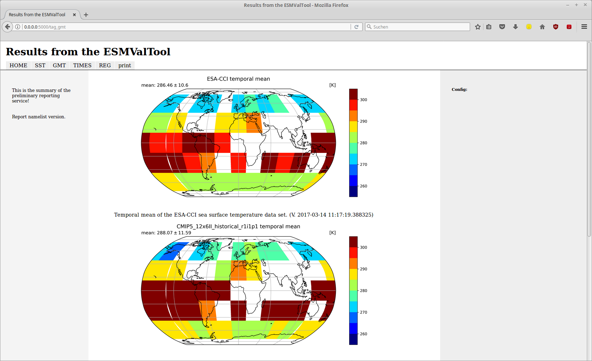

Reporting service for ESMValTool
================================

Why reporting?
------------

The ESMValTool is supposed to provide automated reporting on the calculated diagnostics. The automated reporting service is supposed to be web-based, so the server preparing the data, can also provide the resulting report without forcing the user to download data or install additional software. The automated reporting service should care for gathering the output from the ESMValTool and present it in a flexible manner.

Reporting in ESMValTool
~~~~~~~~~~~~~~~~~~~~~~~

The current reporting service composes a functional and flexible html-based website that is “printer-friendly” to also provide results in a downloadable pdf-format.

Two different approaches were primarily considered for realization:

* The first approach (A1) is, to implement a serial reporting service that is running a **collector (and organizer)** after the ESMValTool produced the output for the reporting. Therefore, the ESMValTool must deliver collectable information on the structure of the outputs and their pattern for the report. This approach allows to prevents redundant and time consuming calculations.

* The other approach (A2) is, to implement the collector (and organizer) as part of the ESMValTool runtime. An ESMValTool **runtime environment** is needed for this. This approach basically is preferred, as the reporting service is in charge of producing and managing the output of the ESMValTool, including reading or setting up namelists, etc. The advantage is, that results from multiple namelist can be easily incorporated. Therefore, information on the reporting structure is not mandatory. It is also possible to easily report on diagnostics that are currently not supporting such kind of information.

The current version 1.0 is a hybrid form of the aforementioned approaches. If the reporting service recognizes an ESMValTool namelist as input, the tool acts as a runtime environment for the tool and collects multiple diagnostic blocks' output into seperately reported parts. If the reporting service receives a specific report namelist, former results are gathered from predefined search directories and are prepared based on specific grouping instructions.

.. TODO: I don't know why neither scaling nor setting the width does not work here. 

.. figure:: reporting_post_workflow.png
   :width: 250 px
   :alt: Reporting service as a collector

   The reporting service (blue) implemented as collector for ESMValTool (red) output based on specific reporting namelists (A1)

.. figure:: reporting_envi_workflow.png
   :width: 250 px
   :alt: Reporting service as an environment

   The reporting service (blue) implemented as environment for ESMValTool (red) output distributing original namelists (A2)

.. figure:: reporting_comb_workflow.png
   :width: 250 px
   :alt: Reporting service as a hybrid

   The reporting service (blue) implemented as environment-collector-hybrid for ESMValTool (red) output reacting to specified namelists

Version 1.0 covers the following issues:

* Automatic production of a short HTML5 report with a simple "Home" site and tabs for different diagnostic blocks or tag combinations (see 'Examples'_ below).
* A print tab for easy conversion to PDF format.
* Currently, only specific data format can be processed (png, jpg, jpeg, tiff). 
* The reports are responsive to scaling of the browser window.
* The reports can be reached and presented within the same network via IP and port number (e.g.: 127.0.0.1:5000). 
* Reports use a defined sorting algorithm to provide a usefull arrangement of results.

Known issues, that will be resolved in future versions:

* Currently, not all (irregular) errors might be caught and show adequate information to prevent them.
* The flask app is not the most stable server for the site and might break. 
* Various data formats need to be incorporated (e.g. csv, pdf).
* It is not possiple to "dismiss" certain tags from the report.
* Currently, there are no tagging conventions. Tags can actually be anything and need to be consistent throughout diagnostics to produce usable reports.

Requirements
------------

*METAdata for output files*

METAdata has to be written to all files for either of the two approaches to provide captions and a rudimental report structure. 
Diagnostics that do not provide METAdata will come down to an unstructured presentation of the results. 

*Specifications for A1*

The collector approach specifically needs such a MetaData structure. 
For gathering results throughout different directories, relevant information must be filtered from a vast number of files. 
Therefore, tags can be specified, that restrict a list of files to a manageable amount.
For example, results might be grouped by ECV, domain, spatial/temporal plots, regionalized information, or specific basic information, like differences. 

*Specifications for A2*

For the runtime environment approach, the ESMValTool figure processing routines need to be time synchronous to python, running *main_report.py*.
The results from the directories, given by the namelist, are then chosen based on the creation time information of the files.
This information must fall within the start and stop time of the processing of ESMValTool's *main.py*.

1) Specify MetaData
~~~~~~~~~~~~~~~~~~~

The required METAdata is in basic xml format, hidden in the data description.
If figures are written in a compatible image format, METAdata is added to the common entry "Image.ImageDescription". 
This functionality is provided by the GExiv2 package.
Additionally and for other files, the same information is stored in a related invisible file.
The format follows the simple rules: ".filename.fileextension.xml", e.g. for "thisimage.png" METAdata is stored in ".thisimage.png.xml".

The structure of the METAdata in it's current realization provides the processing time, user and diagnostic specific tags, a caption and a block identifier for better report structure.

Setup for a python dictionary that can be transferred to xml/image metadata::

	DICT={
	      'ESMValTool':{ 			# mandatory dictonary titel
    	      'built':'datetime',               # datetime string object for processing time
    	      'tags':['tag1','tag2','tag3'],    # list of various tags as strings
    	      'caption':'CAPTIONTEXT',		# one string object as caption
    	      'block':'#123'        		# block specifyer for more structured reports
             }}

Example for a python dictionary that can be transferred to xml/image metadata (from the overview plotting function in diagnostic.py):: 

	DICT={
	      'ESMValTool':{
              'built':str(datetime.datetime.now()),
              'tags':self._basetags + ['TimeS','overview','basic'] + labels,
              'caption':str('Time series of spatial mean for different regions. 
			     The multiple models are: ' + ", ".join(labels) + '.'),
              'block':'#ID'+'regov'+self.var
             }}

Here, the tags are a dynamically built list based on namelist specific strings (**self._basetag**), plot specific strings (**['TimeS','overview','basic']**), and data specific strings (**labels**).
Similarly, the blocks and captions are built based on the ESMValTool input.

2) Specify namelist tags
~~~~~~~~~~~~~~~~~~~~~~~~

Two new elements are introduced to the namelist as it is known from ESMValTool. 
It is the intention to implement a full flexibile while least interferringn additional element to the current namelist structures.
Tags can be added within two sections of the namelist:

* GLOBAL section

Within the GLOBAL section, tags can be introduced, that are covering all following diagnostics. 
Usefull tags might be the author's or project's name, the temporal or spatial resolution, or a version specification.
A typical namelist looks somewhat like this:

.. code-block:: xml

	<namelist>
		<include href="./config_private_local.xml"/>

	<namelist_summary>
	###############################################################################
	namelist.xml

	Description

	Author

	Project

	References

	This namelist is part of the ESMValTool
	###############################################################################
	</namelist_summary>

	<GLOBAL>
	  <write_plots type="boolean">        True                      </write_plots>
	  <write_netcdf type="boolean">       True                      </write_netcdf>
	  <force_processing type="boolean">   False                     </force_processing>
	  <wrk_dir type="path">               @{WORKPATH}               </wrk_dir>
	  <plot_dir type="path">              @{PLOTPATH}      	        </plot_dir>
	  <climo_dir type="path">             @{CLIMOPATH}       	</climo_dir>
	  <write_plot_vars type="boolean">    True                      </write_plot_vars>
	  <max_data_filesize type="integer">  100                       </max_data_filesize>
	  <max_data_blocksize type="integer"> 500                       </max_data_blocksize>
	  <output_file_type>                  png                       </output_file_type>
	  <verbosity  type="integer">         1                         </verbosity>
	  <debuginfo type="boolean">          False                     </debuginfo>
	  <exit_on_warning  type="boolean">   True                      </exit_on_warning>
	  
	  <tags> example, monthly, author 				</tags>		<!-- HERE -->
  
	</GLOBAL>

	<MODELS>

	  <model> CMIP5 Example	Amon historical r1i1p1 1990 2005  @{MODELPATH} 	</model>
	
	</MODELS>

	...

* DIAGNOSTICS section

The tags element in the DIAGNOSTICS section can be used to differentiate between the results of multiple diagnostics.
Specifically, alternative variable names or similar should be used here.
Tags should generally be used to add information the diagnostics by itself does not provide in an accessibley manner.

.. code-block:: xml

	...

	<DIAGNOSTICS>

	    <diag>
	        <description>  				Doing some analysis. 		</description>
        	<variable_def_dir>      		./variable_defs/      		</variable_def_dir>
        	<variable>     				var                             </variable>
        	<field_type>                    	T2Ms                    	</field_type>
        	<diag_script cfg="./nml/cfg.py">   	this_diagnostic.py              </diag_script>
        	<launcher_arguments>               	[('execute_as_shell', False)]   </launcher_arguments>
        
        	<tags> alternative_variable_name, surface 				</tags> 	<!-- HERE -->
        
        	<model> OBS dataset sat Example 1990 2005 @{OBSPATH}  		</model>
    	     </diag>

	</DIAGNOSTICS>

	</namelist>

Beyond these user introduced tags, the ESMValTool will ad the namelist's name (without path) to the global tag list and autogenerated names (e.g. Auto_Diag_001) to the diagnostics tag list.
Running the reporting service with above namelist will provide a one tab report for the defined diagnostic, called Auto_Diag_001. 
Additionally the ESMValTool output will be shown on the Home tab and

3) Specify report namelist 
~~~~~~~~~~~~~~~~~~~~~~~~~~

Additionally, a new kind of namelist is introduced solely for reporting purpose.
The main purpose of this namelist is, to provide tag (combinations) that define the resulting structure of the report and directories that can be searched for tagged output.
subdirectories have to be specified seperately.

.. code-block:: xml

	<namelist>
		<include href="./config_private_local.xml"/>

	<namelist_summary>
	###############################################################################
	report_namelist.xml

	Description

	Author

	Project

	References

	This namelist is part of the reporting service for the ESMValTool 
	###############################################################################
	</namelist_summary>

	<TAGS>
		<set> variable1 </set>
		<set> variable2 </set>
		<set> TimeS 	</set> 	<!-- e.g., for time series plots-->
		<set> reg 	</set> 	<!-- e.g., for regionalized plots-->
		<set> land, reg	</set>	<!-- output with the combination of both "land" and "reg" tags -->
	</TAGS>

	<FOLDERS>
    		<place> @{PLOTPATH} 		</place>
    		<place> @{PLOTPATH}/old_plots/ 	</place>
	</FOLDERS>

	</namelist>

4) Making use of the METAdata package 
~~~~~~~~~~~~~~~~~~~~~~~~~~~~~~~~~~~~~

For providing meta data within the ESMValTool diagnostics, a METAdata package (./diag_scripts/lib/python/METAdata.py) is provided with the ESMValTool. 
Both ESMValTool and reporting service make use of this package.
There is a simple example within the package to show its functionality.

A common call for the METAdata package in python diagnostics looks as follows::

	import matplotlib.pyplot as plt
	import METAdata as MD
	import datetime

	basetags=['example']

	x=[1,2,3,4]
	y=[1,2,3,4]

	plt.figure(1)
	plt.plot(x,y)

	fig_name="name.png"	

	plt.savefig(fig_name)

	Dict={'ESMValTool':{
		    'built':str(datetime.datetime.now()),
		    'tags':basetags + ['linear','basic'] + ['x:'+'-'.join(x),'y:'+'-'.join(y)],
		    'caption':str('This is a simple example for x: ' + str(x) + ' and y: ' + str(y) + '.'),
		    'block':'#ID'+'ExLin'
		}}
		
	MD=METAdata("both",fig_name,Dict)	# "meta" and "xml" are options for specific meta data 
						# (e.g. "xml" with csv files)
	MD.write()

First, a plotting function is called, then the figure is saved to a specific file ("name.png"). 
Afterwards a dictionary object is constructed that is describing the plot and, e.g., the input data.
The last step is, to initialize a METAdata object, connected to the saved file ("name.png") and the describing dictionary, which is finally attatched to this file.

There will be a wrapper for meta data to be written by ncl diagnostics within the next version. 

Examples
--------

For the examples, we use simple ts/sst (sea surface temperature) data from CMIP5 and ESACCI, once regridded to 12x6 pixels and once additionally altered (12x6A).

1) The collector reporting service (A1)
~~~~~~~~~~~~~~~~~~~~~~~~~~~~~~~~~~~~~~~

The Home screen

.. figure:: reporting_post_home.png
   :width: 250 px
   :alt: Reporting service as an environment, Home tab

   The Home tab showing the ESMValTool logo (center) and the namelist's name (right)

   The GMT tab showing the ESMValTool results output (center) with the gmt tag; the rightmost column is empty within this version

2) The runtime environment reporting service (A2)
~~~~~~~~~~~~~~~~~~~~~~~~~~~~~~~~~~~~~~~~~~~~~~~~~

The GLOBAL and DIAGNOSTICS elements from the namelist look as follows: 

.. code-block:: xml

	...
	<GLOBAL>

  		<write_plots type="boolean">        True                      </write_plots>
	  	<write_netcdf type="boolean">       True                      </write_netcdf>
  		<force_processing type="boolean">   False                     </force_processing>
	  	<wrk_dir type="path">               @{WORKPATH}               </wrk_dir>
  		<plot_dir type="path">              @{PLOTPATH}/TEST/         </plot_dir>
  		<climo_dir type="path">             @{CLIMOPATH}       	      </climo_dir>
	  	<write_plot_vars type="boolean">    True                      </write_plot_vars>
  		<max_data_filesize type="integer">  100                       </max_data_filesize>
  		<max_data_blocksize type="integer"> 500                       </max_data_blocksize>
  		<output_file_type>                  png                       </output_file_type>
  		<verbosity  type="integer">         1                         </verbosity>
	 	<debuginfo type="boolean">          False                     </debuginfo>
  		<exit_on_warning  type="boolean">   True                      </exit_on_warning>
  
  		<tags> 				    example, monthly, ESACCI  </tags>
  
	</GLOBAL>

	<MODELS>

  		<model> CMIP5 	12x6 	MIP_VAR_DEF 	  historical 	r1i1p1 1991 2005  @{MODELPATH} </model>
  		<model> CMIP5	12x6A	MIP_VAR_DEF	  historical	r1i1p1 1991 2005  @{MODELPATH} </model>
	
	</MODELS>

	<DIAGNOSTICS>

    		<diag>
        		<description>  						
				Doing ESACCI sea surface temperature analysis. 		
			</description>
			
        		<variable_def_dir>     					
				./variable_defs/      					
			</variable_def_dir>
        		
			<variable ref_model="ESACCI-SST" MIP="Amon">    	
				ts                                        		
			</variable>
        		
			<field_type>                      			
				T2Ms                                      		
			</field_type>
        		
			<diag_script cfg="./nml/cfg_ESACCI/cfg_sst_ESACCI.py">  
				sst_ESACCI.py                    			
			</diag_script>
        		
			<launcher_arguments>               			
				[('execute_as_shell', False)]             		
			</launcher_arguments>
        
        		<tags> 							
				sst, ocean 						
			</tags>
        
        		<model> 	
				OBS       ESACCI-SST 	sat    12x6  1992 2005  @{OBSPATH}  					
			</model>
   		 </diag>

	</DIAGNOSTICS>
	...

This will produce a Home tab with the ESMValTool output and the namelist's name, and an AUTO_DIAG_001 tab, showing the results from the sea surface temperature analsysis together with the config declarations.

.. figure:: reporting_envi_home.png
   :width: 250 px
   :alt: Reporting service as a collector, Home tab

   The Home tab showing the ESMValTool terminal output (center) and the namelist's name (right)

.. figure:: reporting_envi_Auto_Diag.png
   :width: 250 px
   :alt: Reporting service as a collector, Diag tab

   The diagnostic result tab showing the ESMValTool results output (center) and the config file (right)

