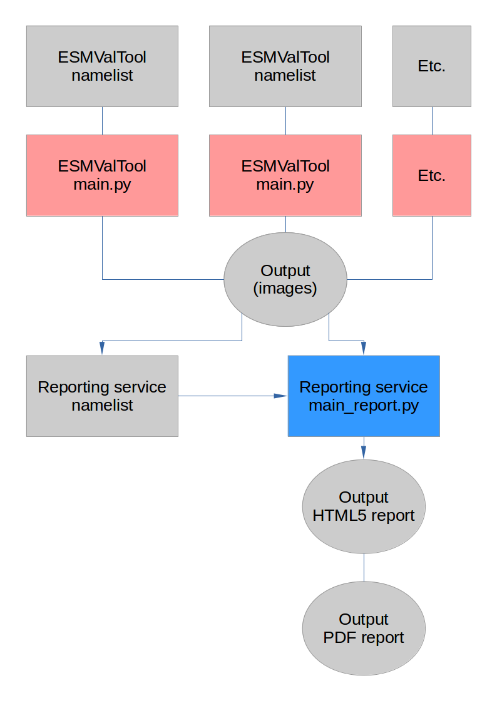
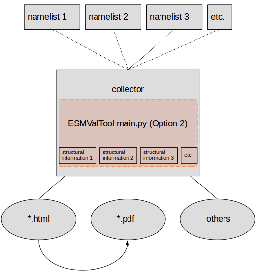
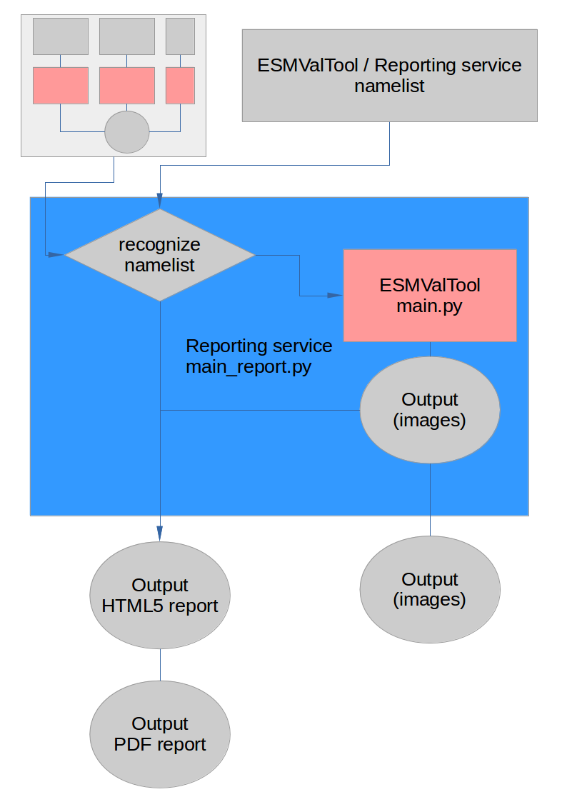

Reporting service for ESMValTool
=====================

Why reporting?
------------

The ESMValTool is supposed to provide automated reporting on the calculated diagnostics. The automated reporting service is supposed to be web-based, so the server preparing the data, can also provide the resulting report without forcing the user to download data or install additional software. The automated reporting service should care for gathering the output from the ESMValTool and present it in a flexible manner.

Reporting in ESMValTool
~~~~~~~~~~~~~~~~~~~~~~~

The current reporting service composes a functional and flexible html-based website that is “printer-friendly” to also provide results in a downloadable pdf-format.

Two different approaches were primarily considered for realization:

* The first approach is, to implement a serial reporting service that is running a **collector (and organizer)** after the ESMValTool produced the output for the reporting. Therefore, the ESMValTool must deliver collectable information on the structure of the outputs and their pattern for the report. This approach allows to prevents redundant and time consuming calculations.

* The other approach is, to implement the collector (and organizer) as part of the ESMValTool runtime. An ESMValTool **run-time environment** is needed for this. This approach basically is preferred, as the reporting service is in charge of producing and managing the output of the ESMValTool, including reading or setting up namelists, etc. The advantage is, that results from multiple namelist can be easily incorporated. Therefore, information on the reporting structure is not mandatory. It is also possible to easily report on diagnostics that are currently not supporting such kind of information.

The current version 1.0 is a hybrid form of the aforementioned approaches. If the reporting service recognizes an ESMValTool namelist as input, the tool acts as a run-time environment for the tool and collects multiple diagnostic blocks' output into seperately reported parts. If the reporting service receives a specific report namelist, former results are gathered from predefined search directories and are prepared based on specific grouping instructions.

   The reporting service (blue) implemented as collector for ESMValTool (red) output based on specific reporting namelists

   The reporting service (blue) implemented as environment for ESMValTool (red) output distributing original namelists

   The reporting service (blue) implemented as environment-collector-hybrid for ESMValTool (red) output reacting to specified namelists

Version 1.0 covers the following issues:

* Automatic production of a short HTML5 report with a simple "Home" site and tabs for different diagnostic blocks or tag combinations.
* A print tab for easy conversion to PDF format.
* Currently, only specific data format can be processed (png, jpg, jpeg, tiff). 
* The reports are responsive to scaling of the browser window.
* The reports can be reached and presented within the same network via IP and port number (e.g.: 127.0.0.1:5000). 
* Reports use a defined sorting algorithm to provide a usefull arrangement of results.

Known issues:

* Currently, not all (irregular) errors might be caught and show adequate information to prevent them.
* The flask app is not the most stable server for the site and might break. 
* Various data formats need to be incorporated (e.g. csv, pdf).

Requirements
------------

MetaData for Files

V1: time synchronous setup

V2: tags version in nmls, tagged images

1) Specify MetaData
~~~~~~~~~~~~~~~~~~~

xml object

current limitation

2) Specify namelist tags
~~~~~~~~~~~~~~~~~~~~~~~~

Global

Diagnostic

3) Specify report namelist 
~~~~~~~~~~~~~~~~~~~~~~~~~~

Tags, Folders

Examples
--------

