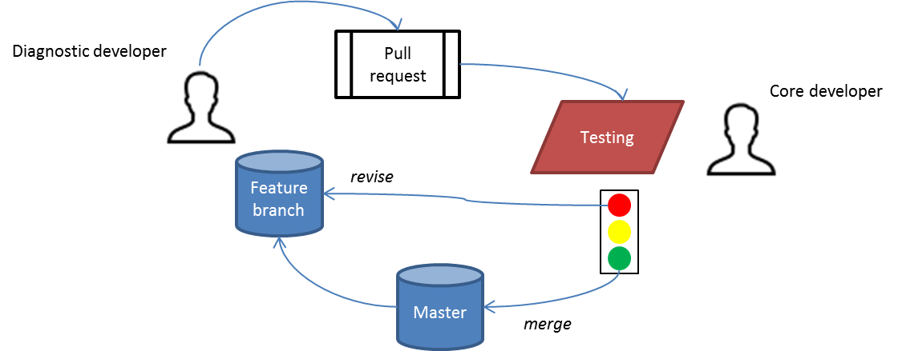

Testing in the ESMValTool
=========================

Why testing?
------------

In a nutshell: To make sure that the software does what it is supposed to do.

The overall objective of automated testing in the ESMValTool is to ensure that

* the software was properly installed on the system, and
* the different software components (backend, diagnostics,
  plotting) results in correct results
  
The following figure shows how testing integrates in the overall ESMValTool software development workflow. After a new feature has been implemented by a contributor, tests should ensure that the altered code of the feature branch does not cause any conflicts with the original version of the code. Once tests have passed sucessfully, the feature branch can be merged into the development or master branch.

  

   The role of testing in the continous integration (CI) lifecyle of the ESMValTool project

Testing levels in ESMValTool
~~~~~~~~~~~~~~~~~~~~~~~~~~~~

Testing is done on different levels within the ESMValTool:

 * `unittests <https://en.wikipedia.org/wiki/Unit_testing>`_ are used to verify that small pieces of the ESMValTool software work correctly. This can comprise the test of specific functions, modules or classes.
 * testing of entire diagnostics are done to verify that a diagnostic produces the right output.
 
 When developing a new diagnostic for the ESMValTool or improve some other components of the ESMValTool framework, one should always consider to implement appropriate tests. One might implement tests after having implemented the code functionality, it might be however also worth to consider a more agile `test driven development cycle <https://en.wikipedia.org/wiki/Test-driven_development>`_.
 
 
Unittesting in the ESMValTool
~~~~~~~~~~~~~~~~~~~~~~~~~~~~~

Test for individual pieces of code are currently implemented largely based on the python core library `unittest <https://docs.python.org/2/library/unittest.html>`_. Please look there or in the `tests` directory for examples how to implement tests for python code.

How does the testing of diagnostics in ESMValTool work in principle?
~~~~~~~~~~~~~~~~~~~~~~~~~~~~~~~~~~~~~~~~~~~~~~~~~~~~~~~~~~~~~~~~~~~~

The general concept of the testing framework is that it compares results of a diagnostic with reference information about expected output. The following checks can be currently performed:

1. check if all output files are available (Filecheck)
2. check that content of output files is the same as expected
3. check that output file sizes are greater than zero bytes
4. check that acknowledgments are provided for each diagnostic by the processing

The overall testing approach is currently based on the philosophy that

a) testing should be fast to execute; this mainly depends on how fast the diagnostic is running with small datasets (e.g. no regridding if possible)
b) should not require the user to download larger data volumes

For that reason, the testing is largely based on synthetic data as an input which allows to fully control the input and thus also expected output of a specific diagnostic.

**What is needed?**

* a namelist for the diagnostic tailored for testing. 
* a script that implements the test

Getting started
---------------

The steps required to sucessfully implement testing for the ESMValTool are described in the following.

To be able to use the testing a number of prerequesites need to be fulfilled.
These are typically already installed when the ESMValTool is installed properly.

Prerequesite #1: install `easytest`
~~~~~~~~~~~~~~~~~~~~~~~~~~~~~~~~~~~

The ESMValTool testing facility is based on the python package `easytest <https://github.com/pygeo/easytest>`_ . If `easytest` is not installed yet on your machine, install it within seconds using the instructions provided `here <http://easytest.readthedocs.org/en/latest/>`_. There you find also the information on the types of tests supported so far. To use the `easytest` functionality for testing entire ESMValTool diagnostics only a few lines of code are needed.

Prerequesite #2: nosetests
~~~~~~~~~~~~~~~~~~~~~~~~~~

`nosetests <https://nose.readthedocs.org/en/latest/>`_ should have been already installed. If not, do so as it is needed for a convenient testing experience. Tests could also be exectuted without `nosetests`, but this makes life so much easier. 

Prerequesite #3: install `dummydata`
~~~~~~~~~~~~~~~~~~~~~~~~~~~~~~~~~~~~~~~

The `dummydata <https://github.com/pygeo/dummydata>`_ package is required for the generation of synthetic datasets to be used within the testing. Install the package as described in its documentation.

How to implement a test for a new diagnostic?
---------------------------------------------

Two cases should be always considered

* **ensure that your code or its individual components do the right thing**. It is therefore highly recommended that you implement unittests for your code as much as you can (and want). This will ensure the integrity of your diagnostic code. If you get used to implementing unittests on a regular basis, you will find out that you will probably write faster and better code with testing. More details on how you can implement unittests is given either in the `tests` directory of the ESMValTool or can be also found in the documentation of the corresponding `unittest <https://docs.python.org/2/library/unittest.html>`_ python package. Please look there or in the `tests` directory for examples how to implement unittests for python code.

* **set up a test for the entire diagnostic**. This test can be as complicated as you like. A template is provided that helps you to facilitate the test integration. This basic testing template will run your diagnostic with sample data and check if the diagnostic produces appropriate output files like you would expect. Based on these basic tests, you can then further implement new tests that check e.g. that specific results have been produced that you expect from the diagnostic with predefined input data. For this, the dummy data used for the testing can have different characteristics. Details are provided in the documentation of the `dummydata <https://github.com/pygeo/dummydata>`_ package.

To implement a test for a new diagnostic only a few steps are required, which are described in the following

Step 1: create your test file
~~~~~~~~~~~~~~~~~~~~~~~~~~~~~

Let us assume that you are in the home directory of the ESMValTool. Then let's start first by copying the template file (`test_namelist_TEMPLATE.py`) to a new directory. This should have the same name as your diagnostic has. For our example here, let us assume that the namelist of our diagnostic is called `namelist_carbon_cycle.nml`.

The filename should include your diagnostic name, therefore we do::

    #!/bin/bash
    # please note that all examples are for bash shell.
    # For other shells you need to adapt the commands accordingly

    export myname='namelist_carbon_cyle'
    cd ./tests/test_diagnostics
    mkdir test_${myname}
    cp ./test_namelist_TEMPLATE.py ./test_${myname}/test_${myname}.py
    cd test_${myname}

Step 2: modify your test file
~~~~~~~~~~~~~~~~~~~~~~~~~~~~~

First of all, have a look at the content of the test file. You will see that the file includes two classes, namely::

    class DiagnosticTest(ESMValToolTest):
        [...]

    class TestDiagnostic(ESMValTestDiagnostic):
        [...]

You now want to adapt this template for your needs. The objective should be that the test checks at least that your diagnostic always produces the files you expect it to produce. To achieve that we do the following:

1. Change the name of the XML file::

    # change the name of the namelist file
    xml_single = 'namelist_myfirsttest.xml' 
    # with
    xml_single = 'namelist_carboncyle.xml' 

What have you done? You told the class where to find the namelist file that should be tested. This namelist file is assumed to be in the same directory like the test routine itself. Thus you will need to copy that (see Step 4 further below).

2. What's the target?

Do you already know what the filenames are which are produced by your diagnostic? Then it's a good option now to take a note of their names and also in which of the ESMValTool output directories they are located (plotting directory, working directory, ...).

Got it? If yes, go to the next point. But wait! Do you have also output that depends on the models that are used in a diagnostics? Let's say that your diagnostic produces some maps and each map is the result for one model, then you would have as many graphics like models, right? You then certainly would also encode the model name in the filename of the output. Too abstract? Here is an example.

Let's say, your diagnostic just analyzes only 3 models (depends on what you specify in the namelist itself for sure), and produces just a global mean map plot as png files, then one could imagine that the `plot_dir` of your results would look somehow like the following::

    MPIESM-LR_temporal_mean_map.png
    MPIESM-MR_temporal_mean_map.png
    BNU-ESM_temporal_mean_map.png

The one or the other way, you have now a list of files that is produced by your diagnostic in principle. You need to tell the test script what these files are. This is acomplished by writing the filenames in a list within the variable `reffile`. Each entry in this list consists of a tuple which specifies the output directory as well as the filename that the diagnostics is expected to produce. For example::

        reffiles=[('plot','test1.png'), ('plot','test2.png')]

means that the files *test1.png* and *test2.png* are both expected to be located in the plotting directory generated by the diagnostics.

Equally, you might produce a list of filenames via *ls [-a] > filenames.txt* and read that file. For this, the class `TestDiagnostic` already provides a convenient function. This function ensures also automatically, that e.g. trailing whitespaces are not considered to be part of the filename. Thus if you have a file which contains the reference filenames and looks as follows::

    fileA.png
    fileB.png
    fileC.png

you can just read the `reffiles` list as follows::

    reffiles = self.read_reffiles('myreffiles.txt')

The directories are specified by the following currently available shortcuts:

* `plot` for the plotting directory
* `work` for working directory

Please note that it is irrelevant if your namelist specifies a specific output directory for plotting or working, as this will be overwritten by the testing routine anyway.

Please note that the example file contains also examples how output files for different models could be easily processed.

Step 3: Specify the data
~~~~~~~~~~~~~~~~~~~~~~~~~~~~

The tests are currently designed to work most efficiently. This is why the default testing implementation is based on generated synthetic data of small size. The generation of such synthetic testing data is acomplished by using the `dummydata <https://github.com/pygeo/dummydata>`_ package. For a detailed documentation of the capabilities of this package, see in its documentation.

Now, it is important that you identify the variables (e.g. precipitation) that are expected as input within the diagnostic to be tested. You need to tell the class for testing which fields are supposed to be generated and which kind of characteristics they are expected to have.

If you have a look to the `get_field_definitions()` function, you will recognize that a dictionary `r` is generated. This dictionary contains all relevant information that tells the testing routine how the test data should be generated.

The most recent list of supported variables is provided within the `dummydata` package. Please have a look `there <https://github.com/pygeo/dummydata/blob/master/dummydata/meta.py#L7>`_ if you want to check which variables are supported. 

Examples for variables definitions::

    # variable: precipitation, with uniform random values,
    # 2D variable (e.g. surface), name of file
    r.update({'pr' : {'method' : 'uniform',
                      'filename' : rpath + os.sep + '@{VAR_FILE}',
                      'ndim' : 2}})
    # generate a variable for surface soil moisture using random values
    r.update({'mrsos' : {'method' : 'uniform',
                         'filename' : rpath + os.sep + '@{VAR_FILE}',
                         'ndim' : 2}})
    # generate a 3D variable for wind speed
    r.update({'va' : {'method' : 'uniform',
                      'filename' : rpath + os.sep + '@{VAR_FILE}',
                      'ndim' : 3}})

Step 4: Copy the original namelist and adapt it for testing
~~~~~~~~~~~~~~~~~~~~~~~~~~~~~~~~~~~~~~~~~~~~~~~~~~~~~~~~~~~

Now it is time to copy the original namelist you want to test to the current directory. To enable a fast testing experience, you should adapt this namelist by in particular

a) reducing the number of models used,
b) reduceing the number of observations used, or,
c) if your namelist contains an include statement to specify local directory configurations, remove these lines. Work, plot and climo directories are set automatically by the testing environment.

Step 5: Run tests
~~~~~~~~~~~~~~~~~

Now we are ready to go to start the testing itself. For our example you simply start the test by::

    nosetests test_namelist_carboncycle.py

If you have not installed `nosetests` you can also run the testing as::

    python test_namelist_carboncycle.py

The following is happening when you are running the tests:

- test data is generated and cached in a specific directory for reuse if needed
- the namelist is copied into a temporary directory and content is changed with filenames for the synthetic test data. Options like e.g. the plotting directory are altered in this copy of the namelist.
- the namelist is executed with the test data as input, producing output
- the output is verified against the list of expected output and output files are also checked for their content if requested

And now ... FAIL.

It would be really an exception if the tests would be exectuted without any error and pass sucessfully. What typically would happen is that errors will occur, indicating that a variable is missing or output files were not found. 

To fix these errors, a sequential approach is recommended:

1) run only the namelist without any testing. This is acomplished by commenting the test execution. Your script should look as follows::

         T.run_nml()
         #T.run_tests(execute=False, graphics=None, checksum_files=None,
         #               files='all', check_size_gt_zero=True)
         #self.assertTrue(T.sucess)

         if __name__ == "__main__":
              unittest.main()

The namelist alone runs? If not and there are complaints that variables are missing, then add them following `Step 2: modify your test file`_ above. If a variable has not yet been defined within `dummydata package <https://github.com/pygeo/dummydata/blob/master/dummydata/meta.py#L7>`_ feel free to modify the dummydata routine by forking the dummydata repository, applying the appropriate changes and opening a pull request to make changes also available for other users.

If the namelist runs without testing, then continue with the next step:

2) run the tests themselves, but do not check for sucess yet::

         T.run_nml()
         T.run_tests(execute=False, graphics=None, checksum_files=None,
                        files='all', check_size_gt_zero=True)
         #self.assertTrue(T.sucess)

Look carefully at the output. Are there any error messages, that tests could not be executed or that files are missing? Test run in general o.k.? ... go ahead!
**WHAT DO WE DO WHEN ERRORS OCCUR?**

3) run tests with sucess check::

         T.run_nml()
         T.run_tests(execute=False, graphics=None, checksum_files=None,
                        files='all', check_size_gt_zero=True)
         self.assertTrue(T.sucess)

If certain output files are not generated, you need to figure out where the problem is. It is also recommended to have a look into the output directories of the test itself. Perhaps there are more files generated by your routine than you had expected? If so, then add them to the `reffiles` variable (`Step 1: create your test file`_).

After the execution was sucessfully completed you should get an::

    O.K!

More advanced testing
---------------------

Like already said in the introduction, you could implement an arbitrary complexity for the testing. The above is only the very basic, but already sufficient at least to test that the diagnostic is working in a lightweight setup.

One very usefull way to also test that the diagnostic produces the correct results would be to a) implement first of all unittest for the individual components of the diagnostic itself if possible and then b) generate synthetic test data with predefined properties. Currently, `dummydata` supports generation of random uniform fields and constant fields. Thus the first question would be, what kind of results you would expect if a constant field is used within the diagnostic (note that you can specify the constant value). Later on, one could also think about generating more complex input fields using `dummydata` like e.g. constants values for each latitude or similar things. If you have a specific request, then open an issue at the `dummydata <https://github.com/pygeo/dummydata>`_ repository.

