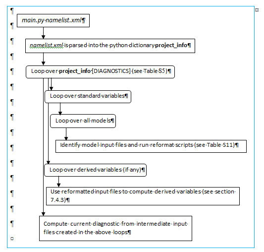

.. _namelists:

ESMValTool namelists
********************

The ESMValTool namelists are the "control centers" acting as interfaces between the user and the various scripts and configuration files that make up the ESMValTool. A namelist specifies a list of diagnostics to run, global flags and a list of models and observations that are used within the diagnostics. Namelists are text files written in XML (EXtensible Markup Language) [XML]. As a simple text file, the XML-namelist can be easily modified by the user.

For any given namelist *"namelist.xml"*, the ESMValTool is invoked from the command line via (see also Section :numref:`running`)::

	python main.py nml/namelist.xml

The Python "workflow manager" *main.py* will parse the namelist (namelist.xml) and call all diagnostic scripts listed in the namelist. This sequence is schematicallypython main.py nml/namelist.xml depicted in :numref:`fig_controlflow` and involves the following steps:

1.	Parse the namelist
2.	Identify the input files on the file system
3.	Run an NCL script to check and reformat the input files
4.	If needed, run a NCL script to compute derived variables such as, for instance, climate indices
5.	Run the diagnostic script (NCL/Python/R/etc.)
6.	Repeat previous steps until all diagnostics listed in the namelist are processed

.. _fig_controlflow:

   :alt: figure_ESMValTool_controlflow.png
   :align: center

   ESMValTool control flow.

The script *main.py* processes the information in the XML namelist to be used by each of the supported programming languages (currently NCL, Python and R) used for the diagnostic scripts. This means that different diagnostics, even if implemented in different programming languages, can be called within the same namelist. Any changes to the settings of the namelist will passed to each diagnostic script.

Note that the coupling between the namelist and the diagnostic scripts is "loose". The Python workflow manager *main.py* passes all information in the namelist to the target diagnostic script, e.g., via intermediate files or environment variables, but it is up to the diagnostic script to act on that information.

**Basic structure of a namelist**
 
	**<GLOBAL>**
	
	controls the general settings (see :numref:`tab_glob_tags`) ; see Section :numref:`glob_tag`, "More on the <GLOBALS>-tag" below for details
	
	**</GLOBAL>**

	**<MODELS>**
	
	defines the models/observations and years to be processed and their pathnames; see Section :numref:`mod_tag`, "More on the <MODELS>-tag" below for details
	
	**</MODELS>**

	**<DIAGNOSTIC>**
	
	defines which diagnostics are run (see :numref:`tab_diag_tags`); each diagnostic is enclosed in an opening <diag> and closing </diag>-tag; see Section :numref:`diag_tag`, "More on the <DIAGNOSTICS>-tag" below for details
	
	**</DIAGNOSTIC>**

Please note that the "loose coupling" described above applies particularly to the settings defined in the two elements <GLOBAL> and <DIAGNOSTIC>.

.. _glob_tag:

More on the <GLOBAL>-tag
========================

:numref:`tab_glob_tags` summarizes the tags defined in the <GLOBAL> section of the namelist. Some of these tags (e.g., regridding_dir) are specific to some diagnostics and not generally defined in all namelists.

   :numref:`tab_glob_tags` Tags of the <GLOBAL> section of the namelist. Note that not all tags might be used by a diagnostic.

.. _tab_glob_tags:

+--------------------+---------+-----------------------------------------------------------------------------------------------+
| Name               | Type    | Description                                                                                   |
+====================+=========+===============================================================================================+
| climo_dir          | string  | Path for intermediate files (netCDF)                                                          |
+--------------------+---------+-----------------------------------------------------------------------------------------------+
| exit_on_warning    | boolean | Stop on warnings                                                                              |
+--------------------+---------+-----------------------------------------------------------------------------------------------+
| force_calc         | boolean | Force diagnostic specific files to be recreated                                               |
+--------------------+---------+-----------------------------------------------------------------------------------------------+
| force_gradecalc    | boolean | Force recalculation of model grading (perfmetrics)                                            |
+--------------------+---------+-----------------------------------------------------------------------------------------------+
| force_processing   | boolean | Force certain intermediate files (netCDF) to be recreated instead of using cached files       |
+--------------------+---------+-----------------------------------------------------------------------------------------------+
| force_taylorcalc   | boolean | Force recalculation of data for Taylor plot (perfmetrics)                                     |
+--------------------+---------+-----------------------------------------------------------------------------------------------+
| max_data_blocksize | integer | Currently not used                                                                            |
+--------------------+---------+-----------------------------------------------------------------------------------------------+
| max_data_filesize  | integer | Limits internal memory handling in some core NCL scripts                                      |
+--------------------+---------+-----------------------------------------------------------------------------------------------+
| output_file_type   | string  | File format of plots (ps, pdf, eps, png); not all formats supported by all diagnostic scripts |
+--------------------+---------+-----------------------------------------------------------------------------------------------+
| plot_dir           | string  | Output path for plots                                                                         |
+--------------------+---------+-----------------------------------------------------------------------------------------------+
| read_from_vault    | boolean | Retrieve computed diagnostic fields from netCDF                                               |
+--------------------+---------+-----------------------------------------------------------------------------------------------+
| regridding_dir     | string  | Path for intermediate files used by NCL regridding routines                                   |
+--------------------+---------+-----------------------------------------------------------------------------------------------+
| show_debuginfo     | string  | Generate a second version of each figure with explanatory text overlayed                      |
+--------------------+---------+-----------------------------------------------------------------------------------------------+
| tags               | string  | Comma separated list of tags used for reporting and visualization                             |
|                    |         | (see Section :numref:`tagging` for details)                                                   |
+--------------------+---------+-----------------------------------------------------------------------------------------------+
| verbosity          | integer | Verbosity level (0 = minimum output, 4=maximum output)                                        |
+--------------------+---------+-----------------------------------------------------------------------------------------------+
| write_netcdf       | boolean | Write results to netCDF file                                                                  |
+--------------------+---------+-----------------------------------------------------------------------------------------------+
| write_plot_vars    | boolean | Currenntly not used                                                                           |
+--------------------+---------+-----------------------------------------------------------------------------------------------+
| write_plots        | boolean | Produce plots                                                                                 |
+--------------------+---------+-----------------------------------------------------------------------------------------------+
| wrk_dir            | string  | Output path for data (netCDF, acknowledgements)                                               |
+--------------------+---------+-----------------------------------------------------------------------------------------------+

.. _mod_tag:

More on the <MODELS>-tag
========================

Each data set is specified by a <model> line with the first entry of each model line being the "project specifier" (see :numref:`tab_proj_spec`). The project specifier refers to a Python class that is used to parse the model line in the namelist. For example, a model line with the "CMIP5" specifier looks like:

   *<model> CMIP5 name mip experiment ensemble start-year end-year path </model>*

* Optionally, the element "*mip*" can be replaced with "*MIP_VAR_DEF*" if the tag "MIP" is specified in the <variable> tag (see :numref:`tab_opt_att`), e.g.: 
   
   *<variable* **MIP** *="cfDay"> rlut </variable>*

   *<model> CMIP5_ETHZ MPI-ESM-LR MIP_VAR_DEF amip r1i1p1 1980 1985 \@{MODELPATH}/ETHZ_CMIP5/ </model>*

* The element "experiment" can be replaced with "*EXP_VAR_DEF*" if the tag "*EXP*" is specified in the <variable> tag (see Table S4), e.g.:

   *<variable MIP="Omon"* **EXP** *="esmHistorical"> fgco2 </variable>*

   *<model> CMIP5_ETHZ NorESM1-ME MIP_VAR_DEF* **EXP_VAR_DEF** *r1i1p1 1960 2005 \@{MODELPATH}/ETHZ_CMIP5 </model>*

The project specifier "CMIP5" will search for files in "path" with filenames matching the pattern

   *_mip_name_experiment_ensemble_*

Here, the leading asterisk is a placeholder for the variable, which is defined in the <DIAGNOSTICS>-tag (see below), the trailing asterisk is a placeholder for the start/end date of the data set. This naming convention conforms to the syntax used for CMIP5 DRS filenames (as implied by the project specifier name). By implementing their own project specifier classes into the Python code (*interface_scripts/projects.py*), the user can handle data sets that follow different file naming conventions or require additional information to be passed along in addition to the filename. :numref:`tab_proj_spec` gives a summary of the available project specifiers and arguments to be used in each <model> line. 

[**Note: Examples for the most commonly used project specifiers CMIP5, CMIP5_ETHZ, OBS, and obs4mips as well as downloading instructions and information on the required local directory structure for the model / observational data can be found in Section :numref:`diag_avail`.**]

The <model>-tag may also take the optional attribute "*id*":

Example:

   *<model* **id** *="ERAINT"> OBS ERA-Interim reanaly 1 2003 2004 @{OBSPATH}/Tier3/ERA-Interim </model>*

The attribute *id* specifies a string that can be used to refer to the model in other places of the namelist. :numref:`tab_mod_tags` gives a summary of valid attributes in <model>-tags.

   :numref:`tab_proj_spec` Project specifiers and corresponding arguments.

.. _tab_proj_spec:

+-------------------+------------+---------------+------------+------------+------------+------------+------------+------------+
| project specifier | argument 1 | argument 2    | argument 3 | argument 4 | argument 5 | argument 6 | argument 7 | argument 8 |
+===================+============+===============+============+============+============+============+============+============+
| ana4mips          | Name       | table         | experiment | ensemble   | realm      | start year | end year   | path       |
+-------------------+------------+---------------+------------+------------+------------+------------+------------+------------+
| CCMVal            | name       | case-name     | ensemble   | start year | end year   | path       |            |            |
| CCMVal1           | name       | case-name     | ensemble   | start year | end year   | path       |            |            |
| CCMVal2           | name       | case-name     | ensemble   | start year | end year   | path       |            |            |
+-------------------+------------+---------------+------------+------------+------------+------------+------------+------------+
| CMIP5             | name       | mip           | experiment | ensemble   | start year |  end year  | Path       |            |
| CMIP5_ETHZ        | name       | mip           | experiment | ensemble   | start year |  end year  | path       |            |
| CMIP5_gridfile    | name       | mip           | experiment | ensemble   | start year |  end year  | path       | gridfile   |
| CMIP5_SMHI        | name       | mip           | experiment | ensemble   | start year |  end year  | frequency  | path       |
+-------------------+------------+---------------+------------+------------+------------+------------+------------+------------+
| ECEARTH           | Name       | experiment    | ensemble   | start year | end year   | path       |            |            |
+-------------------+------------+---------------+------------+------------+------------+------------+------------+------------+
| EMAC              | name       | ensemble      | start year | end year   | path       |            |            |            |
+-------------------+------------+---------------+------------+------------+------------+------------+------------+------------+
| GO                | name       | table         | experiment | ensemble   | start year | end year   | path       |            |
| GO_gridfile       | name       | table         | experiment | ensemble   | start year | end year   | path       |            |
+-------------------+------------+---------------+------------+------------+------------+------------+------------+------------+
| MiKlip            | name       | table         | experiment | ensemble   | realm      | start yea  | end year   | path       |
| MiKlip_baseline0  | name       | table         | experiment | ensemble   | realm      | start yea  | end year   | path       |
+-------------------+------------+---------------+------------+------------+------------+------------+------------+------------+
| OBS               | name       | case-name     | ensemble   | start year | end year   | Path       |            |            |
| OBS_gridfile      | name       | case-name     | ensemble   | start year | end year   | path       | gridfile   |            |
|                   |            | (insitu,      |            |            |            |            |            |            |
|                   |            | sat, ground   |            |            |            |            |            |            |
|                   |            | reanaly)      |            |            |            |            |            |            |
+-------------------+------------+---------------+------------+------------+------------+------------+------------+------------+
| obs4mips          | Name       | process level | ensemble   | start year | end year   | path	     |            |            |
+-------------------+------------+---------------+------------+------------+------------+------------+------------+------------+

   :numref:`tab_mod_tags` Optional attributes of the <model> tag.

.. _tab_mod_tags:

+-------+---------+------------------------------------------------------------------------------+
| Name  | Type    | Description                                                                  |
+=======+=========+==============================================================================+
| id    | String  | Define a name used to refer to the model data in other parts of the namelist |
+-------+---------+------------------------------------------------------------------------------+

   :numref:`tab_opt_att` Optional attributes of the <variable> tag.

.. tabularcolumns:: |l|l|p{12.75cm}|

.. _tab_opt_att:

+-----------+----------+-------------------------------------------------------------------------------------------+
| Name      | Type     | Description                                                                               |
+===========+==========+===========================================================================================+
| exclude   | String   | Model (id) to exclude from processing                                                     |
+-----------+----------+-------------------------------------------------------------------------------------------+
| EXP       | String   | Define a name used to the CMIP5 experiment, e.g., historical                              |
+-----------+----------+-------------------------------------------------------------------------------------------+
| MIP       | String   | Define a name used to refer to the CMIP5 data stream, e.g., "Amon", "Omon", "day", "fx";  |
|           |          | to be used in combination with "MIP_VAR_DEF" replacing the CMIP5 stream in the definition |
|           |          | of a <model> tag.                                                                         |
+-----------+----------+-------------------------------------------------------------------------------------------+
| ref_model | String   | Define a reference model (model id)                                                       |
+-----------+----------+-------------------------------------------------------------------------------------------+

.. _diag_tag:

More on the <DIAGNOSTICS>-tag
=============================

Each <diag> entry refers to one or several scripts in the folder *diag_scripts/* complemented by a variable name (see :numref:`tab_var_def` for a list of variables) and the corresponding (input) field type (see :numref:`tab_fld_typ`). Optionally the <diag>-tag may contain additional <model>-tags; these data sets will be processed only by the diagnostic(s) listed in the current <diag> entry. In this way it is possible to define a set of models to be analyzed by all diagnostics in the namelist (in the <MODELS> section) and a set of models to be analyzed only by specific diagnostics (in the <diag> section). Available <diag>-tags are listed in :numref:`tab_diag_tags`, their optional attributes in :numref:`tab_diag_att`.

   :numref:`tab_diag_tags` Tags of the <diag> section within the <DIAGNOSTICS> section of the namelist. There are no default values.

.. tabularcolumns:: |l|l|p{11.5cm}|

.. _tab_diag_tags:

+----------------------+----------+-----------------------------------------------------------------------------------------------------------------+
| Name                 | Type     | Description                                                                                                     |
+======================+==========+=================================================================================================================+
| description          | string   | 1-line description / title of the diagnostic                                                                    |
+----------------------+----------+-----------------------------------------------------------------------------------------------------------------+
| variable_def_dir     | string   | Path for the variable-specific configuration file (usually variable_defs)                                       |
+----------------------+----------+-----------------------------------------------------------------------------------------------------------------+
| variable             | string   | Variable name: a script with the same name (variable_defs/<variable>.ncl) defines the variable to process       |
|                      |          | see Table S8 for a list of variables) including possible preprocessing (e.g., calculating derived variables).   |
|                      |          | Variable scripts should be located in the local folder variable_defs and written in NCL. Even though the        |
|                      |          | variable scripts are written in NCL all meta data defined in the scripts are passed on to the target diagnostic | 
|                      |          | script regardless of the used language (via variable attributes). If multiple variables need to be passed on to |
|                      |          | a diagnostic script, multiple <variable>-tags have to be defined.                                               |
+----------------------+----------+-----------------------------------------------------------------------------------------------------------------+
| field_type           | string   | Type of input field (see Table S7) that can be used by the diagnostic scripts. If multiple <variable>-tags are  |
|                      |          | defined a single (which is then applied to all) or an equal number of <field type>-tags has to be defined.      |
+----------------------+----------+-----------------------------------------------------------------------------------------------------------------+
| diag_script_cfg_dir  | string   | Path for diagnostic script configuration file                                                                   |
+----------------------+----------+-----------------------------------------------------------------------------------------------------------------+
| diag_script          | string   | Name of diagnostic script; the script can be written in any language currently supported by ESMValTool (NCL, R  |
|                      |          | and Python) and has to be located in the local folder diag_scripts. The settings defined in the diagnostic      |
|                      |          | script configuration file defined by the diag_script cfg attribute is loaded at the beginning of the diagnostic |
|                      |          | script.                                                                                                         |
+----------------------+----------+-----------------------------------------------------------------------------------------------------------------+
| model (optional)     | string   | Additional data sets specific for this <diag>-section. Data sets defined here will be processed in addition to  |
|                      |          | the ones defined in the MODELS section (see above) but will be ignored by other <diag>-sections.                |
+----------------------+----------+-----------------------------------------------------------------------------------------------------------------+
| tags                 | string   | Comma separated list of tags used for reporting and visualization (see Section :numref:`tagging` for details)   |
+----------------------+----------+-----------------------------------------------------------------------------------------------------------------+

   :numref:`tab_diag_att` Optional attributes of selected tags in the <diag> section. 

.. tabularcolumns:: |l|l|l|p{10cm}|

.. _tab_diag_att:

+------------+----------+---------------+---------------------------------------------------------------------------------------------------+
| Name       | Type     | Parent tag    | Description                                                                                       |
+============+==========+===============+===================================================================================================+
| ref_model  | string   | <variable>    | Defines this data set as the reference data set within the diagnostic. The string ref_model       |
|            |          |               | refers to either the model name, as specified in Table S2, or the model attribute id as specified |
|            |          |               | in Table S3. Note that because both model and observational data sets are specified via the       |
|            |          |               | <model>-tag any of them can be used as a reference data set.                                      |
+------------+----------+---------------+---------------------------------------------------------------------------------------------------+
| exclude    | string   | <variable>    | When using more than one variable corresponding to different observational data sets (e.g.,       |
|            |          |               | precipitation and skin temperature), it is necessary to use this attribute to match which         |
|            |          |               | variable goes with which data set, e.g., pr with TRMM and ts with HadISST using,                  |
|            |          |               |                                                                                                   |
|            |          |               | <variable ref_model="trmm" exclude="hadisst">  pr ...                                             |
|            |          |               | <variable ref_model="hadisst" exclude="trmm">  ts ...                                             |
+------------+----------+---------------+---------------------------------------------------------------------------------------------------+
| cfg        | string   | <diag_script> | Configuration file for the diagnostic script                                                      |
+------------+----------+---------------+---------------------------------------------------------------------------------------------------+

   :numref:`tab_fld_typ` Field types.

.. _tab_fld_typ:

+-------+--------------------------------------------------------------------------------------------------------+
| Name  | Description                                                                                            |
+=======+========================================================================================================+
| T2Ms  | Monthly-mean 2d atmosphere or land surface data (longitude, latitude, time:month)                      |             
+-------+--------------------------------------------------------------------------------------------------------+
| T3M   | Monthly-mean 3d atmosphere data (longitude, latitude, pressure, time:month)                            |
+-------+--------------------------------------------------------------------------------------------------------+
| T2Mz  | Monthly-mean zonal mean 2d atmosphere or land surface data (longitude, pressure, time:month)           |
+-------+--------------------------------------------------------------------------------------------------------+
| T1Ms  | Monthly-mean 1d atmosphere or land surface data on a certain pressure level (latitude, time:month)     |
+-------+--------------------------------------------------------------------------------------------------------+
| T2Ds  | Daily-mean 2d atmosphere data (longitude, latitude, time:day)                                          |
+-------+--------------------------------------------------------------------------------------------------------+
| T3D   | Daily-mean 3d atmosphere data (longitude, latitude, pressure, time:day)                                |
+-------+--------------------------------------------------------------------------------------------------------+
| T2Dz  | Daily-mean zonal mean 2d atmosphere data (latitude, pressure, time:month)                              |
+-------+--------------------------------------------------------------------------------------------------------+
| T2Is  | Daily instantaneous 2d atmosphere data for all years (longitude, latitude, time:day)                   |
+-------+--------------------------------------------------------------------------------------------------------+
| T3I   | Daily-instantaneous 3d atmosphere data for selected years (longitude, latitude, model level, time:day) |
+-------+--------------------------------------------------------------------------------------------------------+
| T2Iz  | Daily instantaneous zonal mean 2d atmosphere data for all years (latitude, pressure, time:day)         |
+-------+--------------------------------------------------------------------------------------------------------+
| T1Iz  | Daily instantaneous 1d field for all years (latitude-pressure, time:day)                               |
+-------+--------------------------------------------------------------------------------------------------------+
| T0I   | Daily instantaneous 0d field for all years (time:day)                                                  |
+-------+--------------------------------------------------------------------------------------------------------+
| T0As  | Annual-mean 0d atmosphere or land surface data on a certain pressure level (latitude, time:year)       |
+-------+--------------------------------------------------------------------------------------------------------+
| F2Ms  | Constant 2d land surface data (latitude, longitude)                                                    |
+-------+--------------------------------------------------------------------------------------------------------+
| TO2Ms | Monthly-mean 2d ocean or sea ice data (longitude, latitude, time:month)                                |
+-------+--------------------------------------------------------------------------------------------------------+
| TO3M  | Monthly-mean 3d ocean or sea ice data (longitude, latitude, model level, time:month)                   |
+-------+--------------------------------------------------------------------------------------------------------+

   :numref:`tab_var_def` Variable definition scripts.

.. _tab_var_def:

+--------------------------+-----------------------------------------------------------------------------------+
| Script name              | Description                                                                       |
+==========================+===================================================================================+
| abs550aer.ncl            | Absorption optical depth (550 nm)                                                 |
+--------------------------+-----------------------------------------------------------------------------------+
| albisccp.ncl             | ISCCP-like cloud albedo                                                           |
+--------------------------+-----------------------------------------------------------------------------------+
| baresoilFrac.ncl         | Fraction of bare soil (land cover variable)                                       |
+--------------------------+-----------------------------------------------------------------------------------+
| burntArea.ncl            | Burned area (land cover variable)                                                 |
+--------------------------+-----------------------------------------------------------------------------------+
| chl.ncl                  | Chlorophyll mass concentration at the surface (ocean)                             |
+--------------------------+-----------------------------------------------------------------------------------+
| clcci.ncl                | CCI Cloud Area Fraction                                                           |
+--------------------------+-----------------------------------------------------------------------------------+
| clhmtcci.ncl             | CCI High Level Medium-Thickness Cloud Area Fraction                               |
+--------------------------+-----------------------------------------------------------------------------------+
| clhmtisccp.ncl           | ISCCP high level medium-thickness cloud area fraction                             |
+--------------------------+-----------------------------------------------------------------------------------+
| clhtkcci.ncl             | CCI High Level Thick Cloud Area Fraction                                          |
+--------------------------+-----------------------------------------------------------------------------------+
| clhtkisccp.ncl           | ISCCP High Level Thick Cloud Area Fraction                                        |
+--------------------------+-----------------------------------------------------------------------------------+
| clhtncci.ncl             | CCI High Level Thin Cloud Area Fraction                                           |
+--------------------------+-----------------------------------------------------------------------------------+
| clhtnisccp.ncl           | ISCCP High Level Thin Cloud Area Fraction                                         |
+--------------------------+-----------------------------------------------------------------------------------+
| clisccp.ncl              | ISCCP Cloud Area Fraction                                                         |
+--------------------------+-----------------------------------------------------------------------------------+
| clivi.ncl                | Vertically integrated cloud ice                                                   |
+--------------------------+-----------------------------------------------------------------------------------+
| cllmtcci.ncl             | CCI Low Level Medium-Thickness Cloud Area Fraction                                |
+--------------------------+-----------------------------------------------------------------------------------+
| cllmtisccp.ncl           | ISCCP Low Level Medium-Thickness Cloud Area Fraction                              |
+--------------------------+-----------------------------------------------------------------------------------+
| clltkcci.ncl             | CCI Low Level Thick Cloud Area Fraction                                           |
+--------------------------+-----------------------------------------------------------------------------------+
| clltkisccp.ncl           | ISCCP Low Level Thick Cloud Area Fraction                                         |
+--------------------------+-----------------------------------------------------------------------------------+
| clltncci.ncl             | CCI Low Level Thin Cloud Area Fraction                                            |
+--------------------------+-----------------------------------------------------------------------------------+
| clltnisccp.ncl           | ISCCP Low Level Thin Cloud Area Fraction                                          |
+--------------------------+-----------------------------------------------------------------------------------+
| clmmtcci.ncl             | CCI Middle Level Medium-Thickness Cloud Area Fraction                             |
+--------------------------+-----------------------------------------------------------------------------------+
| clmmtisccp.ncl           | ISCCP Middle Level Medium-Thickness Cloud Area Fraction                           |
+--------------------------+-----------------------------------------------------------------------------------+
| clmtkcci.ncl             | CCI Middle Level Thick Cloud Area Fraction                                        |
+--------------------------+-----------------------------------------------------------------------------------+
| clmtkisccp.ncl           | ISCCP Middle Level Thick Cloud Area Fraction                                      |
+--------------------------+-----------------------------------------------------------------------------------+
| clmtncci.ncl             | CCI Middle Level Thin Cloud Area Fraction                                         |
+--------------------------+-----------------------------------------------------------------------------------+
| clmtnisccp.ncl           | ISCCP Middle Level Thin Cloud Area Fraction                                       |
+--------------------------+-----------------------------------------------------------------------------------+
| cl.ncl                   | Cloud area fraction (3d)                                                          |
+--------------------------+-----------------------------------------------------------------------------------+
| clt.ncl                  | Total cloud fraction                                                              |
+--------------------------+-----------------------------------------------------------------------------------+
| cltcci.ncl               | CCI Total Cloud Fraction                                                          |
+--------------------------+-----------------------------------------------------------------------------------+
| cltisccp.ncl             | ISCCP-like total cloud fraction                                                   |
+--------------------------+-----------------------------------------------------------------------------------+
| cltStderr.ncl            | Standard error of total cloud fraction (observations)                             |
+--------------------------+-----------------------------------------------------------------------------------+
| clwcci.ncl               | CCI Liquid Cloud Area Fraction                                                    |
+--------------------------+-----------------------------------------------------------------------------------+
| clwtcci.ncl              | CCI Liquid Cloud Area Fraction                                                    |
+--------------------------+-----------------------------------------------------------------------------------+
| clwvi.ncl                | Vertically integrated total cloud water (ice + liquid)                            |
+--------------------------+-----------------------------------------------------------------------------------+
| co2flux.ncl              | Sum of land and ocean carbon fluxes                                               |
+--------------------------+-----------------------------------------------------------------------------------+
| conccnd10.ncl            | EMAC aerosol variable                                                             |
+--------------------------+-----------------------------------------------------------------------------------+
| conccnd5.ncl             | EMAC aerosol variable                                                             |
+--------------------------+-----------------------------------------------------------------------------------+
| conccnd14.ncl            | EMAC aerosol variable                                                             |
+--------------------------+-----------------------------------------------------------------------------------+
| conccnmode.ncl           | EMAC aerosol variable                                                             |
+--------------------------+-----------------------------------------------------------------------------------+
| conccnSTPd120.ncl        | EMAC aerosol variable                                                             |
+--------------------------+-----------------------------------------------------------------------------------+
| conccnSTPd14.ncl         | EMAC aerosol variable                                                             |
+--------------------------+-----------------------------------------------------------------------------------+
| conccnSTPd3.ncl          | EMAC aerosol variable                                                             |
+--------------------------+-----------------------------------------------------------------------------------+
| conccnSTPd5.ncl          | EMAC aerosol variable                                                             |
+--------------------------+-----------------------------------------------------------------------------------+
| conccnSTPmode.ncl        | EMAC aerosol variable                                                             |
+--------------------------+-----------------------------------------------------------------------------------+
| cropFrac.ncl             | Fraction of crop (land cover variable)                                            |
+--------------------------+-----------------------------------------------------------------------------------+
| cSoil.ncl                | Carbon mass in soil pool                                                          |
+--------------------------+-----------------------------------------------------------------------------------+
| cumnbp.ncl               | Cumulated NBP                                                                     |
+--------------------------+-----------------------------------------------------------------------------------+
| cVeg.ncl                 | Carbon mass in vegetation                                                         |
+--------------------------+-----------------------------------------------------------------------------------+
| diamcnmode.ncl           | EMAC aerosol variable                                                             |
+--------------------------+-----------------------------------------------------------------------------------+
| dos.ncl                  | Degree of saturation                                                              |
+--------------------------+-----------------------------------------------------------------------------------+
| dosStderr.ncl            | Degree of saturation standard error (observations)                                |
+--------------------------+-----------------------------------------------------------------------------------+
| ec532dust.ncl            | EMAC aerosol variable                                                             |
+--------------------------+-----------------------------------------------------------------------------------+
| et.ncl                   | Evapotranspiration                                                                |
+--------------------------+-----------------------------------------------------------------------------------+
| evspsbl.ncl              | Evaporation                                                                       |
+--------------------------+-----------------------------------------------------------------------------------+
| fgco2.ncl                | Surface downward CO2 flux (ocean)                                                 |
+--------------------------+-----------------------------------------------------------------------------------+
| gpp.ncl                  | Carbon mass flux out of atmosphere due to gross primary production on land        |
+--------------------------+-----------------------------------------------------------------------------------+
| grassFrac.ncl            | Fraction of grass (land cover variable)                                           |
+--------------------------+-----------------------------------------------------------------------------------+
| grassNcropFrac.ncl       | Fraction of grass + crop (land cover variable)                                    |
+--------------------------+-----------------------------------------------------------------------------------+
| hfds.ncl                 | Downward heat flux at sea surface                                                 |
+--------------------------+-----------------------------------------------------------------------------------+
| hfls.ncl                 | Surface upward latent heat flux (includes both evaporation and sublimation)       |
+--------------------------+-----------------------------------------------------------------------------------+
| hfss.ncl                 | Surface upward sensible heat flux                                                 |
+--------------------------+-----------------------------------------------------------------------------------+
| hus.ncl                  | Specific humidity                                                                 |
+--------------------------+-----------------------------------------------------------------------------------+
| huss.ncl                 | Surface specific humidity                                                         |
+--------------------------+-----------------------------------------------------------------------------------+
| intpp.ncl                | Carbon cycle variable                                                             |
+--------------------------+-----------------------------------------------------------------------------------+
| ita.ncl                  | Depth weighted temperature (ocean, 730 m)                                         |
+--------------------------+-----------------------------------------------------------------------------------+
| iwpStderr.ncl            | Ice water path standard error (observations)                                      |
+--------------------------+-----------------------------------------------------------------------------------+
| lai.ncl                  | Leaf area index                                                                   |
+--------------------------+-----------------------------------------------------------------------------------+
| LW\_CRE.ncl              | Longwave cloud radiative forcing                                                  |
+--------------------------+-----------------------------------------------------------------------------------+
| lwp.ncl                  | Vertically integrated cloud water (liquid only)                                   |
+--------------------------+-----------------------------------------------------------------------------------+
| lwpStderr.ncl            | Vertically integrated cloud water standard error (observations)                   |
+--------------------------+-----------------------------------------------------------------------------------+
| mlotst.ncl               | Ocean mixed layer thickness                                                       |
+--------------------------+-----------------------------------------------------------------------------------+
| mmraer.ncl               | EMAC aerosol variable                                                             |
+--------------------------+-----------------------------------------------------------------------------------+
| mmrbcfree.ncl            | EMAC aerosol variable                                                             |
+--------------------------+-----------------------------------------------------------------------------------+
| mmrbc.ncl                | BC mass mixing ration                                                             |
+--------------------------+-----------------------------------------------------------------------------------+
| mrro.ncl                 | Total runoff                                                                      |
+--------------------------+-----------------------------------------------------------------------------------+
| mrso.ncl                 | Soil moisture content                                                             |
+--------------------------+-----------------------------------------------------------------------------------+
| mrsos.ncl                | Surface soil moisture content                                                     |
+--------------------------+-----------------------------------------------------------------------------------+
| msftmyz.ncl              | Ocean meridional overturning mass streamfunction                                  |
+--------------------------+-----------------------------------------------------------------------------------+
| MyVar.ncl                | Template                                                                          |
+--------------------------+-----------------------------------------------------------------------------------+
| nbp.ncl                  | Carbon mass flux out of atmosphere due to net biospheric production on land       |
+--------------------------+-----------------------------------------------------------------------------------+
| NET\_CRE.ncl             | Net cloud forcing                                                                 |
+--------------------------+-----------------------------------------------------------------------------------+
| o2.ncl                   | O2 (ocean)                                                                        |
+--------------------------+-----------------------------------------------------------------------------------+
| o2\_onelev.ncl           | O2 (ocean) on a single level                                                      |
+--------------------------+-----------------------------------------------------------------------------------+
| od550aer.ncl             | Aerosol optical depth (550 nm)                                                    |
+--------------------------+-----------------------------------------------------------------------------------+
| od550aerStderr.ncl       | Aerosol optical depth (550 nm) standard error (observations)                      |
+--------------------------+-----------------------------------------------------------------------------------+
| od550lt1aer.ncl          | Fine mode aerosol optical depth (550 nm)                                          |
+--------------------------+-----------------------------------------------------------------------------------+
| od870aer.ncl             | Aerosol optical depth (870 nm)                                                    |
+--------------------------+-----------------------------------------------------------------------------------+
| od870aerStderr.ncl       | Aerosol optical depth (870 nm) standard error (observations)                      |
+--------------------------+-----------------------------------------------------------------------------------+
| pastureFrac.ncl          | Fraction pasture (land cover variable)                                            |
+--------------------------+-----------------------------------------------------------------------------------+
| pctcci.ncl               | CCI Mean Cloud Top Pressure                                                       |
+--------------------------+-----------------------------------------------------------------------------------+
| pctisccp.ncl             | ISCCP-like cloud top height                                                       |
+--------------------------+-----------------------------------------------------------------------------------+
| phacci.ncl               | CCI Cloud Top Phase                                                               |
+--------------------------+-----------------------------------------------------------------------------------+
| prc-mmh.ncl              | Convective precipitation in mm per hour                                           |
+--------------------------+-----------------------------------------------------------------------------------+
| pr-mmday.ncl             | Precipitation (total) in mm per day                                               |
+--------------------------+-----------------------------------------------------------------------------------+
| pr-mmh.ncl               | Precipitation (total) in mm per hour                                              |
+--------------------------+-----------------------------------------------------------------------------------+
| pr.ncl                   | Precipitation (total)                                                             |
+--------------------------+-----------------------------------------------------------------------------------+
| prStderr.ncl             | Precipitation (total) standard error (observations)                               |
+--------------------------+-----------------------------------------------------------------------------------+
| prw.ncl                  | Water vapor path                                                                  |
+--------------------------+-----------------------------------------------------------------------------------+
| prwStderr.ncl            | Water vapor path standard error (observations)                                    |
+--------------------------+-----------------------------------------------------------------------------------+
| psl.ncl                  | Surface pressure                                                                  |
+--------------------------+-----------------------------------------------------------------------------------+
| rldscs.ncl               | Surface downwelling longwave flux (clear sky)                                     |
+--------------------------+-----------------------------------------------------------------------------------+
| rlds.ncl                 | Surface downwelling longwave flux (all sky)                                       |
+--------------------------+-----------------------------------------------------------------------------------+
| rlns.ncl                 | Surface Net downward Longwave Radiation                                           |
+--------------------------+-----------------------------------------------------------------------------------+
| rlus.ncl                 | Surface upwelling longwave flux                                                   |
+--------------------------+-----------------------------------------------------------------------------------+
| rlutcs.ncl               | TOA outgoing clear-sky longwave radiation                                         |
+--------------------------+-----------------------------------------------------------------------------------+
| rlut.ncl                 | TOA outgoing all-sky longwave radiation                                           |
+--------------------------+-----------------------------------------------------------------------------------+
| rsdscs.ncl               | Surface downwelling shortwave flux (clear sky)                                    |
+--------------------------+-----------------------------------------------------------------------------------+
| rsds.ncl                 | Surface downwelling shortwave flux (all sky)                                      |
+--------------------------+-----------------------------------------------------------------------------------+
| rsdt.ncl                 | TOA Incoming Shortwave Radiation                                                  |
+--------------------------+-----------------------------------------------------------------------------------+
| rsns.ncl                 | Surface Net downward Shortwave Radiation                                          |
+--------------------------+-----------------------------------------------------------------------------------+
| rsnt.ncl                 | TOA Net downward Shortwave Radiation                                              |
+--------------------------+-----------------------------------------------------------------------------------+
| rsuscs.ncl               | SWupSFCclr                                                                        |
+--------------------------+-----------------------------------------------------------------------------------+
| rsus.ncl                 | SWupSFC                                                                           |
+--------------------------+-----------------------------------------------------------------------------------+
| rsutcs.ncl               | TOA outgoing clear-sky shortwave radiation                                        |
+--------------------------+-----------------------------------------------------------------------------------+
| rsut.ncl                 | TOA outgoing all-sky shortwave radiation                                          |
+--------------------------+-----------------------------------------------------------------------------------+
| rtns.ncl                 | Surface Net downward Total Radiation                                              |
+--------------------------+-----------------------------------------------------------------------------------+
| rtnt.ncl                 | TOA Net downward Total Radiation                                                  |
+--------------------------+-----------------------------------------------------------------------------------+
| sconcbc.ncl              | BC surface concentration                                                          |
+--------------------------+-----------------------------------------------------------------------------------+
| sconccl.ncl              | Cl- surface concentration (aerosol)                                               |
+--------------------------+-----------------------------------------------------------------------------------+
| sconcna.ncl              | Na+ surface concentration (aerosol)                                               |
+--------------------------+-----------------------------------------------------------------------------------+
| sconcnh4.ncl             | NH4 surface concentration                                                         |
+--------------------------+-----------------------------------------------------------------------------------+
| sconcno3.ncl             | NO3 surface concentration                                                         |
+--------------------------+-----------------------------------------------------------------------------------+
| sconcoa.ncl              | Organic aerosol (OA) surface concentration                                        |
+--------------------------+-----------------------------------------------------------------------------------+
| sconcpm10.ncl            | PM10 surface concentration                                                        |
+--------------------------+-----------------------------------------------------------------------------------+
| sconcpm2p5.ncl           | PM2.5 surface concentration                                                       |
+--------------------------+-----------------------------------------------------------------------------------+
| sconcso4.ncl             | SO4 surface concentration                                                         |
+--------------------------+-----------------------------------------------------------------------------------+
| sfcWind.nc               | Near-surface wind speed                                                           |
+--------------------------+-----------------------------------------------------------------------------------+
| sftlf.ncl                | Land fraction                                                                     |
+--------------------------+-----------------------------------------------------------------------------------+
| shrubFrac.ncl            | Fraction shrub (land cover variable)                                              |
+--------------------------+-----------------------------------------------------------------------------------+
| shrubNtreeFrac.ncl       | Fraction shrub and tree (land cover variable)                                     |
+--------------------------+-----------------------------------------------------------------------------------+
| sic.ncl                  | Sea ice area fraction                                                             |
+--------------------------+-----------------------------------------------------------------------------------+
| sicStderr.ncl            | Sea ice area fraction standard error (observations)                               |
+--------------------------+-----------------------------------------------------------------------------------+
| sit.ncl                  | Sea ice thickness                                                                 |
+--------------------------+-----------------------------------------------------------------------------------+
| sm.ncl                   | Volumetric moisture content of soil layer                                         |
+--------------------------+-----------------------------------------------------------------------------------+
| smStderr.ncl             | Volumetric moisture content of soil layer standard error (observations)           |
+--------------------------+-----------------------------------------------------------------------------------+
| snc.ncl                  | Fraction of grid cell covered by snow on land                                     |
+--------------------------+-----------------------------------------------------------------------------------+
| snd.ncl                  | Surface snow thickness                                                            |
+--------------------------+-----------------------------------------------------------------------------------+
| snw.ncl                  | Mass of snow on land                                                              |
+--------------------------+-----------------------------------------------------------------------------------+
| so.ncl                   | Sea water salinity                                                                |
+--------------------------+-----------------------------------------------------------------------------------+
| sos.ncl                  | Sea surface salinity                                                              |
+--------------------------+-----------------------------------------------------------------------------------+
| spco2.ncl                | pCO2 (ocean)                                                                      |
+--------------------------+-----------------------------------------------------------------------------------+
| stratospheric\_column.ncl| Stratospheric ozone column                                                        |
+--------------------------+-----------------------------------------------------------------------------------+
| SW\_CRE.ncl              | Shortwave cloud radiative forcing                                                 |
+--------------------------+-----------------------------------------------------------------------------------+
| talk.ncl                 | Total alkalinity (ocean)                                                          |
+--------------------------+-----------------------------------------------------------------------------------+
| ta.ncl                   | Air temperature                                                                   |
+--------------------------+-----------------------------------------------------------------------------------+
| tas.ncl                  | Near-surface air temperature                                                      |
+--------------------------+-----------------------------------------------------------------------------------+
| tas-degC.ncl             | Near-surface air temperature in degrees Centigrade                                |
+--------------------------+-----------------------------------------------------------------------------------+
| tauu.ncl                 | Surface eastward wind stress                                                      |
+--------------------------+-----------------------------------------------------------------------------------+
| tauv.ncl                 | Surface northward wind stress                                                     |
+--------------------------+-----------------------------------------------------------------------------------+
| tauw.ncl                 | Surface wind stress                                                               |
+--------------------------+-----------------------------------------------------------------------------------+
| theta-850.ncl            | Potential temperature at 850 hPa                                                  |
+--------------------------+-----------------------------------------------------------------------------------+
| theta.ncl                | Potential temperature                                                             |
+--------------------------+-----------------------------------------------------------------------------------+
| to.ncl                   | Sea water temperature                                                             |
+--------------------------+-----------------------------------------------------------------------------------+
| tos.ncl                  | Sea surface temperature                                                           |
+--------------------------+-----------------------------------------------------------------------------------+
| total\_column.ncl        | Total ozone column                                                                |
+--------------------------+-----------------------------------------------------------------------------------+
| toz.ncl                  | Total ozone column (alternative name)                                             |
+--------------------------+-----------------------------------------------------------------------------------+
| tozStderr.ncl            | Total ozone column standard error (observations)                                  |
+--------------------------+-----------------------------------------------------------------------------------+
| treeFrac.ncl             | Fraction tree (land cover variable)                                               |
+--------------------------+-----------------------------------------------------------------------------------+
| tro3.ncl                 | Ozone volume mixing ratio                                                         |
+--------------------------+-----------------------------------------------------------------------------------+
| tro3\_NHext.ncl          | Ozone volume mixing ratio restricted to northern hemisphere extra tropics         |
+--------------------------+-----------------------------------------------------------------------------------+
| tro3prof.ncl             | Vertical profile of zonally averaged ozone mixing ratio                           |
+--------------------------+-----------------------------------------------------------------------------------+
| tro3\_SHext.ncl          | Ozone volume mixing ratio restricted to southern hemisphere extra tropics         |
+--------------------------+-----------------------------------------------------------------------------------+
| tro3\_Trop.ncl           | Ozone volume mixing ratio restricted to tropics                                   |
+--------------------------+-----------------------------------------------------------------------------------+
| tropospheric\_column.ncl | Tropospheric ozone column                                                         |
+--------------------------+-----------------------------------------------------------------------------------+
| tropoz.ncl               | Tropospheric ozone column (alternative name)                                      |
+--------------------------+-----------------------------------------------------------------------------------+
| ts.ncl                   | Skin temperature                                                                  |
+--------------------------+-----------------------------------------------------------------------------------+
| tsStderr.ncl             | Skin temperature standard error (observations)                                    |
+--------------------------+-----------------------------------------------------------------------------------+
| ua-1000.ncl              | Wind u-component at 1000 hPa                                                      |
+--------------------------+-----------------------------------------------------------------------------------+
| ua-200-850.ncl       	   | Wind u-component at 200 hPa and at 850 hPa (monsoon diagnostics)                  |
+--------------------------+-----------------------------------------------------------------------------------+
| ua-200.ncl               | Wind u-component at 200 hPa                                                       |
+--------------------------+-----------------------------------------------------------------------------------+
| ua-700.ncl               | Wind u-component at 700 hPa                                                       |
+--------------------------+-----------------------------------------------------------------------------------+
| ua-850.ncl               | Wind u-component at 850 hPa                                                       |
+--------------------------+-----------------------------------------------------------------------------------+
| ua-925.ncl               | Wind u-component at 925 hPa                                                       |
+--------------------------+-----------------------------------------------------------------------------------+
| ua.ncl                   | Wind u-component                                                                  |
+--------------------------+-----------------------------------------------------------------------------------+
| uo.ncl                   | Sea water x velocity                                                              |
+--------------------------+-----------------------------------------------------------------------------------+
| va-200-850.ncl           | Wind v-component at 200 hPa and at 850 hPa (monsoon diagnostics)                  |
+--------------------------+-----------------------------------------------------------------------------------+
| va-200.ncl               | Wind v-component at 200 hPa                                                       |
+--------------------------+-----------------------------------------------------------------------------------+
| va-700.ncl               | Wind v-component at 700 hPa                                                       |
+--------------------------+-----------------------------------------------------------------------------------+
| va-850.ncl               | Wind v-component at 850 hPa                                                       |
+--------------------------+-----------------------------------------------------------------------------------+
| va-925.ncl               | Wind v-component at 925 hPa                                                       |
+--------------------------+-----------------------------------------------------------------------------------+
| va.ncl                   | Wind v-component                                                                  |
+--------------------------+-----------------------------------------------------------------------------------+
| vmrc2h4.ncl              | EMAC chemistry variable                                                           |
+--------------------------+-----------------------------------------------------------------------------------+
| vmrc2h6.ncl              | EMAC chemistry variable                                                           |
+--------------------------+-----------------------------------------------------------------------------------+
| vmrc3h6.ncl              | EMAC chemistry variable                                                           |
+--------------------------+-----------------------------------------------------------------------------------+
| vmrc3h8.ncl              | EMAC chemistry variable                                                           |
+--------------------------+-----------------------------------------------------------------------------------+
| vmrch3coch3.ncl          | EMAC chemistry variable                                                           |
+--------------------------+-----------------------------------------------------------------------------------+
| vmrco\_alt.ncl           | EMAC chemistry variable                                                           |
+--------------------------+-----------------------------------------------------------------------------------+
| vmrco\_azr.ncl           | EMAC chemistry variable                                                           |
+--------------------------+-----------------------------------------------------------------------------------+
| vmrco\_chr.ncl           | EMAC chemistry variable                                                           |
+--------------------------+-----------------------------------------------------------------------------------+
| vmrco\_eic.ncl           | EMAC chemistry variable                                                           |
+--------------------------+-----------------------------------------------------------------------------------+
| vmrco\_gmi.ncl           | EMAC chemistry variable                                                           |
+--------------------------+-----------------------------------------------------------------------------------+
| vmrco\_hpb.ncl           | EMAC chemistry variable                                                           |
+--------------------------+-----------------------------------------------------------------------------------+
| vmrco\_lef.ncl           | EMAC chemistry variable                                                           |
+--------------------------+-----------------------------------------------------------------------------------+
| vmrco\_mlo.ncl           | EMAC chemistry variable                                                           |
+--------------------------+-----------------------------------------------------------------------------------+
| vmrco.ncl                | CO volume mixing ratio                                                            |
+--------------------------+-----------------------------------------------------------------------------------+
| vmrco\_nwr.ncl           | EMAC chemistry variable                                                           |
+--------------------------+-----------------------------------------------------------------------------------+
| vmrh2o.ncl               | EMAC chemistry variable                                                           |
+--------------------------+-----------------------------------------------------------------------------------+
| vmrnox.ncl               | NOx volume mixing ratio                                                           |
+--------------------------+-----------------------------------------------------------------------------------+
| vo.ncl                   | Sea water y velocity                                                              |
+--------------------------+-----------------------------------------------------------------------------------+
| wfpe-mmday.ncl           | Water flux from precipitation and evaporation in mm day-1                         |
+--------------------------+-----------------------------------------------------------------------------------+
| wfpe.ncl                 | Water flux from precipitation and evaporation                                     |
+--------------------------+-----------------------------------------------------------------------------------+
| xch4.ncl                 | Column averaged CH4 mixing ratio                                                  |
+--------------------------+-----------------------------------------------------------------------------------+
| xch4Stderr.ncl           | Column averaged CH4 mixing ratio standard error (observations)                    |
+--------------------------+-----------------------------------------------------------------------------------+
| xco2.ncl                 | Column averaged CO2 mixing ratio                                                  |
+--------------------------+-----------------------------------------------------------------------------------+
| xco2Stderr.ncl           | Column averaged CO2 mixing ratio standard error (observations)                    |
+--------------------------+-----------------------------------------------------------------------------------+
| zg.ncl                   | Geopotential height                                                               |
+--------------------------+-----------------------------------------------------------------------------------+

**Naming convention for ESMValTool namelists:**

Typically, all namelists are stored in the folder *nml*, the naming convention is *namelist_xxx.xml* with "xxx" being the name of the diagnostic and/or a description of the purpose of the namelist:

1. **For papers:**

   xxx = SurnameYearJournalabbreviation (e.g., stocker12jgr, stocker12sci1, stocker12sci2). 

2. **For copies of reports that are not publicly available:**

   xxx = OrgYearTitleabbrev (e.g., unep10water, unep11gap, roysoc09geoengineering).

3. **For grouped sets of diagnostics and performance metrics that do not follow a published paper or report:** 

   xxx = an intuitive name describing the scientific topic (e.g., aerosol, MyDiag, SAMonsoon, SeaIce)

.. _nml_config:

Namelist configuration file
===========================

The user can define base path names in a namelist configuration file and refer to them in the actual namelist file. The configuration file such as, for instance, config_private.xml has the following structure:

.. code-block:: xml

   <?xml version="1.0" encoding="UTF-8"?>
   <settings>
      <pathCollection>
         <usrpath category="userDirectory" type="output" id="WORKPATH">
            <path>./work/</path>
            <description>working directory</description>
         </usrpath>
         <usrpath category="userDirectory" type="output" id="PLOTPATH">
            <path>./work/plots/</path>
            <description>directory for output plots</description>
         </usrpath>
         <usrpath category="userDirectory" type="output" id="CLIMOPATH">
            <path>./work/climo/</path>
            <description>directory for output files</description>
         </usrpath>
         <usrpath category="simulation" type="input" id="MODELPATH">
            <path>/path/to/model/data/</path>
            <description>root directory of model data</description>
         </usrpath>
         <usrpath category="observation" type="input" id="OBSPATH">
            <path>/path/to/data/OBS/</path>
            <description>root directory of observational data</description>
         </usrpath>
         <usrpath category="auxiliary" type="input" id="AUXPATH">
            <path>/path/to/data/AUX/</path>
            <description>root directory of auxiliary data</description>
         /usrpath>
      </pathCollection>
   </settings>

A version-controlled template exists (*config_private_template.xml*). The workflow for setting up a repository is to copy *config_private_template.xml* to *config_private.xml* and then to adapt the path names within *config_private.xml* to the user's system structure. *config_private.xml* is ignored by version control (*.gitignore*) and should be backed up elsewhere for reuse.

Inside the namelist file the configuration file can be included in the following way:

.. code-block:: xml

   <include href="config_private.xml"/>

and referred to with the syntax:

.. code-block:: xml

   @{id-of-the-usrpath}

Note: alternatively, explicitely defined pathnames can be used at any time.

.. _std_namelist:

Standard header for the namelist
================================

For the sake of documentation, standard headers are defined and applied to all namelists and scripts in the ESMValTool. This is a template of the standard header for the main namelist. The parts in red are the ones to be modified by the author.

.. code-block:: xml

   <namelist_summary>
   ###############################################################################
   namelist_name.xml
   
   Description
   A one-sentence description of the namelist content and purpose.
   
   Author(s)
   Name Surname (Affiliation, Country - e-mail@address)
   
   Contributor(s)
   Name Surname (Affiliation, Country - e-mail@address)
   
   Project(s)
   PROJECT-NAME 
   
   Reference(s)
   Reference to the paper(s) considered by this namelist (if available).
   Author, N. et al., Journ. Abbrev., NN, P1-P2, doi: (YEAR)
   
   This namelist is part of the ESMValTool.
   ###############################################################################
   </namelist_summary>

.. _ex_nml:

Example namelist
================

.. code-block:: xml

   <namelist>
   <include href="config_private.xml"/>
   <namelist_summary>
   ###############################################################################
   # namelist_clouds.xml
   #
   # Description
   # Diagnostics of clouds and hydrological cycle.
   # 
   # Author(s)
   # Axel Lauer (DLR, Germany - axel.lauer at dlr.de)
   # 
   # Contributor(s)
   # 
   # Project(s)
   # EMBRACE
   #
   # Reference(s)
   # 
   # This namelist is part of the ESMValTool.
   ###############################################################################
   </namelist_summary>
   
   <GLOBAL>
       <write_plots type="boolean">        True         </write_plots>
       <write_netcdf type="boolean">       True         </write_netcdf>
       <force_processing type="boolean">   False        </force_processing>
       <wrk_dir type="path">               work/        </wrk_dir>
       <plot_dir type="path">              work/plots/  </plot_dir>
       <climo_dir type="path">             work/climo/  </climo_dir>
       <max_data_filesize type="integer">  100          </max_data_filesize>
       <verbosity  type="integer">         1            </verbosity>
       <exit_on_warning  type="boolean">   False        </exit_on_warning>
       <output_file_type>                  ps           </output_file_type>
   </GLOBAL>
   
   <MODELS>
       <model>  CMIP5_ETHZ CESM1-CAM5   Amon  historical  r1i1p1  2000 2004  @{MODELPATH}/ETHZ_CMIP5/   </model>
       <model>  CMIP5_ETHZ GFDL-ESM2G   Amon  historical  r1i1p1  2000 2004  @{MODELPATH}/ETHZ_CMIP5/   </model>
       <model>  CMIP5_ETHZ MIROC5       Amon  historical  r1i1p1  2000 2004  @{MODELPATH}/ETHZ_CMIP5/   </model>
       <model>  CMIP5_ETHZ MPI-ESM-MR   Amon  historical  r1i1p1  2000 2004  @{MODELPATH}/ETHZ_CMIP5/   </model>
       <model>  CMIP5_ETHZ NorESM1-M    Amon  historical  r1i1p1  2000 2004  @{MODELPATH}/ETHZ_CMIP5/   </model>
   </MODELS>
   
   <!
          This is an example of a comment in XML
    -->

   
   <!-- Please do not change anything below this line, 
        unless you want to modify the standard diagnostic settings. -->
   <DIAGNOSTICS>
       <diag>
           <description> Cloud diagnostics                     </description>
           <variable_def_dir>     ./variable_defs/             </variable_def_dir>
           <variable>             lwp                          </variable>
           <field_type>           T2Ms                         </field_type>
           <diag_script_cfg_dir>  ./nml/cfg_clouds/            </diag_script_cfg_dir>
           <model> OBS UWisc sat v2 1988 2007 @{OBSPATH}/UWisc </model>
           <diag_script cfg="cfg_clouds.ncl"> clouds.ncl       </diag_script>
       </diag>
   </DIAGNOSTICS>
   
   </namelist>
