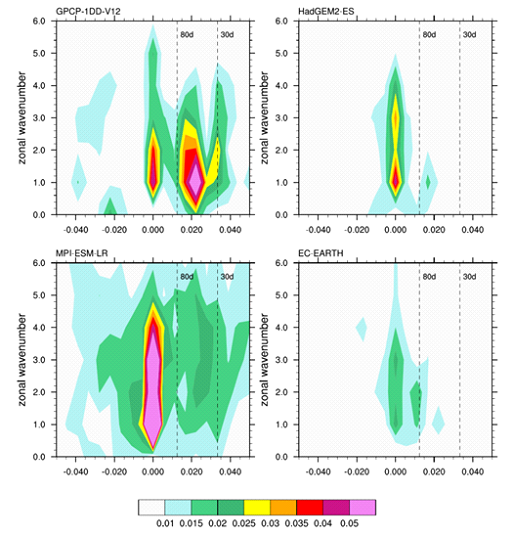
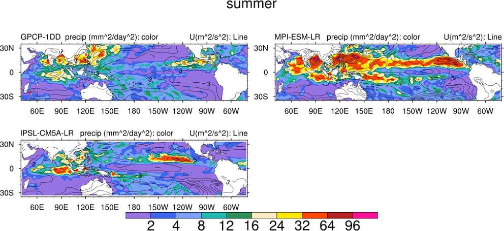

Madden-Julian Oscillation (MJO)
===============================

Overview
--------

To assess the main MJO features in ESMs, a namelist with a number of
diagnostics developed by the US CLIVAR MJO Working Group (Kim et al.,
2009; Waliser et al., 2009) has been implemented in the ESMValTool.
These diagnostics are calculated using precipitation (pr), outgoing
longwave radiation (OLR) (rlut), eastward (ua) and northward wind (va)
at 850 hPa (u850) and 200 hPa (u200) against various observations and
reanalysis data sets for boreal summer (May-October) and winter
(November-April).

Observation and reanalysis data sets include GPCP-1DD for precipitation,
ERA-Interim and NCEP-DOE reanalysis 2 for wind components (Kanamitsu et
al., 2001) and NOAA polar-orbiting satellite data for OLR (Liebmann and
Smith, 1996). The majority of the scripts are based on example scripts
available at http://ncl.ucar.edu/Applications/mjoclivar.shtml. Daily data
is required for most of the scripts. The basic diagnostics include mean
seasonal state and 20-100 day bandpass filtered variance for precipitation
and u850 in summer and winter. To better assess and understand model biases
in the MJO, a number of more sophisticated diagnostics have also been
implemented. These include: univariate empirical orthogonal function (EOF)
analysis for 20-100 day bandpass filtered daily anomalies of precipitation,
OLR, u850 and u200. To illustrate the northward and eastward propagation of
the MJO, lag-longitude and lag-latitude diagrams show either the equatorially
(latitude) averaged (10°S-10ºN) or zonally (longitude) averaged (80ºE-100ºE)
intraseasonal precipitation anomalies and u850 anomalies correlated against
intraseasonal precipitation at an Indian Ocean reference point (75ºE-100ºE,
10ºS-5ºN). Similar figures can also be produced for other key variables and
regions following the definitions of Waliser et al. (2009). To further
explore the MJO intraseasonal variability, the wavenumber-frequency spectra
for each season is calculated for individual variables. In addition, we also
produce cross-spectral plots to quantify the coherence and phase relationships
between precipitation and u850.

Available Namelists and Diagnostics
-----------------------------------

Namelists are stored in nml/

* namelist_mjo_mean_state.xml
* namelist_mjo_daily.xml

Diagnostics are stored in diag_scripts/

* mjo_univariate_eof.ncl
* mjo_wave_freq.ncl
* mjo_precip_u850-200_propagation.ncl
* mjo_precip_uwnd_variance.ncl
* mjo_olr_u850-200_cross_spectra.ncl
* mjo_olr_u850_200_ceof.ncl
* mjo_olr_uv850_ceof_life_cycle.ncl
* mjo_precip_u850_basic_month.ncl

User settings
-------------

User setting files (cfg files) are stored in nml/cfg_mjo/

Variables
---------

* pr (atmos, daily/monthly mean, longitude latitude time)
* rlut (atmos, daily mean, longitude latitude time)
* ua (atmos, daily/monthly mean, longitude latitude level time)
* va (atmos, daily mean, longitude latitude level time)

Observations and Reformat Scripts
---------------------------------

*Note:* (1) obs4mips data can be used directly without any preprocessing;
(2) see headers of reformat scripts for non-obs4mips data for download instructions.

* ERA-Interim (ua, monthly means)

  *Reformat script:* reformat_scripts/obs/ reformat_obs_ERA-Interim.ncl

* GPCP-1DD (pr, daily means  obs4mips)
* GPCP-SG (pr, monthly means  obs4mips)
* NCEP (ua, va, daily means)

  *Reformat script:* reformat_scripts/obs/reformat_obs_NCEP-daily.ncl

* NOAA-PSD-Interp (rlut, daily means)

  *Reformat script:* reformat_scripts/obs/reformat_obs_NOAA-PSD-Interp.ncl

References
----------

* Kanamitsu, M., Kousky, V., van den Dool, H., Jenne, R., and Fiorino, M.:
  The NCEP-NCAR 50-Year Reanalysis: Monthly Means CD-ROM and Documentation,
  B. Am. Meteorol. Soc., 82, 247-267, 2001.
* Kim, D., Sperber, K., Stern, W., Waliser, D., Kang, I. S., Maloney, E.,
  Wang, W., Weickmann, K., Benedict, J., Khairoutdinov, M., Lee, M. I.,
  Neale, R., Suarez, M., Thayer-Calder, K., and Zhang, G.: Application of
  MJO Simulation Diagnostics to Climate Models, J. Climate, 22, 6413-6436, 2009.
* Liebmann, B. and Smith, C. A.: Description of a complete (interpolated)
  outgoing longwave radiation data set, B. Am. Meteorol. Soc., 77, 1275-1277,
  1996.
* Waliser, D., Sperber, K., Hendon, H., Kim, D., Wheeler, M., Weickmann, K.,
  Zhang, C., Donner, L., Gottschalck, J., Higgins, W., Kang, I. S., Legler,
  D., Moncrieff, M., Vitart, F., Wang, B., Wang, W., Woolnough, S., Maloney,
  E., Schubert, S., Stern, W., and Oscillation, C. M.-J.: MJO Simulation
  Diagnostics, J. Climate, 22, 3006-3030, 2009.

Example plots
-------------

.. figure:: ../../source/namelists/figures/MJO/fig_mjo_2.png
   :scale: 50 %
   :alt: xxxx

.. figure:: ../../source/namelists/figures/MJO/fig_mjo_3.png
   :scale: 50 %
   :alt: xxxx

