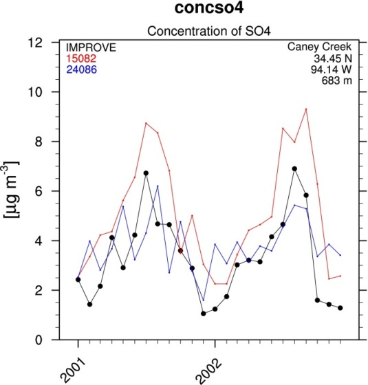
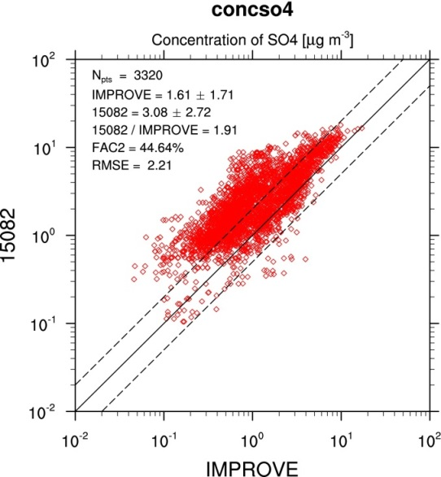
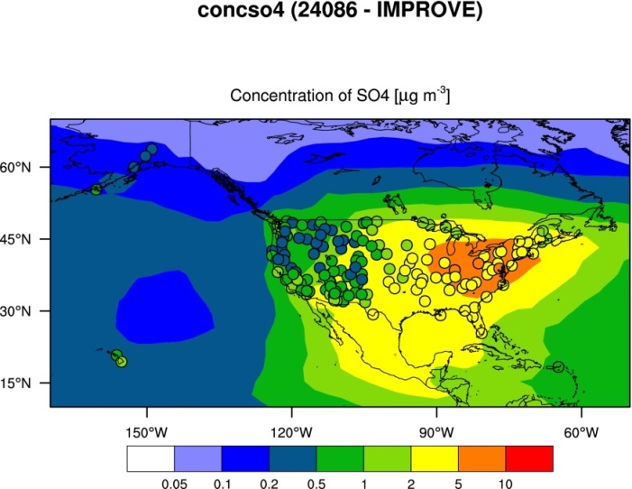
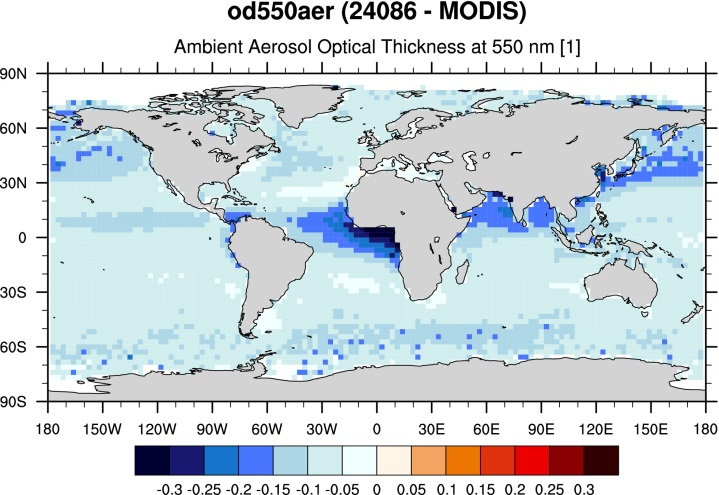
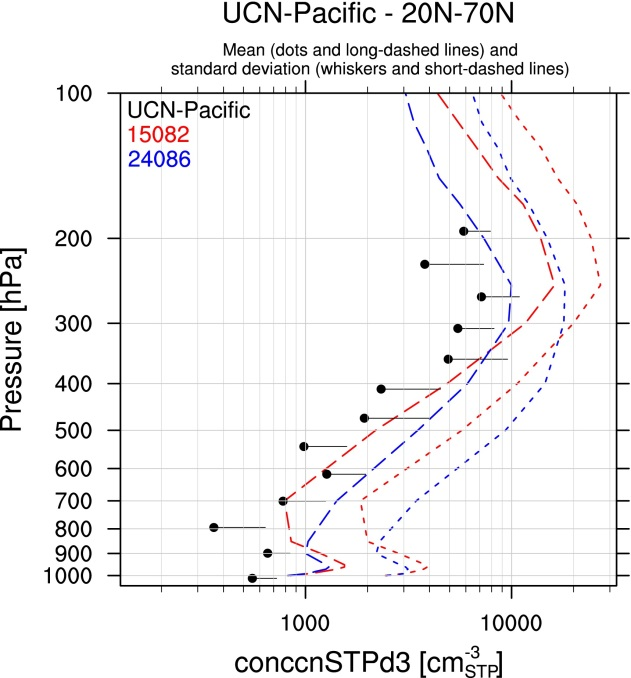
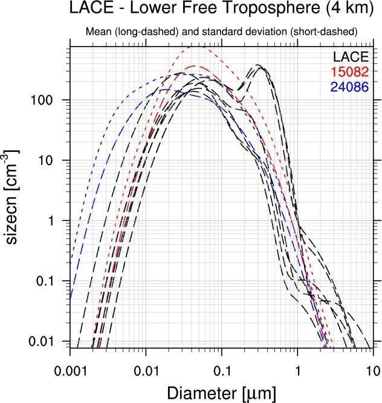

Aerosol
=======

Overview
--------

The aerosol diagnostics currently implemented allow for three kinds of
comparisons:

* *station data*: concentrations of various aerosol species (aerosol sulfate, aerosol nitrate, aerosol ammonium, black carbon, organic carbon, PM2.5 and PM10) are compared with observational data from station networks (IMPROVE and CASTNET for North America, EMEP for Europe and EANET for Asia). Aerosol optical depth (AOD) at 550 nm is compared with AERONET data. The comparison between model and observations is performed considering all available observational data in the selected time period, on a monthly-mean basis. The model data is extracted in the grid boxes where the respective observational stations are located (co-located model and observational data). This diagnostic produces three types of plot: time series (model/observations vs. time), scatter plot (model versus observations) and a map plot (model as contour map, observations as dots using the same color coding).

* *satellite data*: AOD at 550 nm is compared with satellite data (MODIS and MISR). This diagnostic produces contour map plots of the AOD of model and observations, as well as difference plot between model and observations.

* *vertical profiles, size distributions*: vertical profiles of aerosol (mass and number) concentrations and of aerosol size distributions are compared to observational data from aircraft campaigns and ground based stations. The model data are extracted based on the campaign/station location (lat-lon box) and time period (on a climatological basis, i.e. selecting the same days/months, but regardless of the year). The basic statistics is calculated on the selected model data (mean, standard deviation, median, 5-10-25-75-90-95 percentiles) and compared to the same quantities from the observations (where available). This diagnostics supports monthly-mean, daily-mean and instantaneous input data, with the latter two providing a more robust evaluation. For this diagnostic, rather specific variables are required (i.e., aerosol number concentration for particles with diameter larger than 14 nm) to match the properties of the instruments used during the campaign. New CMOR variables have been added and corresponding EMAC recipes have been defined.

Available namelists and diagnostics
-----------------------------------

Namelists are stored in nml/

* namelist_aerosol_CMIP5.xml
* namelist_aerosol_EMAC.xml

Diagnostics are stored in diag_scripts/

* aerosol_stations.ncl
* aerosol_satellite.ncl
* aerosol_profiles.ncl

User settings
-------------

User setting files (cfg files) are stored in nml/cfg_aerosol/CMIP5/ and nml/cfg_aerosol/EMAC/:

**! NOTE ! The cfg files may contain hard coded pathnames (attribute "datapath", see below) for the observational data that have to be set by the user!**
  
1.	aerosol_stations.ncl (AERONET, CASTNET, EANET, EMEP, IMPROVE)
      
   * cfg_aerosol_stations_AERONET.ncl
   * cfg_aerosol_stations_CASTNET.ncl
   * cfg_aerosol_stations_EANET.ncl
   * cfg_aerosol_stations_EMEP.ncl
   * cfg_aerosol_stations_IMPROVE.ncl
   * cfg_aerosol_tsline.ncl

2.	aerosol_satellites.ncl (ESACCI, MISR, MODIS)

   * satellite_ESACCI-AEROSOL.ncl
   * cfg_aerosol_satellite_MISR.ncl
   * cfg_aerosol_satellite_MODIS.ncl

   *Required diag_script_info attributes*

   * ref_model: name of reference data set (e.g., "ESACCI-AEROSOL")
   * styleset: style ("DEFAULT")
   * regrid_method: regridding method (coarsest, finest, ref)
   * range_option: time range option (0: model own time range, 1: intersection between models)

3.	aerosol_profiles.ncl (ACCESS, ACCESS-2, Asmi11, CIRRUS, CONCERT, CR-AVE, DC3, HIPPO, IMPROVE, INCA, LACE, Putaud, SALTRACE, TC4, Texas, UCN-Pacific)

   * cfg_aerosol_profiles_ACCESS.ncl
   * cfg_aerosol_profiles_ACCESS-2.ncl
   * cfg_aerosol_profiles_Asmi11.ncl
   * cfg_aerosol_profiles_CIRRUS.ncl
   * cfg_aerosol_profiles_CONCERT.ncl 
   * cfg_aerosol_profiles_CR-AVE.ncl
   * cfg_aerosol_profiles_DC3.ncl
   * cfg_aerosol_profiles_HIPPO.ncl
   * cfg_aerosol_stations_IMPROVE.ncl
   * cfg_aerosol_profiles_INCA.ncl
   * cfg_aerosol_profiles_LACE.ncl
   * cfg_aerosol_profiles_Putaud.ncl
   * cfg_aerosol_profiles_SALTRACE.ncl
   * cfg_aerosol_profiles_TC4.ncl
   * cfg_aerosol_profiles_Texas.ncl
   * cfg_aerosol_profiles_UCN-Pacific.ncl

   *Required diag_script_info attributes*      

   * campaign: name of measurement campaign (e.g., INCA, LACE, Texas)
   * styleset: "DEFAULT"
   * **datapath: path for campaign data**
   * cc_threshold: cloud cover threshold (%)
   * summary_plot: create a summary with the median of all flights on a single plot
   * exclude_flights: exclude specific flights from the summary plot

Variables
---------

**CMIP5**

* sconcbc, sconcoa, sconcso4
* od550aer, od550lt1aer, abs550aer, od870aer

**EMAC**

* conccnmode, conccnmodeSTP, diamcnmode, cl
* conccnd5, conccnd10, conccnSTPd3, conccnSTPd5, conccnSTPd14, conccnSTPd120
* mmrbc, mmraer, mmrbcfree
* sconcso4, sconcno3, sconcnh4, sconcbc, sconcoa, sconcna, sconccl, sconcpm10, sconcpm2p5
* od550aer

Observations and reformat scripts
---------------------------------

*Note: (1) obs4mips data can be used directly without any preprocessing; (2) see headers of reformat scripts for non-obs4mips data for download instructions.*

* AERONET (reformat_scripts/obs/reformat_obs_AERONET.ncl)
* CASTNET (reformat_scripts/obs/reformat_obs_CASTNET.ncl)
* EANET (reformat_scripts/obs/reformat_obs_EANET.ncl)
* EMEP (reformat_scripts/obs/reformat_obs_EMEP.ncl)
* IMPROVE (reformat_scripts/obs/reformat_obs_IMPROVE.ncl)
* MODIS (obs4mips)
* MISR (obs4mips)
* ESACCI-AEROSOL (reformat_scripts/obs/reformat_obs_ESACCI-AEROSOL.ncl)
* ACCESS (reformat_scripts/obs/reformat_obs_ACCESS.ncl)
* ACCESS-2 (reformat_scripts/obs/reformat_obs_ACCESS-2.ncl)
* Asmi11 (reformat_scripts/obs/reformat_obs_Asmi11.ncl)
* CIRRUS (reformat_scripts/obs/reformat_obs_CIRRUS.ncl)
* CONCERT (reformat_scripts/obs/reformat_obs_CONCERT.ncl)
* CR-AVE (reformat_scripts/obs/reformat_obs_CR-AVE.ncl)
* DC3 (reformat_scripts/obs/reformat_obs_DC3.ncl)
* HIPPO (reformat_scripts/obs/reformat_obs_HIPPO.ncl)
* INCA (reformat_scripts/obs/reformat_obs_INCA.ncl)
* LACE (reformat_scripts/obs/reformat_obs_LACE.ncl)
* Putaud (reformat_scripts/obs/reformat_obs_Putaud.ncl)
* SALTRACE (reformat_scripts/obs/reformat_obs_SALTRACE.ncl)
* TC4 (reformat_scripts/obs/reformat_obs_TC4.ncl)
* Texas (reformat_scripts/obs/reformat_obs_Texas.ncl)
* UCN-Pacific (reformat_scripts/obs/reformat_obs_UCN-Pacific.ncl)

References
----------

* Aquila, V. et al., MADE-in: a new aerosol microphysics submodel for global simulation of insoluble particles and their mixing state. Geosci. Model Dev. 4 (2), 325-355 (2011).

* Lauer, A. et al., Simulating aerosol microphysics with the EMAC/MADE GCM - Part I: Model description and comparisons with observations. Atmos. Chem. Phys. 5 (12), 3251-3276 (2005). 

* Righi, M. et al.. The global impact of the transport sectors on atmospheric aerosol: Simulations for year 2000 emissions. Atmos. Chem. Phys. 13 (19), 9939-9970 (2013).

Example plots
-------------

.. centered:: |pic_aerosol_1| |pic_aerosol_2|

.. centered:: |pic_aerosol_3| |pic_aerosol_4|

.. |pic_aerosol_3| image:: ../../source/namelists/figures/aerosol/figure_namelist_aerosol_conc_SO4_spatial_global.png
   :width: 45%

.. centered:: |pic_aerosol_5| |pic_aerosol_6|

