South asian monsoon
===================

Overview
--------

Three South Asian Summer Monsoon (SASM) namelists for the basic climatology, seasonal cycle, intra-seasonal and inter-annual variability and key teleconnections have been implemented into the ESMValTool focusing on SASM rainfall and horizontal winds in June-September (JJAS). The goal is to provide a comprehensive overview of the basic features of the South Asian Monsoon for a certain model compared to other models, observational and reanalysis data sets for a range of processes and variables relevant to the monsoon.

Available Namelists and Diagnostics
-----------------------------------

Namelists are stored in nml/

* namelist_SAMonsoon_AMIP.xml
* namelist_SAMonsoon_daily.xml
* namelist_SAMonsoon.xml

Diagnostics are stored in diag_scripts/

* SAMonsoon_precip_basic.ncl
* SAMonsoon_precip_daily.ncl
* SAMonsoon_precip_domain.ncl
* SAMonsoon_precip_IAV.ncl
* SAMonsoon_precip_propagation.ncl
* SAMonsoon_precip_seasonal.ncl
* SAMonsoon_teleconnections.ncl
* SAMonsoon_wind_basic.ncl
* SAMonsoon_wind_IAV.ncl
* SAMonsoon_wind_seasonal.ncl

User settings
-------------

User setting files (cfg files) are stored in nml/cfg_SAMonsoon/

    #. SAMonsoon_wind_basic.ncl

        *Required diag_script_info attributes*

        * styleset: "CMIP5", "DEFAULT"
        * season: season in letters, e.g., "JJAS"
        * latrange_basic: min. and max. latitude of crop area (array)
        * lonrange_basic: min. and max. longitude of crop area (array)
        * cn_levels_mean_basic: contour levels for mean plots (array)
        * cn_levels_mean_diff_basic: contour levels for mean difference plots (array)
        * cn_levels_stddev_basic: contour levels for standard deviation plots (array)
        * cn_levels_stddev_diff_basic: contour levels for standard deviation difference plots (array) 
        * my_region: monsoon region (must be set to "SA")

    #. SAMonsoon_wind_seasonal.ncl, SAMonsoon_wind_IAV.ncl

        *Required diag_sccript_info attributes*

        * styleset: "CMIP5", "DEFAULT"
        * season: season in letters, e.g., "JJAS"
        * multi_model_mean : calculate multi-model mean ("y", "n")

    #. SAMonsoon_precip_basic.ncl, SAMonsoon_precip_seasonal.ncl, SAMonsoon_precip.ncl, SAMonsoon_precip_domain.ncl, SAMonsoon_precip_basic_daily.ncl, SAMonsoon_precip_IAV.ncl, SAMonsoon_precip_propagation.ncl

        *Required diag_script_info attributes*

        * season: season in letters, e.g., "JJAS"

        Settings specific for the precip basic plot_type

        * latrange_basic: min. and max. latitude (2-element array)
        * lonrange_basic: min. and max longitude (2-element array)
        * cn_levels_mean_basic: contour levels for mean plots (n-element array)
        * cn_levels_mean_diff_basic: contour levels for mean difference plots (n-element array)
        * cn_levels_stddev_basic: contour levels for standard deviation plots (n-element array)
        * cn_levels_stddev_diff_basic: contour levels for standard deviation difference plots (n-element array)
        * cn_levels_stddev_norm_basic (only SAMonsoon_precip_basic_daily.ncl): contour levels for standard deviation plots (n-element array)
        * cn_levels_stddev_norm_diff_basic (only SAMonsoon_precip_basic_daily.ncl): contour levels for standard deviation difference plots (n-element array)

        Settings specific for the precip seasonal plot_type (SAMonsoon_precip_seasonal.ncl)

        * latrange_seasonal: min. and max. latitude of crop area (2-element array)
        * lonrange_seasonal: min. and max. longitude of crop area (2-element array)
        * styleset: "CMIP5", "DEFAULT"
        * multi_model_mean : calculate multi-model mean ("y", "n")

        Settings shared by the precip global domain/intensity plot_type

        * summer_season: "MJJAS"
        * winter_season: "NDJFM"

        Settings specific for the precip global domain plot_type

        * latrange_global: min. and max. latitude (2-element array)
        * cn_levels_global_domain_mean: contour levels for global domain plots (array)
        * cn_levels_global_domain_diff: contour levels for global domain difference plots (array)
        * high_intensity_cutoff_mmday: cut-off for monsoon domain definition in mm day-1

        Settings specific for the precip intensity plots

        * cn_levels_intensity_mean: contor levels for intensity mean plots (n-element array)
        * cn_levels_intensity_diff: contor levels for intensity difference plots (n-element array)
        * abs_cmap: path and filename of color map for absolute values
        * diff_cmap: path and filename of color map for difference values
        * my_region: monsoon region (must be set to "SA")

        Settings specific for daily precipitation plots (SAMonsoon_precip_daily.ncl)

        * isv_latrange: min. and max. latitude of crop area (2-element array)
        * isv_lonrange: min. and max. latitude of crop area (2-element array)
        * bob_latrange: min. and max. latitude of crop area for Bay of Bengal (2-element array)
        * bob_lonrange = min. and max. longitude of crop area for Bay of Bengal (2-element array)
        * eio_latrange: min. and max. latitude of crop area for eastern equatorial Indian Ocean (2-element array)
        * eio_lonrange: min. and max. longitude of crop area for eastern equatorial Indian Ocean (2-element array)
        * filter_min: lower limit used for filtering
        * filter_max: upper limit used for filtering
        * filter_weights: number of filter weights to use

        Settings specific for daily propagation plots (SAMonsoon_precip_propagation.ncl)

        * prop_isv_latrange: min. and max. latitude of crop area (2-element array)
        * prop_isv_lonrange: min. and max. longitude of crop area (2-element array)
        * prop_lag_latrange: min. and max. latitude of crop area for lag computation along longitude (2-element array)
        * prop_lag_lonrange: min. and max. longitude of crop area for lag computation along latitude (2-element array)
        * prop_ref_latrange: min. and max. latitude of crop area for lag reference area (2-element array)
        * prop_ref_lonrange: min. and max. longitude of crop area for lag reference area (2-element array)
        * prop_filter_mxlag: size of lag
        * ihp: Lanczos switch for low/high band pass filter
        * nWgt: total number of weights for Lanczos
        * sigma: Lanczos sigma
        * min_days: min days in filtering
        * max_days: max day in filtering
        * fca: start frequency to compute Lanczos weights
        * fcb: end frequency to compute Lanczos weights

    #. SAMonsoon_teleconnections.ncl

        *Required diag_script_info attributes*

        * monsoon_latrange: min. and max. latitude of crop area for Indian Monsoon (2-element array)
        * monsoon_lonrange: min. and max. longitude of crop area for Indian Monsoon (2-element array)
        * nino34_latrange: min. and max. latitude of Niño3.4 region (2-element array)
        * nino34_lonrange: min. and max. longitude of Niño3.4 region (2-element array)
        * tele_latrange: min. and max. latitude of crop area for overview area (2-element array)
        * tele_lonrange: min. and max. longitude of crop area for overview area (2-element array)
        * cn_levels_mean_basic: contour levels for mean plot (n-element array)
        * cn_levels_mean_diff_basic: contour levels for mean difference plot (n-element array)
        * cn_levels_stddev_basic: contour levels for standard deviation plot (n-element array)
        * cn_levels_stddev_diff_basic: contour levels for standard deviation difference plot (n-element array)

Variables
---------

* pr (atmos, daily/monthly, longitude latitude time)
* ts (atmos, monthly, longitude latitude time)
* ua (atmos, monthly, longitude latitude lev time)
* va (atmos, monthly, longitude latitude lev time)

Observations and Reformat Scripts
---------------------------------

**Note**: (1) obs4mips data can be used directly without any preprocessing; (2) see headers of reformat scripts for non-obs4mips data for download instructions.

* ERA-Interim (ua, va, pr – reformat_scripts/obs/reformat_obs_ERA-Interim.ncl, reformat_obs_ERA-Interim_surffluxes.ncl)
* NCEP (ua, va – reformat_scripts/obs/reformat_obs_NCEP.ncl)
* TRMM-L3 (pr, monthly means – obs4mips)
* TRMM_3B42 (pr, daily means – reformat_scripts/obs/reformat_obs_TRMM-3B42-daily.ncl)
* HadISST (ts – reformat_scripts/obs/reformat_obs_HadISST.ncl)
* GPCP-1DD (pr, daily means – obs4mips)
* GPCP-SG (pr, monthly means – obs4mips)
* MERRA (pr – obs4mips)
* CMAP (pr – reformat_scripts/obs/reformat_obs_CMAP.ncl)

References
----------

* Sperber, K. R., et al., The Asian summer monsoon: an intercomparison of CMIP5 vs. CMIP3 simulations of the late 20th century, Clim Dyn (2013) 41:2711–2744, doi: 10.1007/s00382-012-1607-6, 2012.
* Lin, Jia-Lin, Klaus M. Weickman, George N. Kiladis, Brian E. Mapes, Siegfried D. Schubert, Max J. Suarez, Julio T. Bacmeister, Myong-In Lee, 2008: Subseasonal Variability Associated with Asian Summer Monsoon Simulated by 14 IPCC AR4 Coupled GCMs. J. Climate, 21, 4541-4567. doi: http://dx.doi.org/10.1175/2008JCLI1816.1.
* Webster, P. J., and S.Yang, 1992: Monsoon and ENSO: Selectively interactive systems. Quart. J. Roy. Meteor. Soc., 118, 877-926. (Webster-Yang dynamical monsoon index)
* Goswami, B. N., B. Krishnamurthy, and H. Annamalai, 1999: A broad-scale circulation index for interannual variability of the Indian summer monsoon. Quart. J. Roy. Meteor. Soc., 125, 611-633. (Goswami dynamical monsoon index)
* Wang, B., and Z. Fan, 1999: Choice of south Asian summer monsoon indices. Bull. Amer. Meteor. Soc., 80, 629-638. (Wang-Fan dynamical monsoon index)
* Wang B., J. Liu, H. J. Kim, P. J. Webster, and S. Y. Yim, Recent change of global monsoon precipitation (1979-2008), Climate Dynamics, doi: 10.1007/s00382-011-1266-z, 2011. (Intensity/Monsoon domain reference)

Example plots
-------------

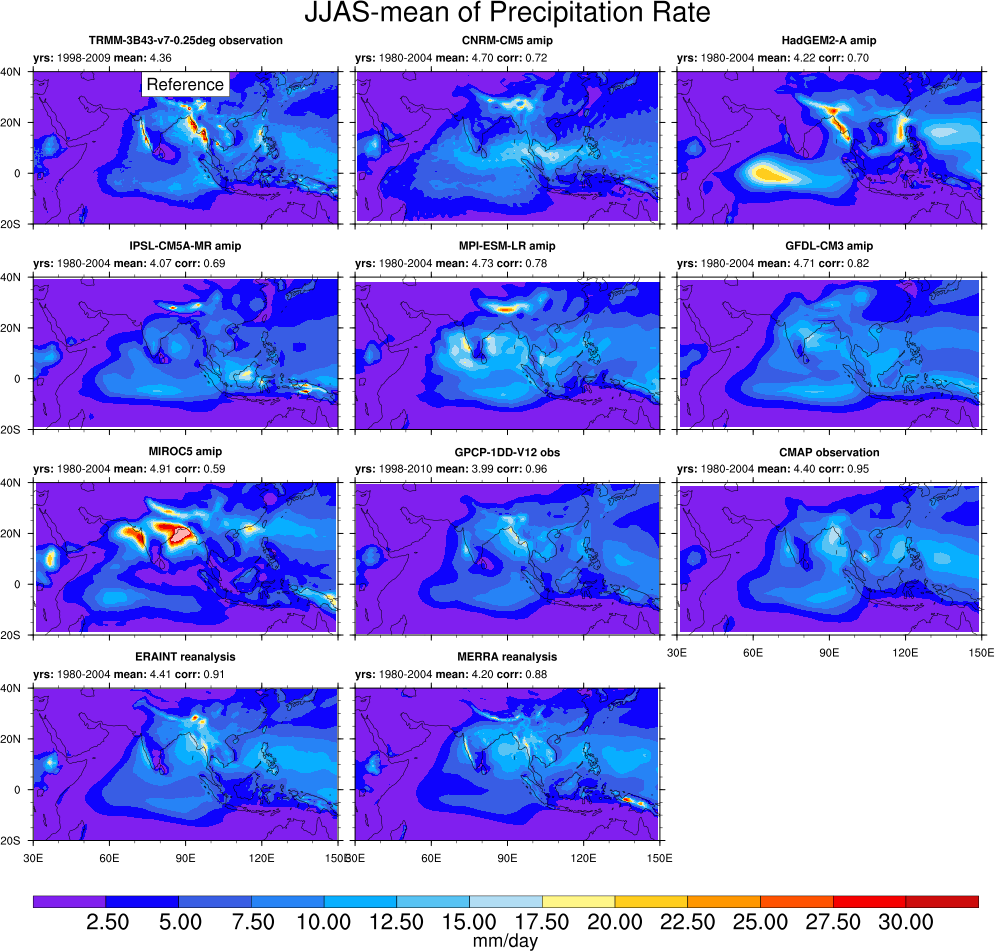
   

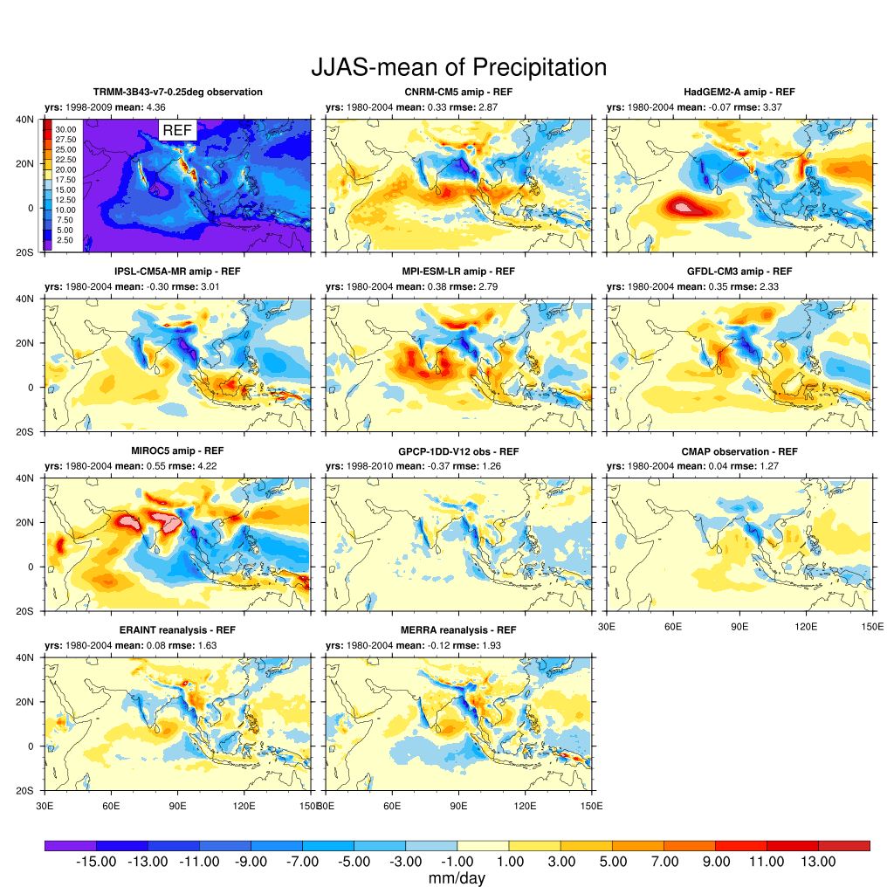

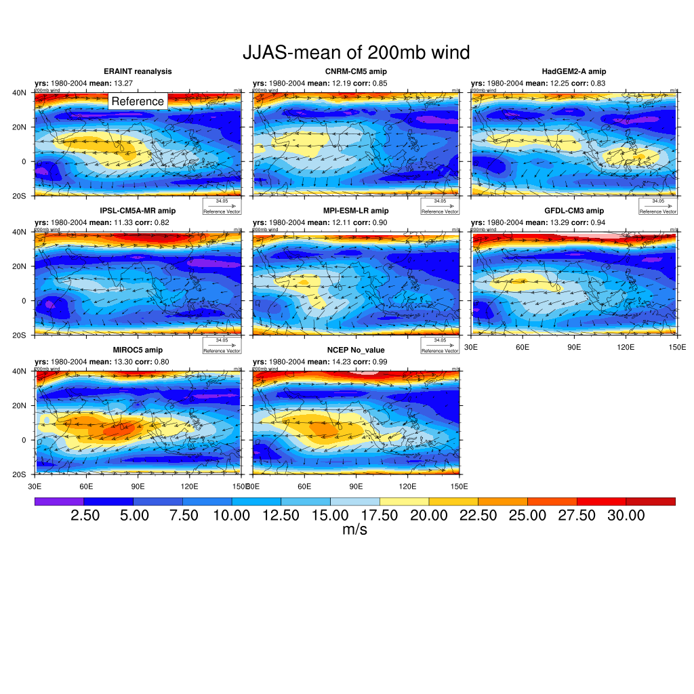

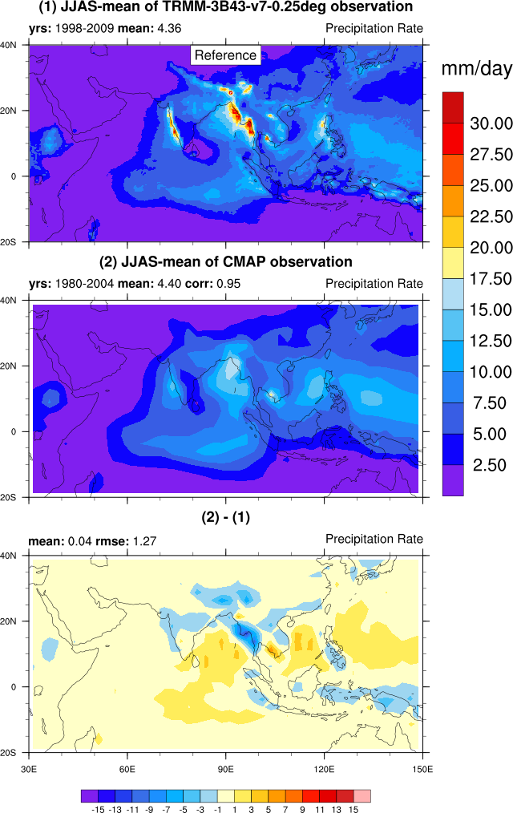

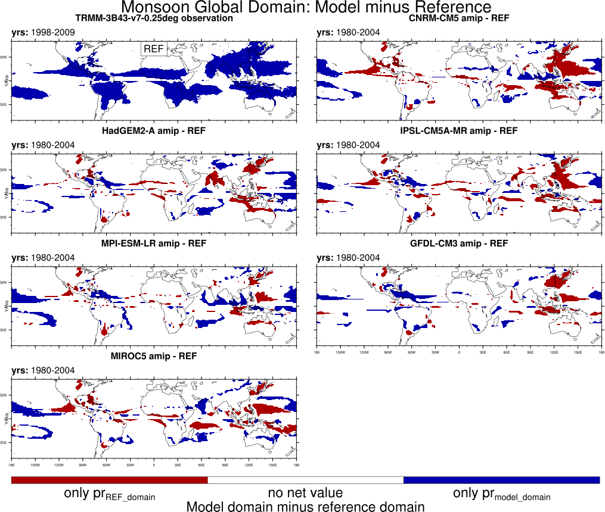

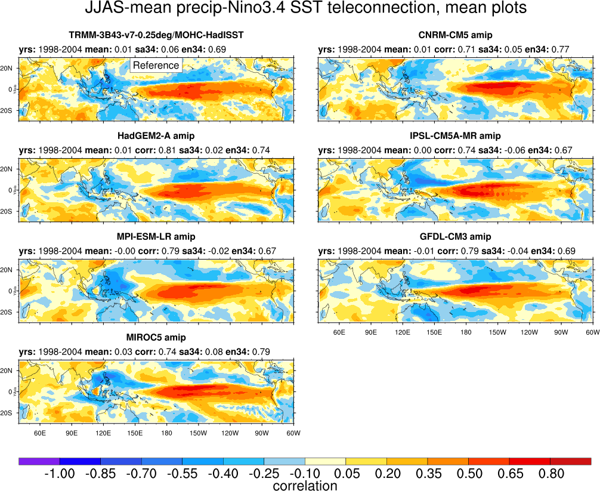

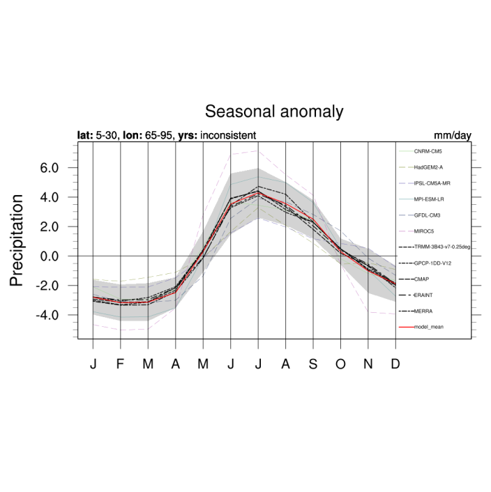

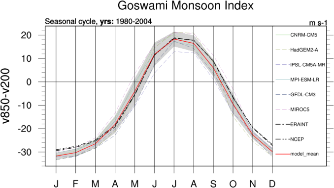

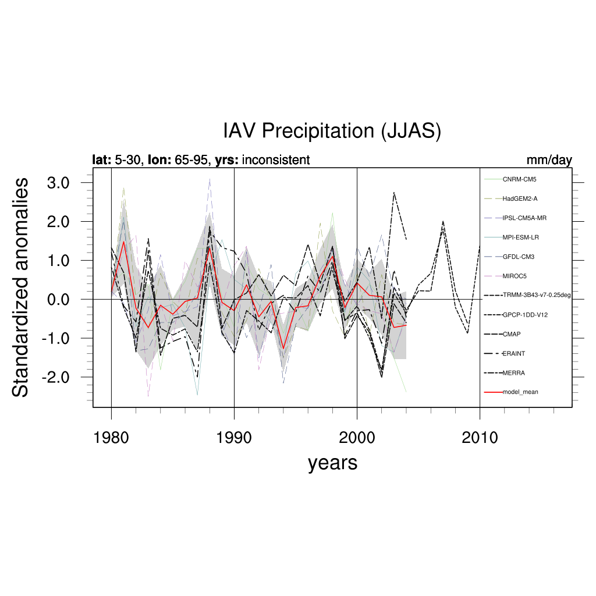

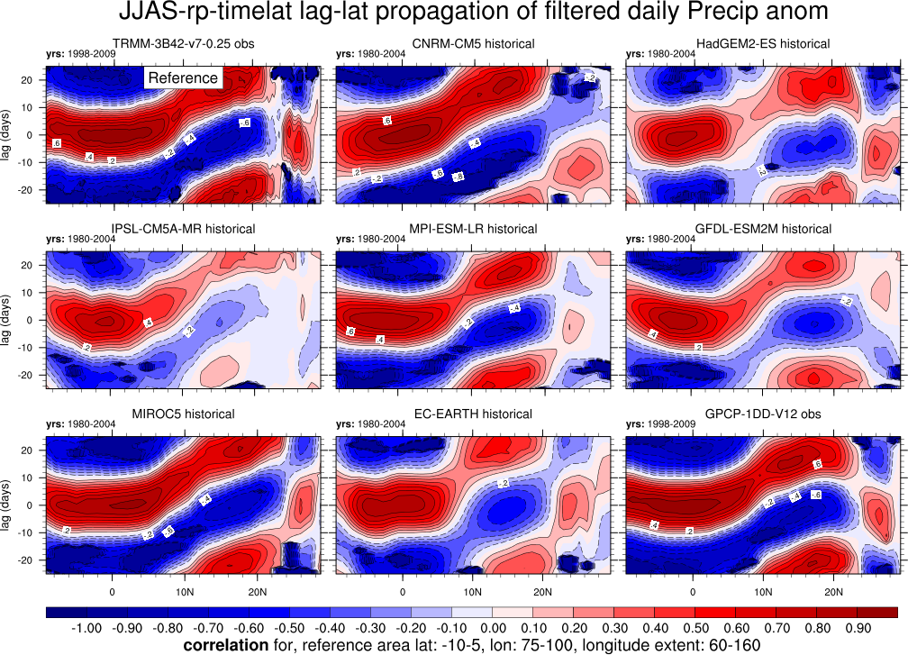
   

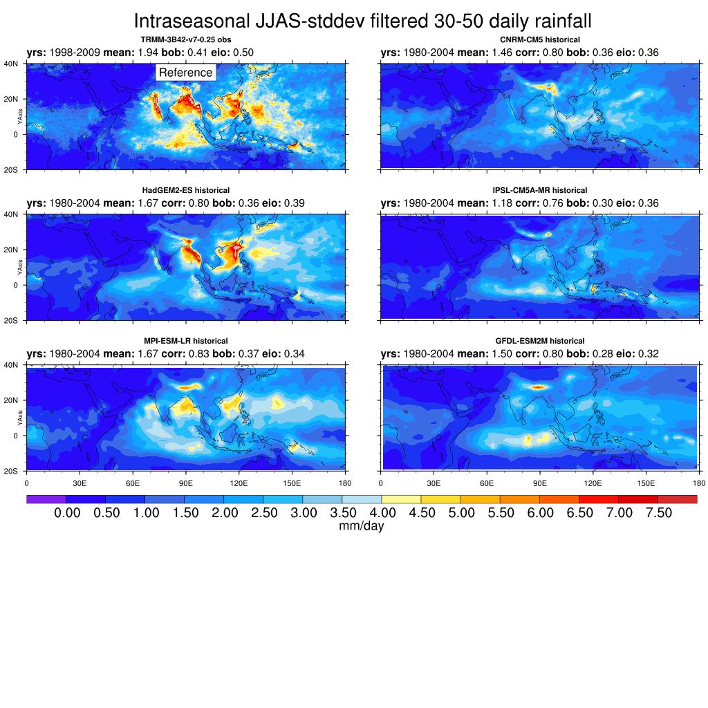

