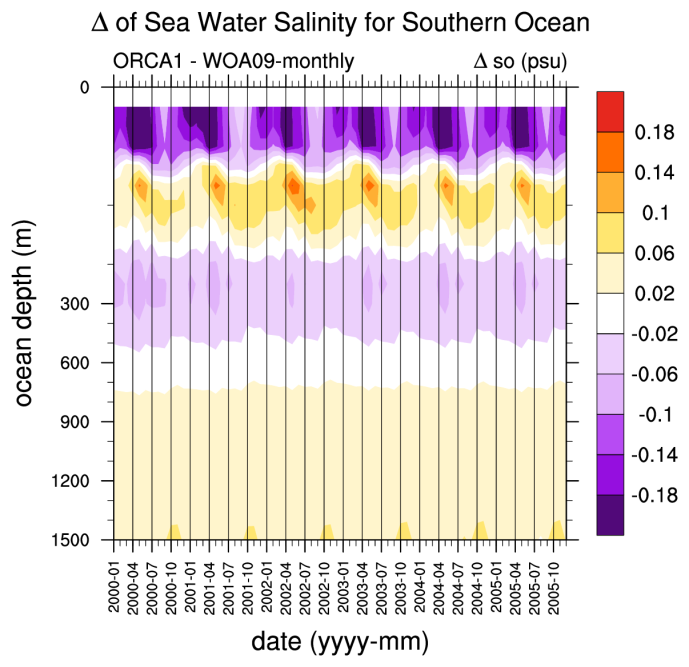
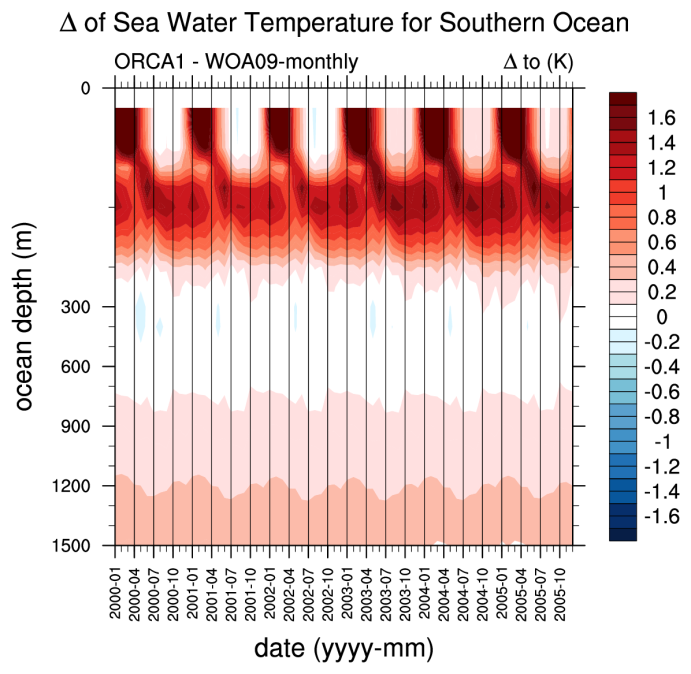
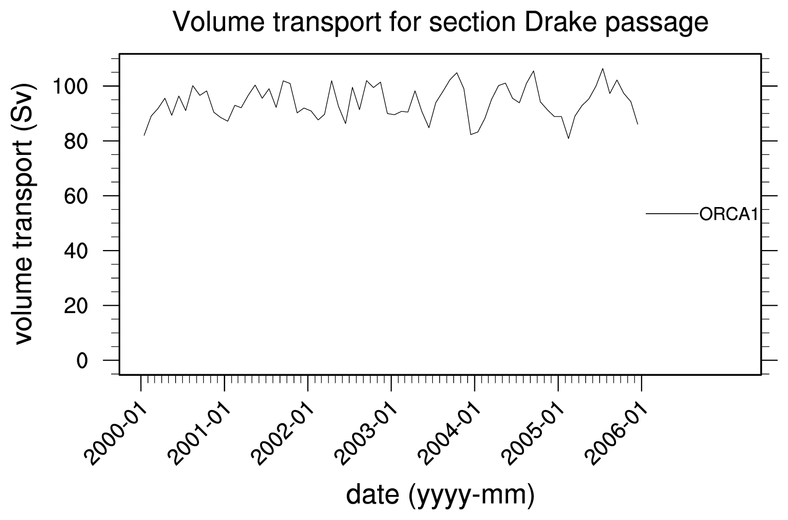
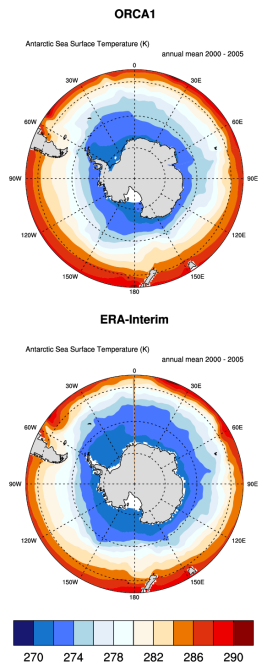
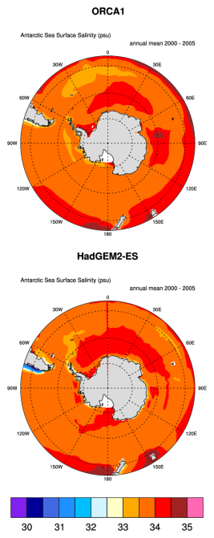

South Asian Monsoon
=====================

Overview
--------

TBD

Available Namelists and Diagnostics
-----------------------------------

TBD

User settings
-------------

TBD

Variables
---------

TBD

Observations and Reformat Scripts
---------------------------------

TBD

References
----------

TBD

Example plots
-------------

   

.. figure:: ../../source/namelists/figures/southern_ocean/fig4.png
   :scale: 50 %
   :alt: xxxx

.. figure:: ../../source/namelists/figures/southern_ocean/fig5.png
   :scale: 50 %
   :alt: xxxx

.. figure:: ../../source/namelists/figures/southern_ocean/fig8.png
   :scale: 50 %
   :alt: xxxx

.. figure:: ../../source/namelists/figures/southern_ocean/fig9.png
   :scale: 50 %
   :alt: xxxx

.. figure:: ../../source/namelists/figures/southern_ocean/fig10.png
   :scale: 50 %
   :alt: xxxx
   

.. figure:: ../../source/namelists/figures/southern_ocean/fig11.png
   :scale: 50 %
   :alt: xxxx

