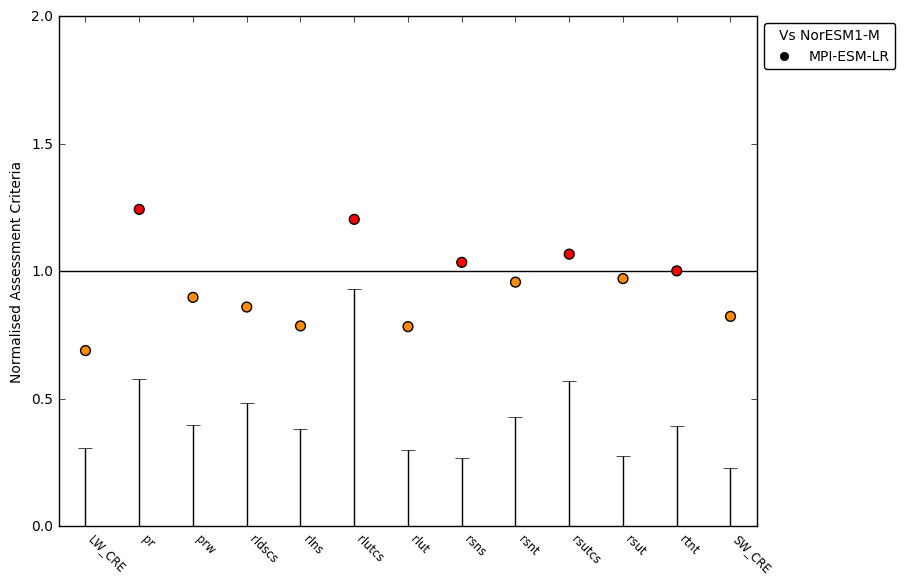

AutoAssess Radition RMS errors
==============================

Overview
--------
  
The goal of this effort is to code up routines of calculate RMS errors in AutoAssess Radiation and draw a summary plot, so that errors in two models or versions simulations can be compared.

Available Namelists and Diagnostics
-----------------------------------

Namelists are stored in nml/

* namelist_AutoAssess_radiation_rms_Amon_all.xml
* namelist_AutoAssess_radiation_rms_cfMon_all.xml

Diagnostics are stored in diag_scripts/

AutoAssess radiation calculates the spatial RMS errors of diagnostics of radiation budget, cloud and hydrological cycle. Specifically,

* TOA Net Incoming Total Radiation 
* TOA Net Incoming Shortwave Radiation 
* TOA Outgoing Shortwave Radiation
* TOA Outgoing Longwave Radiation
* TOA Outgoing Clear-Sky Shortwave Radiation
* TOA Outgoing Clear-Sky Longwave Radiation
* TOA Shortwave Cloud Radiative Effect
* TOA Longwave Cloud Radiative Effect
* Surface Net Downwelling Shortwave Radiation
* Surface Net Downwelling Longwave Radiation 
* Surface Downwelling Clear-Sky Longwave Radiation 
* ISCCP High Level Intermediate Cloud Fraction 
* ISCCP High Level Thick Cloud Fraction 
* ISCCP Middle Level Intermediate Cloud Fraction 
* ISCCP Middle Level Thick Cloud Fraction 
* ISCCP Low Level Intermediate Cloud Fraction 
* ISCCP Low Level Thick Cloud Fraction
* Water Vapor Path
* Precipitation

Following variables are defined so that they can be evaluated after their COSP outputs become available.

* CCI Total Cloud Fraction 
* CCI High Level Intermediate Cloud Fraction 
* CCI High Level Thick Cloud Fraction 
* CCI Middle Level Intermediate Cloud Fraction 
* CCI Middle Level Thick Cloud Fraction 
* CCI Low Level Intermediate Cloud Fraction 
* CCI Low Level Thick Cloud Fraction 
* CCI Total Liquid Cloud Area Fraction
* CCI Mean Cloud Top Pressure

The main plot is a summary plot which shows normalized RMS errors of different diagnostics in a model (version) relative to those in another model (version).

Specific Routines
-----------------

See the individual namelists for specific routines.

**Summary Plot**

A python program which draw a summary plot: plot_scripts/python/plot_norm_ac_ideal.py

A script to run the program:
plot_scripts/python/AutoAssess_radiation_summary/Plot_AutoAssess_radiation_summary.csh
(Please follow instructions written in the script to obtain a summary file with RMS errors for multi variables.)

Observational uncertainty can be calculated using the second reference data. See below how to calculate observational uncertainty for other variables.

**Observational Uncertainty**

Observational uncertainty is defined by the RMS difference of two reference dataset. 
Area mean of this RMS difference can be calculated by using the AutoAssess_radiation programs, giving two reference data as input to the program. This value can be plotted as an uncertainty bar for each variable in the summary plot. 
As an example, the file radiation_obs2_cmipname_ANN.csv.example contains the RMS differences calculated with the example namelist nml/namelist_AutoAssess_radiation_rms_Amon_all_obs.xml. 

The following steps are required to obtain a summary plot with observational uncertainty bars:

* Calculate the RMS difference of two reference dataset

  * An example namelist file: nml/namelist_AutoAssess_radiation_rms_Amon_all_obs.xml

* You get csv files for each diagnostics with the RMS difference value in each file: summary_global_<observational data name for the diagnostic>.csv  (e.g. summary_global_CERES-EBAF.csv)

* Create a file 'radiation_obs2_cmipname_ANN.csv' under the directory 'plot_scripts/python/AutoAssess_radiation_summary' and add the diagnostics names with their RMS difference values

  * There is a template file:

    plot_scripts/python/AutoAssess_radiation_summary/radiation_obs2_cmipname_ANN.csv.template 

  * Edit the file (with your favourite editor) by replacing the undefined value to the calculated RMS difference value

  * If the RMS difference value is not available, please set undefined value '-10000', instead

* Run Plot_AutoAssess_radiation_summary.csh

Variables
---------

* rlut (atmos, monthly mean, longitude, latitude, time)
* rlutcs (atmos, monthly mean, longitude, latitude, time)
* rsut (atmos, monthly mean, longitude, latitude, time)
* rsutcs (atmos, monthly mean, longitude, latitude, time)
* rsdt (atmos, monthly mean, longitude, latitude, time)
* rsds (atmos, monthly mean, longitude, latitude, time)
* rsus (atmos, monthly mean, longitude, latitude, time)
* rlds (atmos, monthly mean, longitude, latitude, time)
* rlus (atmos, monthly mean, longitude, latitude, time)
* rldscs (atmos, monthly mean, longitude, latitude, time)
* prw (atmos, monthly mean, longitude, latitude, time)
* pr (atmos, monthly mean, longitude, latitude, time)
* clisccp (atmos, monthly mean, longitude, latitude, time)
 
Observations and Scripts
------------------------

* Reference data (and the second reference data which are currently available in a readable netCDF format to the program to estimate the observational uncertainty)
* obs4mips CERES-EBAF L3B   Ed2-8 (CERES CERES_SYN1deg-Month  Terra-Aqua-MODIS Ed3A)
* obs4mips    SSMI  L3  RSS (obs4mips    SSMI-MERIS L3 V1-00)
* obs4mips    GPCP-SG  L3  v2.2
* ana4mips JRA-55 Amon reanalysis 
* obs4mips ISCCP_L3_V1.0

* Global mean of the RMS difference of variables are in

  scripts/python/AutoAssess_radiation_summary/radiation_obs2_cmipname_ANN.csv.new

Example Plots
-------------

