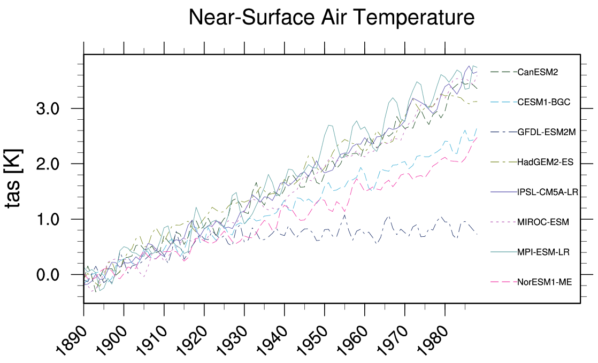
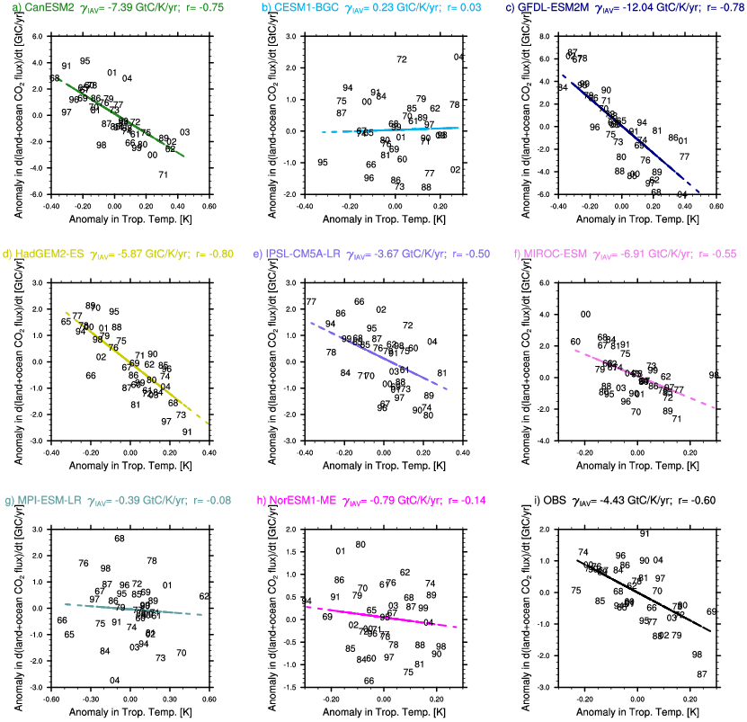
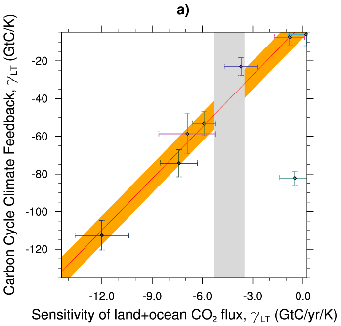
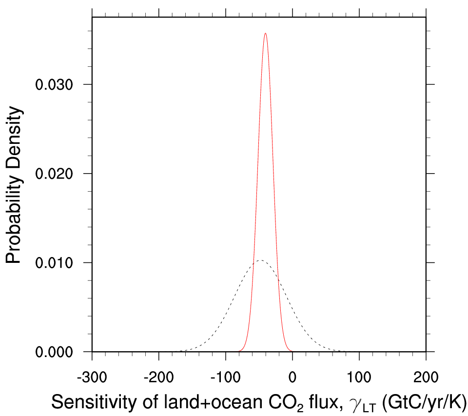

Emergent constraints on carbon cycle feedbacks
==============================================

Overview
--------

Figures from Wenzel et al. (2014) are reproduced with namelist_wenz14jgr.xml. Variables relevant for the carbon cycle-climate feedback such as near surface air temperature (tas), net biosphere productivity (nbp) and (fgco2) are analyzed for coupled (1pctCO2; here the carbon cycle is fully coupled to the climate response) and uncoupled (esmFixCLim1; here the carbon cycle is uncoupled to the climate response) simulations. The standard namelist includes a comparison of cumulated nbp from coupled and uncoupled simulations and includes a set of routines to diagnose the long-term carbon cycle-climate feedback parameter (GammaLT) from an ensemble of CMIP5 models. Also included in the namelist is a comparison of the interannual variability of nbp and fgco2 for historical simulations used to diagnose the observable sensitivity of CO2 to tropical temperature changes (GammaIAV). As a key figure of this namelist, the diagnosed values from the models GammaLT vs. GammaIAV are compared in a scatter plot constituting an emergent constraint.

Available namelists and diagnostics
-----------------------------------

Namelists are stored in nml/

* namelist_wenzel14jgr.xml

Diagnostics are stored in diag_scripts/

* tsline.ncl: time line plots of annual means for spatial averages
* carbon_corr_2var.ncl: scatter plot of annual mean anomalies of two different variables; diagnosing and saving GammaIAV
* carbon_constraint.ncl: scatter plot of GammaLT vs. GammaIAV + line plot of probability density functions; diagnosing GammaLT

User settings
-------------

User setting files (cfg files) are stored in nml/cfg_carbon/

    #.	tsline (cfg_carbon_line.ncl, cfg_carbon_line_h.ncl)

        *Required diag_script_info attributes*

        * styleset: "CMIP5"
        * ts_minlat: minimum latitude for area-averaging
        * ts_maxlat: maximum latitude for area-averaging
        * ts_minlon: minimum longitude for area-averaging
        * ts_maxlon: maximum longitude for area-averaging
        * multi_model_mean: True for multi-model mean calculation
        * ts_maxyear: last year (time range)
        * ts_minyear: first year (time range)
        * time_avg: "yearly" (currently, only yearly is available)
        * ts_anomaly: calculates anomalies with respect to the first 10-year average (anom, noanom)
        * area_opper: type of area operation (average, sum)

    #.	ts_line (cfg_carbon_line_h.ncl)

        Required diag_script_info attributes

        * ts_detrend: detrend time series (detr, nodetr)

    #.	create_co2_flux.ncl, carbon_corr_2var.ncl

        Required diag_script_info attributes

        * styleset: "CMIP5"
        * con_latrange: 2-element array of latitudes for time series plots if 2D or 3D
        * con_lonrange: 2-element array of pressure levels for time series plots if 2D or 3D
        * con_units: label string for units, e.g., "GtC/K"
        * pcBGC: label for CMIP5 experiment (for creating filename mask), e.g., "esmFixClim1"
        * reg_models: models to be included in emergent constraint (n-element array or (/"all"/)); **note: has to be consistent with the list of models specified in the namelist!**

Variables
---------

* tas (atmos, monthly mean, longitude latitude time)
* co2 (atmos, monthly mean, plev longitude latitude time)
* nbp (land, monthly mean, longitude latitude time)
* fgco2 (ocean, monthly mean, longitude latitude time)

Observations and reformat scripts
---------------------------------

**Note:** (1) obs4mips data can be used directly without any preprocessing; (2) see headers of reformat scripts for non-obs4mips data for download instructions.

* GCP - Global Carbon Budget including land (nbp) and ocean (fgco2) carbon fluxes
Reformat script: reformat_scripts/obs/reformat_obs_GCP.ncl
* NCEP - National Centers for Environmental Prediction reanalysis data for near surface temperature
Reformat script: reformat_scripts/obs/reformat_obs_NCEP.ncl

References
----------

* Cox, P. M., D. B. Pearson, B. B. Booth, P. Friedlingstein, C. C. Huntingford, C. D. B. Jones, and C. M. Luke, 2013, Sensitivity of tropical carbon to climate change constrained by carbon dioxide variability, Nature, 494(7437), 341–344. doi: 10.1038/nature11882
* Wenzel, S., P. M. Cox, V. Eyring, and P. Friedlingstein, 2014, Emergent Constraints on Climate Carbon Cycle Feedbacks in the CMIP5 Earth System Models, JGR Biogeoscience, 119(5), doi: 2013JG002591.

Example plots
-------------

   
   Time series of tropical (30°S - 30°N) mean near surface temperature (tas) change between year 30 and year 110 for the CMIP5 models simulated with prescribed CO2 (1%/yr CO2 increase) coupled simulation (1pctCO2).
   
   

   
   Correlations between the interannual variability of global co2flux (nbp+fgco2) and tropical temperature for the individual CMIP5 models using esmHistorical simulations, and for observations.

   Carbon cycle-climate feedback of tropical land carbon vs. the sensitivity of co2flux to interannual temperature variability in the tropics (30°S-30°N). The red line shows the linear best fit of the regression together with the prediction error (orange shading) and the gray shading shows the observed range.
   
   
   

   
   Probability Density Functions for the pure CMIP5 ensemble (black dashed) and after applying the observed constraint to the models (red solid)

