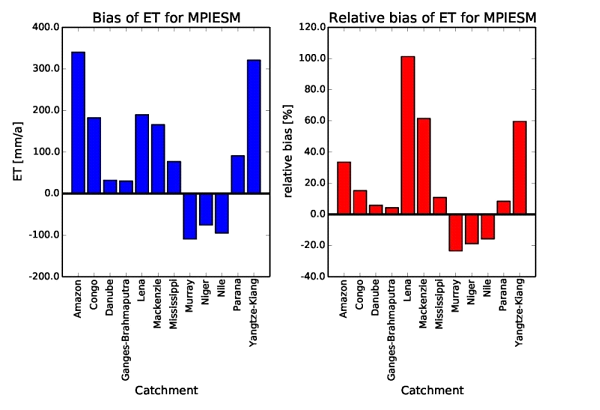
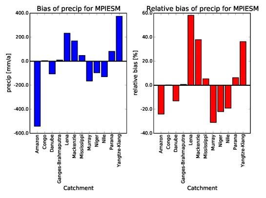
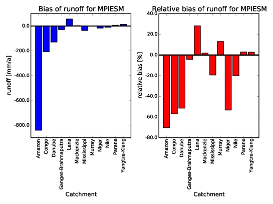
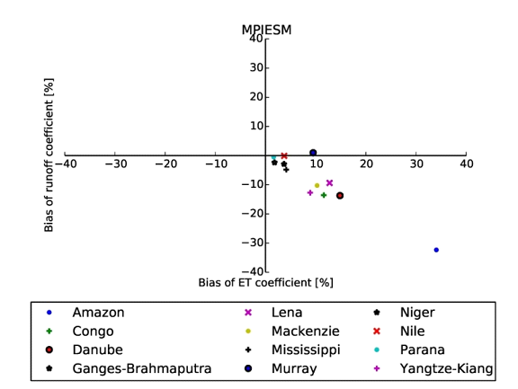
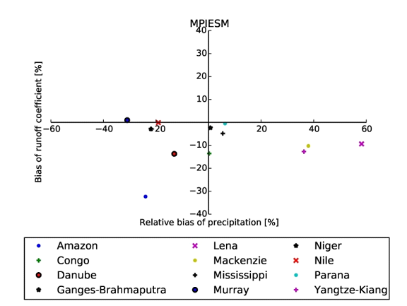

Catchment Analysis
=====================

Overview
--------

This diagnostic calculates biases of long-term climatological annual means
of total runoff, precipitation and evapotranspiration for 12 large-scale
catchments on different continents and climates. For total runoff, catchment
averaged model values are compared to climatological GRDC station
observations of river runoff (Dümenil Gates et al., 2000). Due to the
incompleteness of these station data, a year-to-year correspondence of data
cannot be achieved in a generalized way, so that only climatological data
are considered, such it has been done in Hagemann et al. (2013).
For precipitation, catchment-averaged WFDEI precipitation 
(Weedon et al., 2014) data from 1979-2010 is used as reference.
For evapotranspiration, observations are estimated using the difference
of the above mentioned precipitation reference minus the climatological
GRDC river runoff.

Available Namelists and Diagnostics
-----------------------------------

Namelists are stored in nml/

* namelist_runoff_et.xml

Diagnostics are stored in diag_scripts/

* catchment_analysis_val.py

User settings
-------------

None.

Variables
---------

* mrro (land, annual mean, longitude latitude time)
* evspsbl (atmos, annual mean, longitude latitude time)
* pr (atmos, annual mean, longitude latitude time)

Observations and Reformat Scripts
---------------------------------

The observational data (big_catchments.nc) are provided with the ESMValTool
and are located in diag_scripts/aux/catchment_analysis/.

* Climatological river runoff from various GRDC stations
* WFDEI precipitation (Weedon et al., 2014).

References
----------

* Dümenil Gates, L., S. Hagemann and C. Golz, 2000: Observed historical
  discharge data from major rivers for climate model validation. Max Planck
  Institute for Meteorology Report 307, Hamburg, Germany.
* Hagemann, S., A. Loew, A. Andersson, 2013: Combined evaluation of MPI-ESM
  land surface water and energy fluxes. J. Adv. Model. Earth Syst., 5:
  259-286, doi: 10.1029/2012MS000173.
* Weedon, G. P., G. Balsamo, N. Bellouin, S. Gomes, M. J. Best, and P.
  Viterbo (2014), The WFDEI meteorological forcing data set: WATCH Forcing
  Data methodology applied to ERA-Interim reanalysis data, Water Resour. Res.,
  50, 75057514, doi: 10.1002/2014WR015638.

Example plots
-------------

.. _fig_catchment:

+--------------------------------------------------------------------------+--------------------------------------------------------------------------+
| .. image:: ../../source/namelists/figures/catchment/fig_catchment_1.png  | .. image:: ../../source/namelists/figures/catchment/fig_catchment_2.png  |
+--------------------------------------------------------------------------+--------------------------------------------------------------------------+
| .. image:: ../../source/namelists/figures/catchment/fig_catchment_3.png                                                                             |
|    :width: 50%                                                                                                                                      |
+--------------------------------------------------------------------------+--------------------------------------------------------------------------+
| .. image:: ../../source/namelists/figures/catchment/fig_catchment_4.png  | .. image:: ../../source/namelists/figures/catchment/fig_catchment_5.png  |
+-----------------------------------------------------------------------------------------------------------------------------------------------------+

