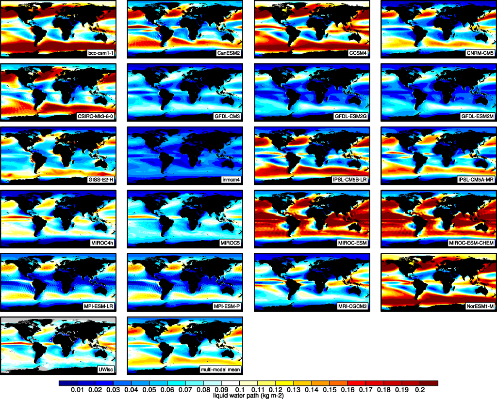
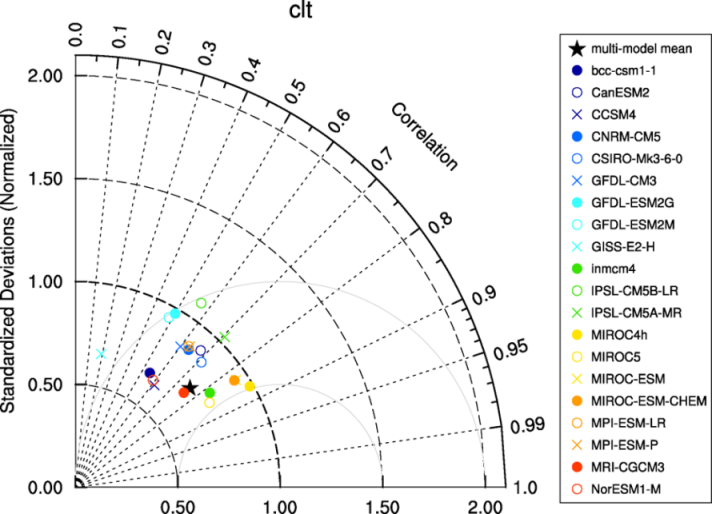
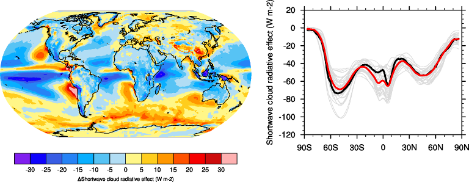
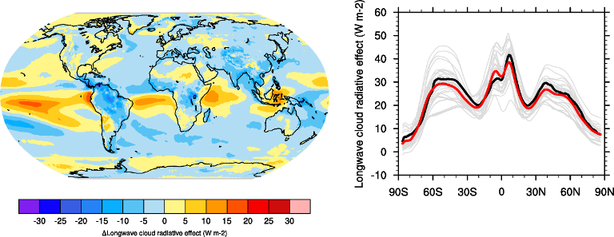
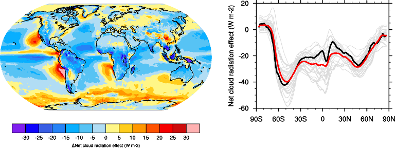
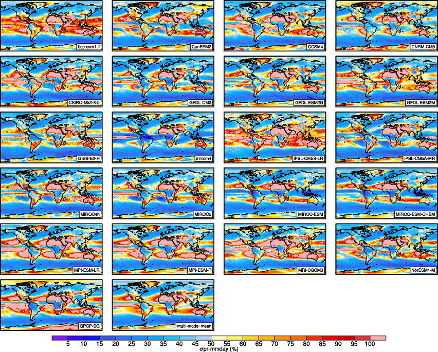

Clouds
======

Overview
--------

The namelist namelist_lauer13jclim.xml computes the climatology and interannual variability of climate relevant cloud variables such as cloud radiative forcing (CRE), liquid (lwp) and ice water path (iwp), cloud amount (clt), and total precipitation (pr) reproducing some of the evaluation results of Lauer and Hamilton (2013).
The standard namelist includes a comparison of the geographical distribution of multi-year average cloud parameters from individual models and the multi-model mean with satellite observations.
Taylor diagrams are generated that show the multi-year annual or seasonal average performance of individual models and the multi-model mean in reproducing satellite observations.
The diagnostic also facilitates the assessment of the bias of the multi-model mean and zonal averages of individual models compared with satellite observations.
Interannual variability is estimated as the relative temporal standard deviation from multi-year timeseries of data with the temporal standard deviations calculated from monthly anomalies after subtracting the climatological mean seasonal cycle.

Available namelists and diagnostics
-----------------------------------

Namelists are stored in nml/

    * namelist_lauer13jclim.xml

Diagnostics are stored in diag_scripts/

    * clouds.ncl: global maps of (multi-year) annual means including multi-model mean
    * clouds_bias.ncl: global maps of the multi-model mean and the multi-model mean bias
    * clouds_interannual: global maps of the interannual variability
    * clouds_isccp: global maps of multi-model mean minus observations + zonal averages of individual models, multi-model mean and observations
    * clouds_taylor.ncl: taylor diagrams

User settings
-------------

User setting files (cfg files) are stored in nml/cfg_cloud/

#. clouds.ncl: cfg_clouds.ncl

   *Required diag_script_info attributes*

   * grid: grid for regridding (coarsest, finest, ref, 1°x1°) in case calculation of the multi-model mean or difference plots are requested
   * ref_model: name of reference data set

   *Optional diag_scipt_info attributes*

   * calcmm: calculate multi-model mean (True, False)
   * embracesetup: True = 2 plots per line, False = 4 plots per line (default)
   * showdiff: calculate and plot differences (True, False)
   * timemean: time averaging, i.e. "seasonal" (DJF, MAM, JJA, SON), "annual" (annual mean)

   *Required variable_info attributes*

   * long_name: description of variable
   * map_Levels: contour levels for plotting
   * units: variable units

   *Color tables*

   * variable "lwp": diag_scripts/lib/ncl/rgb/qcm3.rgb
    
#. clouds_bias.ncl: cfg_clouds_bias.ncl

   *Required diag_script_info attributes*

   * grid: grid for regridding (coarsest, finest, ref) in case calculation of the multi-model mean is requested
   * ref_model: name of reference data set
   * valid_fraction: minimum fraction of valid data points (for creating a mask)

   *Optional diag_scipt_info attributes*

   * ncdf: enable to output to netCDF; either use "default" or give a full file name
   * projection: map projection, e.g., Mollweide, Mercator (see http://www.ncl.ucar.edu/Document/Graphics/Resources/mp.shtml#mpProjection for available projections)
   * timemean: time averaging, i.e. "seasonalclim" (DJF, MAM, JJA, SON), "annualclim" (annual mean)

   *Required variable_info attributes*

   * long_name: description of variable
   * map_diff_Levels: contour levels for difference plot
   * units: variable units

   *Color tables*

   * variable "tas": diag_scripts/lib/ncl/rgb/ipcc-tas.rgb, diag_scripts/lib/ncl/rgb/ipcc-tas-delta.rgb
   * variable "pr-mmday": diag_scripts/lib/ncl/rgb/ipcc-precip.rgb, diag_scripts/lib/ncl/rgb/ipcc-precip-delta.rgb

#. clouds_interannual.ncl: cfg_clouds_interannual.ncl

   *Required diag_script_info attributes*

   * colormap: e.g., WhiteBlueGreenYellowRed, rainbow
   * grid: grid for regridding (coarsest, finest, ref, 1°x1°) in case calculation of the multi-model mean is requested
   * models_to_skip: name(s) of data set(s) to be skipped when calculating the multi-model mean
   * projection: map projection, e.g., Mollweide, Mercator (see http://www.ncl.ucar.edu/Document/Graphics/Resources/mp.shtml#mpProjection for available projections)
   * ref_model: specifies model that should be taken as "reference" when regridding to "ref" (only required if grid = "ref")

   *Optional diag_scipt_info attributes*

   * calcmm: calculate multi-model mean (True, False)
   * extrafiles: write plots for individual models to separate files (True, False)

   *Color tables*

   * variable "lwp": diag_scripts/lib/ncl/rgb/qcm3.rgb

#. clouds_ipcc.ncl: cfg_clouds_ipcc.ncl

   *Required diag_script_info attributes*

   * grid: grid for regridding (coarsest, finest, ref, 1x1)
   * ref_model: name of reference data set
   * valid_fraction: minimum fraction of valid data points (for creating a mask)
   * projection: map projection, e.g., Mollweide, Mercator (see http://www.ncl.ucar.edu/Document/Graphics/Resources/mp.shtml#mpProjection for available projections)

   *Optional diag_scipt_info attributes*

   * mask_ts_sea_ice: True = mask T < 272 K as sea ice (only for variable "ts"), False = no additional grid cells masked for variable "ts"
   * models_to_skip: name(s) of data set(s) to be skipped when calculating the multi-model mean (usually all observations)
   * ncdf: enable to output to netCDF; either use "default" or give a full file name
   * styleset: "CMIP5", "DEFAULT"
   * timemean: time averaging, i.e. "seasonalclim" (DJF, MAM, JJA, SON), "annualclim" (annual mean)

   *Required variable_info attributes*

   * long_name: description of variable
   * map_Levels: contour levels for plotting
   * units: variable units

   *Color tables*

   * variables "pr", "pr-mmday": diag_scripts/lib/ncl/rgb/ ipcc-precip-delta.rgb
    
#. clouds_taylor.ncl: cfg_clouds_taylor.ncl

   *Required diag_script_info attributes*
    
   * grid: grid for regridding (coarsest, finest, ref, 1x1)
   * valid_fraction: minimum fraction of valid data points (for creating a mask)

   *Optional diag_scipt_info attributes*

   * calcmm: calculate multi-model mean (True, False)
   * models_to_skip: name(s) of data set(s) to be skipped when calculating the multi-model mean (usually all observations)
   * embracelegend: False (default) = include legend in plot, max. 2 columns with model names in legend; True = write extra file with legend, max. 7 model names per column in legend, alternative observational dataset(s) will be plotted as a red star and labeled "altern. ref. dataset" in legend (only if dataset is of class "OBS")
   * estimate_obs_uncertainty: True = estimate observational uncertainties from mean values (assuming fractions of obs. RMSE from documentation of the obs data); only available for "CERES-EBAF", "MODIS", "MODIS-L3"; False = do not estimate obs. uncertainties from mean values
   * mask_ts_sea_ice: True = mask T < 272 K as sea ice (only for variable "ts"); False = no additional grid cells masked for variable "ts"
   * styleset: "CMIP5", "DEFAULT" (if not set, CLOUDS_TAYLOR will create a color table and symbols for plotting)
   * ref_model: name of reference data set (if this attribute is not set the variable attribute "ref_model" defined in the namelist is used; see below); note: if neither diag_script_info\@ref_model nor the variable attribute ref_model is set, an error message is issued
   * timemean: time averaging, i.e. "seasonalclim" (DJF, MAM, JJA, SON), "annualclim" (annual mean)

   *Optional variable attributes (defined in namelist)*

   * ref_model: name of reference data set; note: if diag_script_info\@ref_model is defined, diag_script_info\@ref_model will be used and the variable attribute ref_model will be ignored

Variables
---------

* clwvi (atmos, monthly mean, longitude latitude time)
* clivi (atmos, monthly mean, longitude latitude time)
* clt (atmos, monthly mean, longitude latitude time)
* pr (atmos, monthly mean, longitude latitude time)
* rlut, rlutcs (atmos, monthly mean, longitude latitude time)
* rsut, rsutcs (atmos, monthly mean, longitude latitude time)

Observations and reformat scripts
---------------------------------

*Note: (1) obs4mips data can be used directly without any preprocessing; (2) see headers of reformat scripts for non-obs4mips data for download instructions.*

* CERES-EBAF (obs4mips) - CERES TOA radiation fluxes (used for calculation of cloud forcing)
* GPCP-SG (obs4mips) - Global Precipitation Climatology Project total precipitation
* MODIS (obs4mips) - MODIS total cloud fraction
* MODIS-CFMIP - MODIS ice water path climatology, originally created for CFMIP, references: King et al. (2003), IEEE Trans. Geosci. Remote Sens.; Pincus et al. (2012), J. Clim.

  *Reformat script:* reformat_scripts/obs/reformat_obs_MODIS-CFMIP.ncl

* UWisc - University of Wisconsin-Madison liquid water path climatology, based on satellite observbations from TMI, SSM/I, and AMSR-E, reference: O'Dell et al. (2008), J. Clim.

  *Reformat script:* reformat_scripts/obs/reformat_obs_UWisc.ncl

References
----------

* King, M. D., et al. (2003), Cloud and aerosol properties, precipitable water, and profiles of temperature and water vapor from MODIS, IEEE Trans. Geosci. Remote Sens., 41, 442-458, doi: 10.1109/TGRS.2002.808226.

* Lauer A., and K. Hamilton (2013), Simulating clouds with global climate models: A comparison of CMIP5 results with CMIP3 and satellite data, J. Clim., 26, 3823-3845, doi: 10.1175/JCLI-D-12-00451.1.

* O’Dell, C. W., F. J. Wentz, and R. Bennartz (2008), Cloud liquid water path from satellite-based passive microwave observations: A new climatology over the global oceans, J. Clim., 21, 1721-1739, doi:10.1175/2007JCLI1958.1.

* Pincus, R., S. Platnick, S. A. Ackerman, R. S. Hemler, Robert J. Patrick Hofmann (2012), Reconciling simulated and observed views of clouds: MODIS, ISCCP, and the limits of instrument simulators. J. Climate, 25, 4699-4720, doi: 10.1175/JCLI-D-11-00267.1.

Example plots
-------------

.. _fig_cloud_1:

   The 20-yr average LWP (1986-2005) from the CMIP5 historical model runs and the multi-model mean in comparison with the UWisc satellite climatology (1988-2007) based on SSM/I, TMI, and AMSR-E (O'Dell et al. 2008).

.. _fig_cloud_2:

   Taylor diagram showing the 20-yr annual average performance of CMIP5 models for total cloud fraction as compared to MODIS satellite observations.

.. _fig_cloud_3:

   20-year average (1986-2005) annual mean cloud radiative effects of CMIP5 models against the CERES EBAF (2001–2012). Top row shows the shortwave effect; middle row the longwave effect, and bottom row the net effect. Multi-model mean biases against CERES EBAF are shown on the left, whereas the right panels show zonal averages from CERES EBAF (thick black), the individual CMIP5 models (thin gray lines) and the multi-model mean (thick red line). Similar to Figure 9.5 of Flato et al. (2013).

.. _fig_cloud_4:

   Interannual variability of modeled and observed (GPCP) precipitation rates estimated as relative temporal standard deviation from 20 years (1986-2005) of data. The temporal standard devitions are calculated from monthly anomalies after subtracting the climatological mean seasonal cycle.

