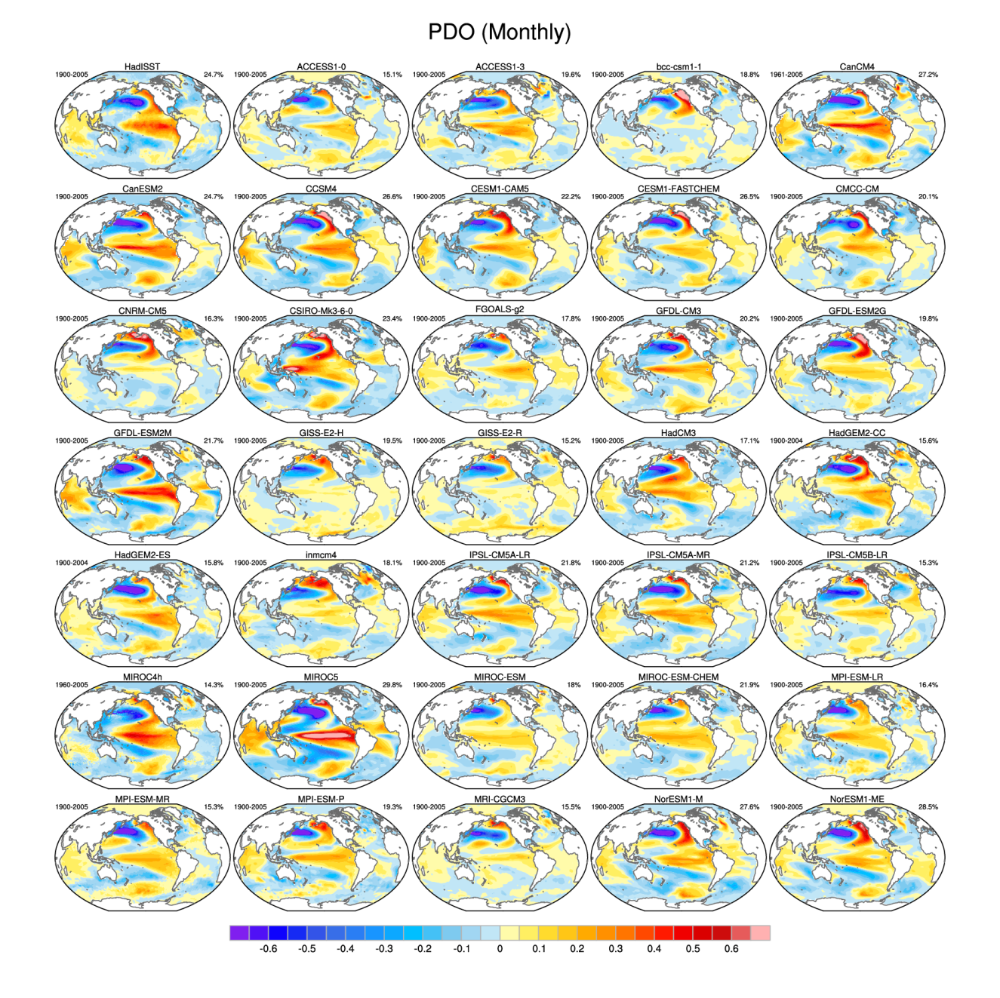
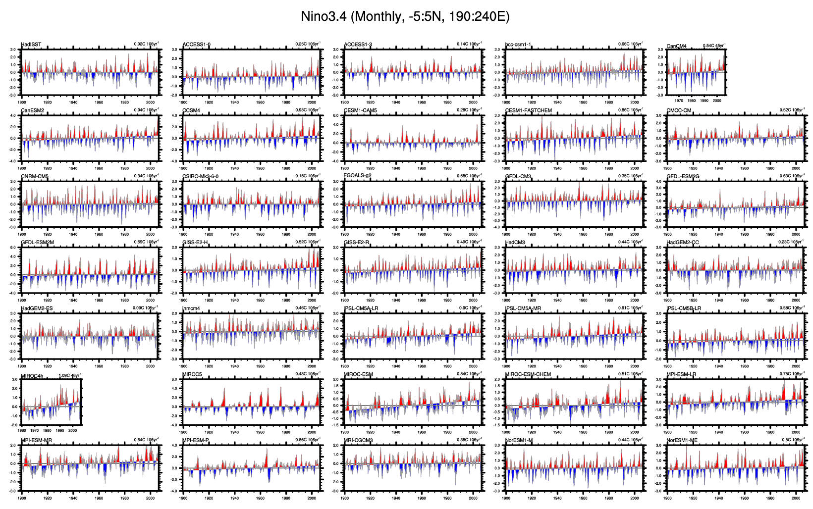
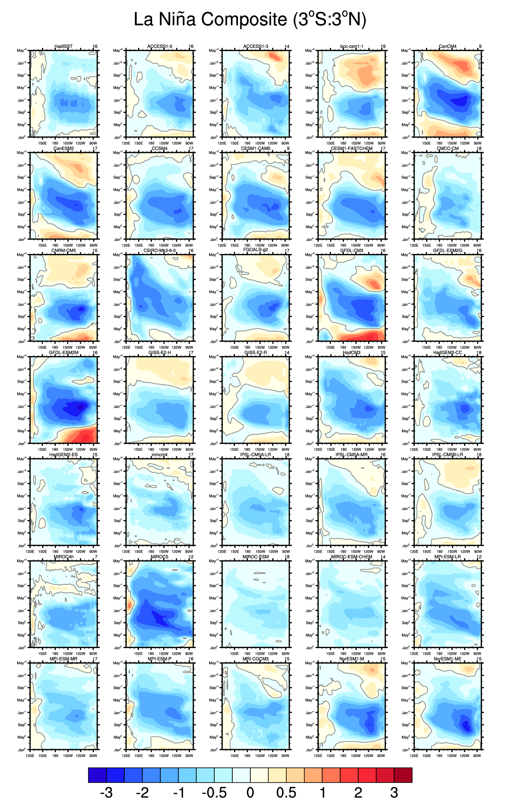
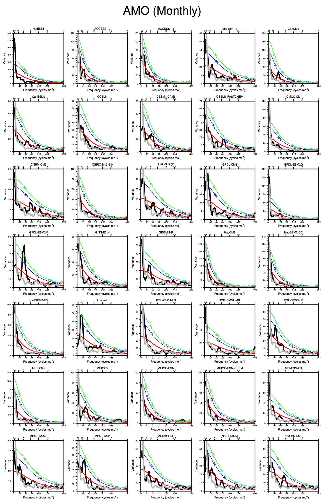

NCAR's Climate Variability Diagnostics Package (CVDP)
=====================================================

Overview
--------

**The NCAR CVDP version currently implemented into the ESMValTool is v4.1.**

The Climate Variability Diagnostics Package (CVDP) developed by NCAR's Climate
Analysis Section (Phillips et al., 2014) has been implemented into the
ESMValTool in order to be able to run it within this framework and alongside
the ESGF on CMIP output. CVDP can be used to evaluate the major modes of
climate variability including ENSO, PDO, AMO, Northern and Southern Annular
Modes (NAM and SAM), North Atlantic Oscillation (NAO), Pacific North and South
American teleconnection patterns (PNA and PSA). In addition it calculates
global trend maps and index time series for the above modes and the North
Pacific Index, the Tropical North Atlantic SST, Tropical South Atlantic SST,
Tropical Indian Ocean SST, Niño1+2, Niño3, and Niño4 times series, and the
Indian Ocean Dipole (IOD).

CVDP is developed as a standalone tool outside the ESMValTool. Once a new
version of CVDP is released, the ESMValTool will be updated
accordingly. Therefore, the structure of CVDP was kept as is and a wrapper has
been written to be able to run CVDP directly within the ESMValTool.

Available Namelists and Diagnostics
-----------------------------------

Namelists are stored in nml/

	* namelist_CVDP.xml

Diagnostics are stored in diag_scripts/

*Wrapper scripts to run CVDP within the framework of the ESMValTool*

	* cvdp_obs.ncl: run for each variable separately with observational data available; renames the ESMValTool output (observations) following the filename conventions of the CVDP and creates the CVDP namelist “namelist_obs”.
	* cvdp_ocean.ncl: renames the ESMValTool output (ocean variables) following the filename conventions of the CVDP.
	* cvdp_atmos.ncl: renames the ESMValTool output (atmosphere variables) following the filename conventions of the CVDP and creates the CVDP namelist “namelist” containing the models. The script then runs the CVDP via a call to the wrapper script cvdp_driver.ncl.

User settings
-------------

User setting files (cfg files) are stored in nml/cfg_CVDP/

     (1)	cvdp_obs.ncl

     *Required diag_script_info attributes*

	* obs_ref: list of reference data sets (observations) (array)

     (2)	cvdp_driver.ncl (called by cvdp_atmos.ncl)

     *The wrapper script cvdp_driver.ncl sets the user options for the CVDP.*

Variables
---------

	* ts (atmos, monthly mean, longitude latitude time)
	* psl (atmos, monthly mean, longitude latitude time)
	* tas (atmos, monthly mean, longitude latitude time)
	* pr (atmos, monthly mean, longitude latitude time)
	* msftmyz (ocean, monthly mean, latitude level basin time)

Observations and Reformat Scripts
---------------------------------

**Note:** (1) obs4mips data can be used directly without any preprocessing; (2) see headers of reformat scripts for non-obs4mips data for download instructions.

	* Sea Surface Temperature (SST): HadISST (1870 - 2005)

	  *Reformat script:* reformat_scripts/obs/reformat_obs_HadISST.ncl

	* Sea Level Pressure (PSL): ERA-Interim/IFS-Cy31r2 (1979 - 2013)

	  *Reformat script:* reformat_scripts/obs/reformat_obs_ERA-Interim.ncl

	* 2m Air Temperature (TAS): NCEP (1979 - 2005)

	  *Reformat script:* reformat_scripts/obs/reformat_obs_NCEP.ncl

	* Precipitation (PR): GPCP-SG (1979 - 2005) (obs4mips)

References
----------

* Danabasoglu, G., S. G. Yeager, Y. -O. Kwon, J. J. Tribbia, A. S. Phillips, and J. W. Hurrell, 2012. Variability of the Atlantic Meridional Overturning Circulation in CCSM4. J. Climate, 25, 5153-5172, doi: 10.1175/JCLI-D-11-00463.1 (AMOC).

* Deser, C., M. A. Alexander, S. -P. Xie, and A. S. Phillips, 2010: Sea surface temperature variability: patterns and mechanisms. Ann. Rev. Mar. Sci., 2010.2, 115-143, doi: 10.1146/annurev-marine-120408-151453 (PDO).

* Deser, C., A. S. Phillips, R. A. Tomas, Y. Okumura, M. A. Alexander, A. Capotondi, J. D. Scott, Y. -O. Kwon, and M. Ohba, 2012: ENSO and Pacific Decadal Variability in Community Climate System Model Version 4. J. Climate, 25, 2622-2651, doi: 10.1175/JCLI-D-11-00301.1 (ENSO Spatial Composites).

* Hurrell, J. W., and C. Deser, 2009: North Atlantic climate variability: The role of the North Atlantic Oscillation. J. Mar. Syst., 78, 28-41, doi  10.1016/j.jmarsys.2008.11.026 (NAO).

* Mantua, N. J., S. R. Hare, Y. Zhang, J. M. Wallace, and R. Francis, 1997: A Pacific interdecadal climate oscillation with impacts on salmon production. Bull. Amer. Met. Soc., 1069-1079 (PDO).

* Phillips, A. S., Deser, C., and Fasullo, J.: Evaluating Modes of Variability in Climate Models, Eos Trans. AGU, 95(49), 453-455, 2014 (Overview Paper of Climate Variability Diagnostics Package).

* Thompson, D. W. J. and J.M. Wallace, 2000: Annular modes in the extratropical circulation. Part I: Month-to-month variability. J. Climate, 13, 1000-1016 (NAM).

* Trenberth, K. E., and D. J. Shea, 2006: Atlantic hurricanes and natural variability in 2005, Geophys. Res. Lett., 33, L12704, doi: 10.1029/2006GL026894 (AMO).

.. raw:: latex

   \newpage

Example plots
-------------

.. fig_cvdp_1:

   The leading empirical orthogonal function (EOF) of monthly sea surface temperature (SST) anomalies over the North Pacific (after removing the global mean SST anomaly) based on the HadISST observational data set (top left) during 1900-2005, and (remaining panels) several model simulations of the Coupled Model Intercomparison Project Phase 5 (CMIP5), for the models MIROC4h and CanCM4 during 1960-2005.

.. fig_cvdp_2:

   The weighted area average of monthly SST anomalies in the region 5°S-5°N, 190°-240°E also known as the "Niño-3.4 Index" (Trenberth et al., 2002) based on the HadISST observational data set (top left) for the period 1900-2005, and (remaining panels) several model simulations of the Coupled Model Intercomparison Project Phase 5 (CMIP5), for the models MIROC4h and CanCM4 during 1960-2005. The red/blue shading on the Niño3.4 time series denotes positive/negative deviations from the best-fit linear trend line.

.. fig_cvdp_3:

   Longitude-latitude sections of composite SST anomalies along the equator (3°N-3°S) for La Niña based on the HadISST oberservational data set (top left) for the period 1900-2005, and (remaining panels) several model simulations of the Coupled Model Intercomparison Project Phase 5 (CMIP5), for the models MIROC4h and CanCM4 during 1960-2005. The number at the top right of each panel indicates the number of events used for the composite.

.. fig_cvdp_4:

   The power spectrum as a function of frequency in cycle per month of the Niño-3.4 SST index for the HadISST observational data set (top left) for the period 1900-2005, and (remaining panels) several model simulations of the Coupled Model Intercomparison Project Phase 5 (CMIP5), for the models MIROC4h and CanCM4 during 1960-2005. The black line denotes the spectrum. The red line indicates the best-fit first-order Markov red noise spectrum, the blue line its 95% and the green line its 99% confidence bounds. The observational spectrum is overlaid in gray on each model spectrum if available.
