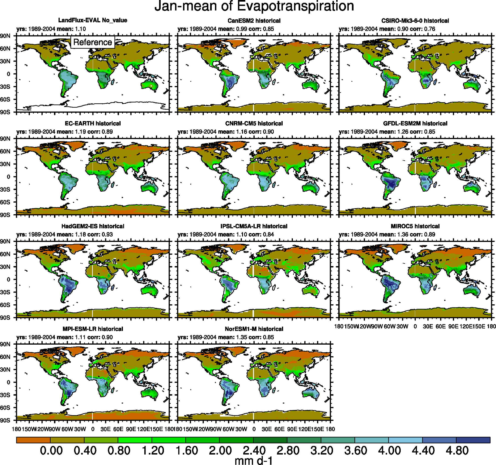
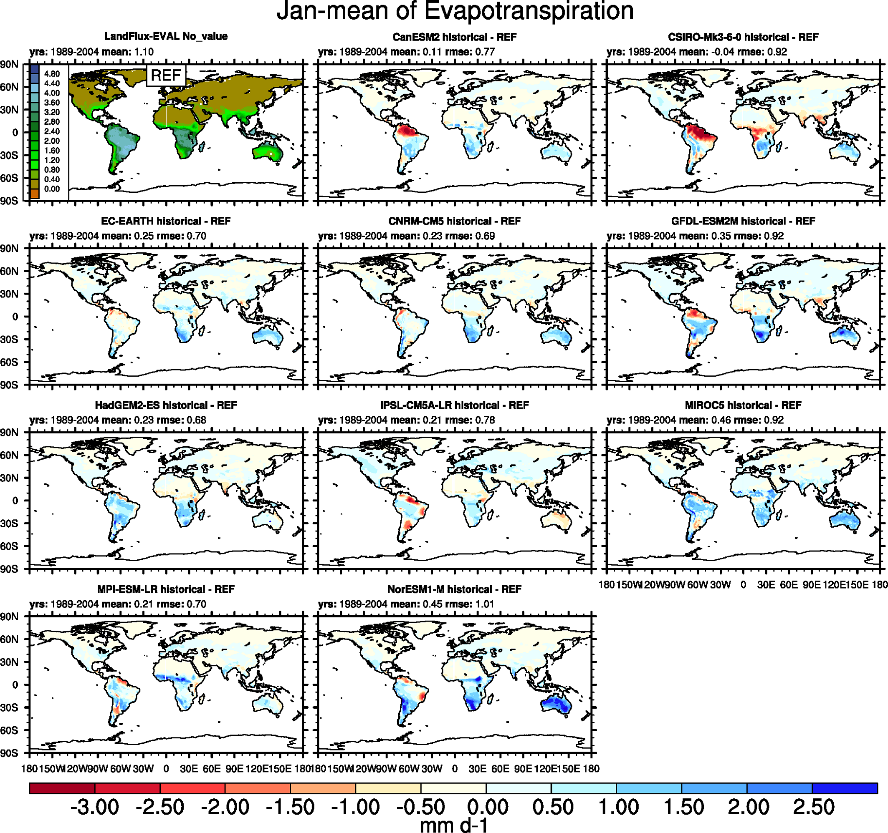
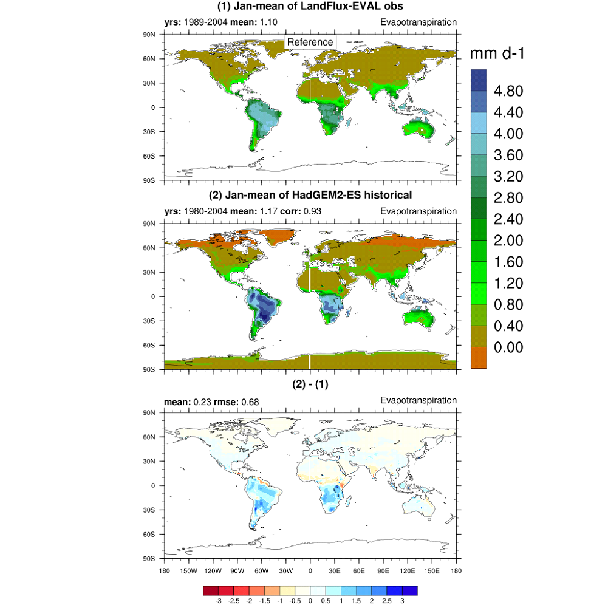

Evapotranspiration
==================

Overview
--------

This diagnostic produces monthly climatologies of evapotranspiration on a
global scale. The model outputs are compared to the LandFlux-EVAL data set
(Mueller et al., 2013), which is used as reference product for
evapotranspiration. An example of application of this diagnostic on CMIP5
models is presented in Mueller and Seneviratne (2014).

Available namelists and diagnostics
-----------------------------------

Namelists are stored in nml/

* namelist_Evapotranspiration.xml

Diagnostics are stored in diag_scripts/

* Evapotranspiration.ncl

User settings
-------------

User setting files (cfg files) are stored in nml/cfg_et/

* Evapotranspiration.ncl

*Required diag_script_info attributes*

* et_colormap: filename of color table
* cn_levels_mean_basic: contour levels of absolute values (array)
* cn_levels_mean_diff_basic: contour levels of differences
* sftlf_cutoff: threshold for land sea mask (> 50  land grid cell)

*Color tables*

* diag_scripts/aux/Evapotranspiration/absolute_evapotranspiration.rgb

Variables
---------

* hfls (atmos, monthly mean, longitude latitude time)

Observations and deformat scripts
---------------------------------

*Note:* see also header of reformat script for downloading instructions.

* The LandFlux-EVAL data set 
  (http://www.iac.ethz.ch/groups/seneviratne/research/LandFlux-EVAL).
  The data set is document in Mueller et al (2013). Download data at the
  above link, then follow the instructions in the reformat script available
  in the repository. The data set is free to use after registration but may
  not be redistributed.

  Reformat script: reformat_scripts/obs/reformat_obs_LandFlux-EVAL.ncl

References
----------

* Mueller, B., and S. I. Seneviratne (2014), Systematic land climate and
  evapotranspiration biases in CMIP5 simulations, Geophys. Res. Lett.,
  41, 128-134, doi: 10.1002/2013GL058055.
* Mueller, B., Hirschi, M., Jimenez, C., Ciais, P., Dirmeyer, P. A., Dolman,
  A. J., Fisher, J. B., Jung, M., Ludwig, F., Maignan, F., Miralles, D. G.,
  McCabe, M. F., Reichstein, M., Sheffield, J., Wang, K., Wood, E. F., Zhang,
  Y., and Seneviratne, S. I. (2013), Benchmark products for land
  evapotranspiration: LandFlux-EVAL multi-data set synthesis, Hydrol.
  Earth Syst. Sci., 17, 3707-3720, doi: 10.5194/hess-17-3707-2013.

Example plots
-------------

   

