TEMPLATE FOR NAMELIST
=====================

Overview
--------

The goal of this effort is to code up routines to reproduce Chapter 9 of AR5, so that the plots can be readily reproduced and compared to previous CMIP versions. In this way we can next time start with what was available in the previous round and can focus on developing more innovative methods of analysis rather than constantly having to "re-invent the wheel".

The plots will be done based on a collection of individual namelists. The following figures from Flato et al. (2013) can currently be reproduced:

* Figure 9.2 a,b: Annual-mean surface air temperature for the period 1980-2005. The left panel shows the multi-model mean and the right panel the bias as the difference between the CMIP5 multi-model mean and the climatology from ERA-Interim (Dee et al., 2011).

* Figure 9.4 a,b: Annual-mean precipitation rate (mm day-1) for the period 1980-2005. The left panel shows the multi-model mean and the right panel the bias as the difference between the CMIP5 multi-model mean and the climatology from the Global Precipitation Climatology Project (Adler et al., 2003).

* Figure 9.5: Climatological (1985-2005) annual-mean cloud radiative effects in Wm-2 for the CMIP5 models against CERES EBAF (2001-2011) in Wm-2. Top row shows the shortwave effect; middle row the longwave effect, and bottom row the net effect. Multi-model-mean biases against CERES EBAF 2.6 are shown on the left, whereas the right panels show zonal averages from CERES EBAF 2.6 (black), the individual CMIP5 models (thin gray lines), and the multi-model mean (thick red line).

* Figure 9.7: Relative space-time root-mean square error (RMSE) calculated from the 1980-2005 climatological seasonal cycle of the CMIP5 historical simulations. A relative performance is displayed, with blue shading indicating performance being better and red shading worse, than the median of all model results. A diagonal split of a grid square shows the relative error with respect to the reference data set (lower right triangle) and the alternate data set (upper left triangle). White boxes are used when data is not available for the given model and variable or no alternate data set has been used. The figure shows that performance varies across CMIP5 models and variables, with some models comparing better with observations for one variable and another model performing better for a different variable.

* Figure 9.10: Total column ozone time series for (a) annual global and (b) Antarctic October mean. CMIP5 models are shown in colored lines and the multi-model mean in thick black, their standard deviation as gray shaded area, and observations (NIWA) (black symbols).

* Figure 9.24 a,b: Time series (1960-2005) of (a) September mean Arctic and (b) February mean Antarctic sea ice extent from the CMIP5 historical simulations. The CMIP5 ensemble mean is highlighted in dark red and the individual ensemble members of each model (colored lines) are shown in different line styles. The model results are compared to observations from the NSIDC (1978-2011, black solid line) and the Hadley Centre Sea ice and Sea Surface Temperature (HadISST, 1978-2011, black dashed line).

* Figure 9.28: Multi-year average aerosol optical depth (AOD) in comparison with satellite data.

* Figure 9.29: Time series of global oceanic mean aerosol optical depth (AOD) from individual CMIP5 models-F¢ historical (1850-2005) and RCP 4.5 (2006-2010) simulations compared with MODIS and ESACCI-AEROSOL satellite data.

* Figure 9.30: Composite diurnal cycle of precipitation averaged over land / ocean for different latitude bands / seasons (JuneJulyAugust (JJA), DecemberJanuaryFebruary (DJF), or their sum) at local time.

* Figure 9.32: Monsoon precipitation intensity (upper panels) and monsoon precipitation domain (lower panels) for TRMM and an example of deviations from observations from three CMIP5 models (EC-Earth, HadGEM2-ES, and GFDL-ESM2M).

* Figure 9.45: The carbon cycle-climate feedback (-F„LT) versus the short-term sensitivity of atmospheric CO2 to interannual temperature variability („IAV) in the tropics for CMIP5 models. The red line shows the best fit line across the CMIP5 simulations and the vertical dashed lines show the observed range of „IAV. (b) Probability distribution function (PDF) for „LT. The solid line is derived after applying the interannual variability (IAV) constraint to the models while the dashed line is the prior PDF derived purely from the models before applying the IAV constraint.-A

Available Namelists and Diagnostics
-----------------------------------

Namelists are stored in nml/

* namelist_flato13ipcc.xml

Diagnostics are stored in diag_scripts/

* aerosol_satellite.ncl (Fig. 9.28: Multi-year average AOD in comparison with satellite data)

* carbon_constraint.ncl (fig. 9.45: Emergent constraints on carbon cycle feedbacks)

* carbon_corr_2var.ncl (fig. 9.45: Emergent constraints on carbon cycle feedbacks)

* carbon_dummy.ncl (fig. 9.45: Emergent constraints on carbon cycle feedbacks)

* clouds_bias.ncl (figs. 9.2 a,b + 9.4 a,b: Clouds)

* clouds_ipcc.ncl (fig. 9.4: Clouds)

* create_co2flux.ncl (fig. 9.45: Emergent constraints on carbon cycle feedbacks)

* DiurnalCycle_box.ncl (fig. 9.30: Composite diurnal cycle of precipitation)

* eyring13jgr_fig02.ncl (fig. 9.10: Ozone and associated climate impacts)

* perfmetrics_grading.ncl (fig. 9.7: Performance metrics for essential climate parameters)

* perfmetrics_grading_collect.ncl (fig. 9.7: Performance metrics for essential climate parameters)

* perfmetrics_main.ncl (fig. 9.7: Performance metrics for essential climate parameters)

* SAMonsoon_precip_domain.ncl (fig. 9.32: South Asian Summer Monsoon diagnostics)

* SeaIce_tsline.ncl (fig. 9.24 a,b: Sea ice)

* tsline.ncl (fig. 9.29: Aerosol; fig. 9.45: Emergent constraints on carbon cycle feedbacks)

User settings
-------------

See individual diagnostics (Annex C):

* Aerosol

* Clouds

* Emergent constraints on carbon cycle feedbacks

* Ozone and associated climate impacts

* Performance metrics for essential climate parameters

* Sea ice

* South Asian Summer Monsoon diagnostics

Variables
---------

* co2 (atmos, monthly mean, longitude, latitude, plev, time)

* fgco2 (ocean, monthly mean, longitude, latitude, time)

* hus (atmos, monthly mean, longitude, latitude, level, time)

* nbp (land, monthly mean, longitude, latitude, time)

* od550aer (aero, monthly mean, longitude, latitude, time)

* pr (atmos, 3-hr/monthly mean, longitude, latitude, time)

* rlut, rlutcs (atmos, monthly mean, longitude, latitude, time)

* rsut, rsutcs (atmos, monthly mean, longitude, latitude, time)

* sic (ocean, monthly mean, longitude, latitude, time)

* ta (atmos, monthly mean, longitude, latitude, level, time)

* tas (atmos, monthly mean, longitude, latitude, time)

* toz (atmos, monthly mean, longitude, latitude, time)

* tro3 (atmos, monthly mean, longitude, latitude, level, time)

* ua (atmos, monthly mean, longitude, latitude, level, time)

* va (atmos, monthly mean, longitude, latitude, level, time)

* zg (atmos, monthly mean, longitude, latitude, level, time)

Observations and Reformat Scripts
---------------------------------

*Note:* (1) obs4mips data can be used directly without any preprocessing; (2) see headers of reformat scripts for non-obs4mips data for download instructions.

* AIRS L3 (hus  obs4mips)

* CERES-EBAF (rlut, rlutcs, rsut, rsutcs  obs4mips)

* CMAP (pr  reformat_scripts/obs/reformat_obs_CMAP.ncl)

* ERA-Interim (tas, ta, ua, va, zg, hus  reformat_scripts/obs/reformat_obs_ERA-Interim.ncl)

* ESACCI-AEROSOL (od550aer  reformat_scripts/obs/reformat_obs_ESACCI-AEROSOL.ncl)

* GCP - Global carbon budget including land (nbp) and ocean (fgco2) carbon fluxes (reformat_scripts/obs/reformat_obs_GCP.ncl)

* GPCP-SG (pr  obs4mips)

* HadISST (sic  reformat_scripts/obs/reformat_obs_HadISST.ncl)

* MERRA (pr  obs4mips)

* MODIS-L3 (od550aer  obs4mips)

* NCEP (tas, ta, ua, va, zg  reformat_scripts/obs/reformat_obs_NCEP.ncl)

* NIWA (toz  reformat_scripts/obs/reformat_obs_NIWA.ncl)

* NSIDC-NT (sic  reformat_scripts/obs/reformat_obs_NSIDC.ncl)

* TRMM-3B42 (pr  reformat_scripts/obs/reformat_obs_TRMM-3B42-3hourly.ncl)

References
----------

* Adler, R. F., Huffman, G. J., Chang, A., Ferraro, R., Xie, P.-P., Janowiak, J., Rudolf, B., Schneider, U., Curtis, S., Bolvin, D., Gruber, A., Susskind, J., Arkin, P., and Nelkin, E.: The Version-2 Global Precipitation Climatology Project (GPCP) Monthly Precipitation Analysis (1979Present), J Hydrometeorol, 4, 1147-1167, 2003.

* Dee, D. P., Uppala, S. M., Simmons, A. J., Berrisford, P., Poli, P., Kobayashi, S., Andrae, U., Balmaseda, M. A., Balsamo, G., Bauer, P., Bechtold, P., Beljaars, A. C. M., van de Berg, L., Bidlot, J., Bormann, N., Delsol, C., Dragani, R., Fuentes, M., Geer, A. J., Haimberger, L., Healy, S. B., Hersbach, H., Holm, E. V., Isaksen, L., Kallberg, P., Kohler, M., Matricardi, M., McNally, A. P., Monge-Sanz, B. M., Morcrette, J. J., Park, B. K., Peubey, C., de Rosnay, P., Tavolato, C., Thepaut, J. N., and Vitart, F.: The ERA-Interim reanalysis: configuration and performance of the data assimilation system, Q J Roy Meteor Soc, 137, 553-597, 2011.

* Eyring, V., Righi, M., Lauer, A., Evaldsson, M., Wenzel, S., Jones, C., Anav, A., Andrews, O., Cionni, I., Davin, E. L., Deser, C., Ehbrecht, C., Friedlingstein, P., Gleckler, P., Gottschaldt, K.-D., Hagemann, S., Juckes, M., Kindermann, S., Krasting, J., Kunert, D., Levine, R., Loew, A., M‰kel‰, J. Martin, G., Mason, E., Phillips, A. S., Read, S., Rio, C., Roehrig, R., Senftleben, D., Sterl, A., van Ulft, L. H., Walton, J., Wang, S., and Williams, K. D.: ESMValTool (v1.0)  a community diagnostic and performance metrics tool for routine evaluation of Earth System Models in CMIP, Geosci. Model Dev., 9, 1747-1802, doi: 10.5194/gmd-9-1747-2016, 2016.

* Flato, G., J. Marotzke, B. Abiodun, P. Braconnot, S.C. Chou, W. Collins, P. Cox, F. Driouech, S. Emori, V. Eyring, C. Forest, P. Gleckler, E. Guilyardi, C. Jakob, V. Kattsov, C. Reason and M. Rummukainen, 2013: Evaluation of Climate Models. In: Climate Change 2013: The Physical Science Basis. Contribution of Working Group I to the Fifth Assessment Report of the Intergovernmental Panel on Climate Change [Stocker, T.F., D. Qin, G.-K. Plattner, M. Tignor, S.K. Allen, J. Boschung, A. Nauels, Y. Xia, V. Bex and P.M. Midgley (eds.)]. Cambridge University Press, Cambridge, United Kingdom and New York, NY, USA.

Example plots
-------------

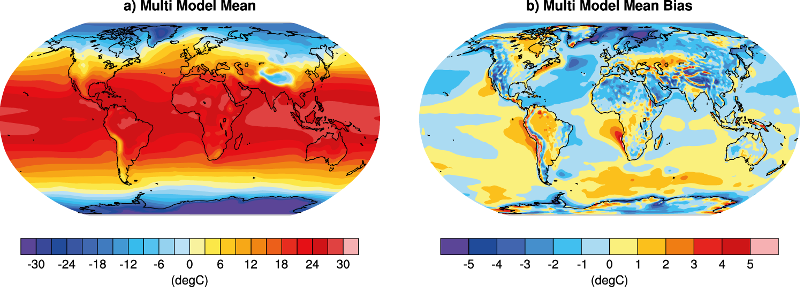
   
   Resembling Flato et al. (2013), Fig. 9.2a,b (Eyring et al., 2016: Fig. 4).

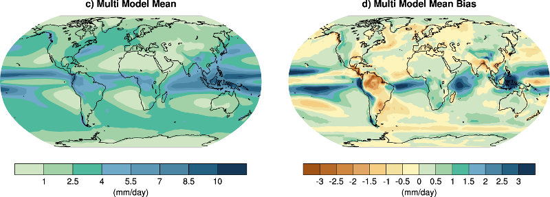
   
   Resembling Flato et al. (2013), Fig. 9.4a,b (Eyring et al., 2016: Fig. 4).

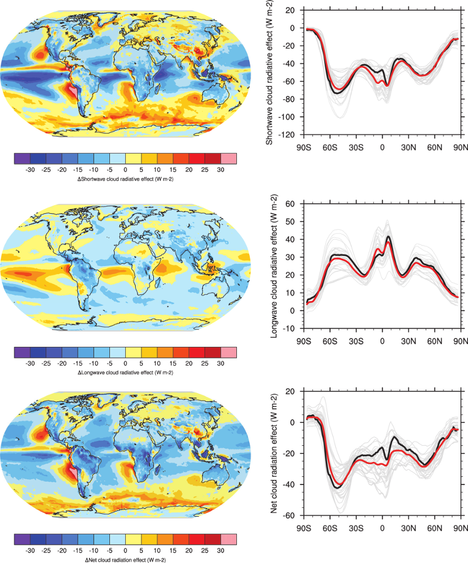
   
   Resembling Flato et al. (2013), Fig. 9.5 (Eyring et al., 2016: Fig. 12).

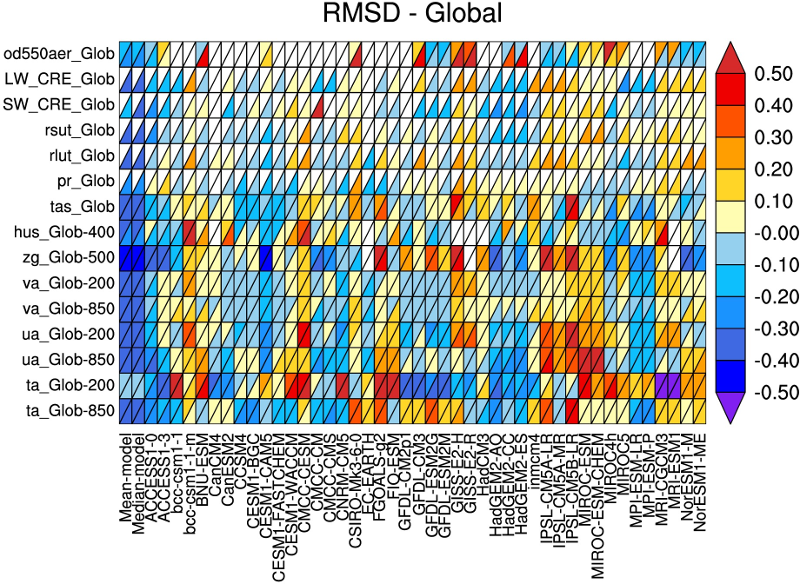
   
   Resembling Flato et al. (2013), Fig. 9.7 (Eyring et al., 2016: Fig. 2).E

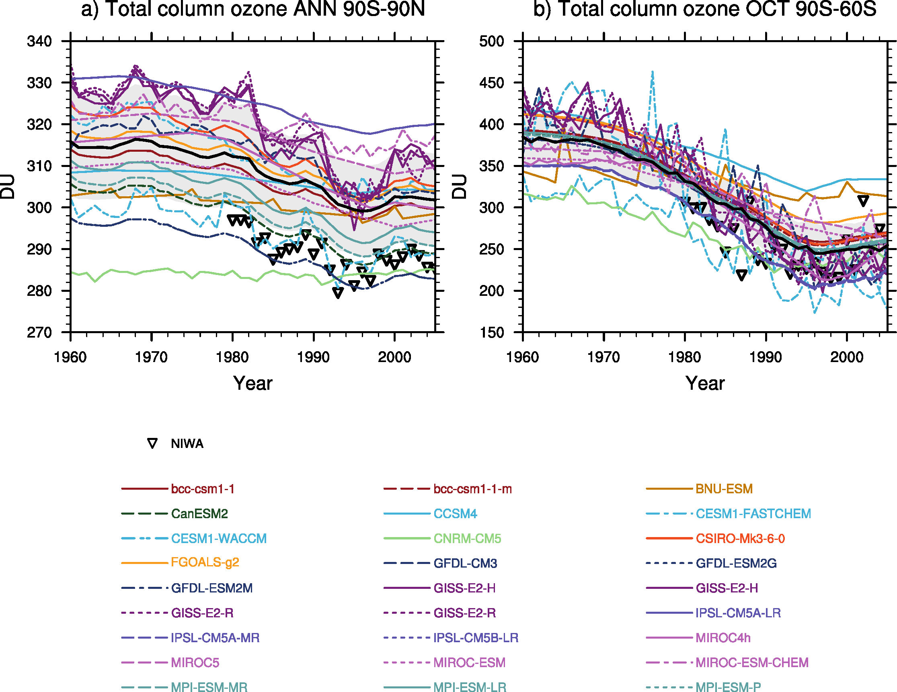
   
   Resembling Flato et al. (2013), Fig. 9.10 (Eyring et al., 2016: Fig. 25).

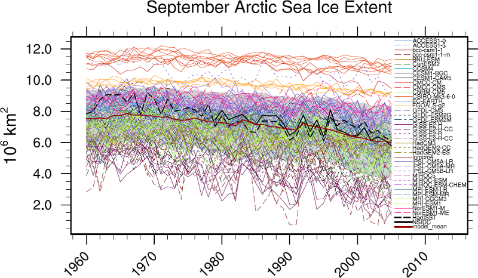
   
   Resembling Flato et al. (2013), Fig. 9.24 (Eyring et al., 2016: Fig. 17).

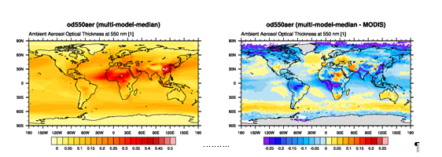
   
   Similar to Flato et al. (2013), Fig. 9.28.

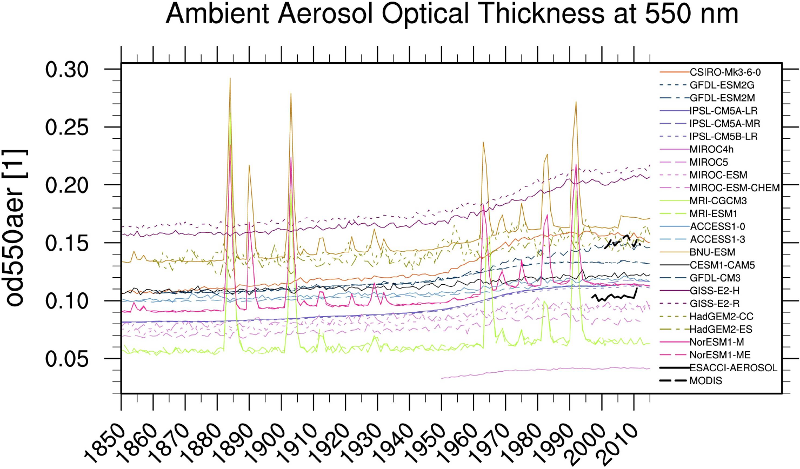
   
   Resembling Flato et al. (2013), Fig. 9.29 (Eyring et al., 2016: Fig. 23).

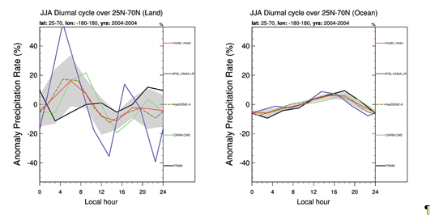
   
   Similar to Flat et al. (2013), Fig. 9.30.

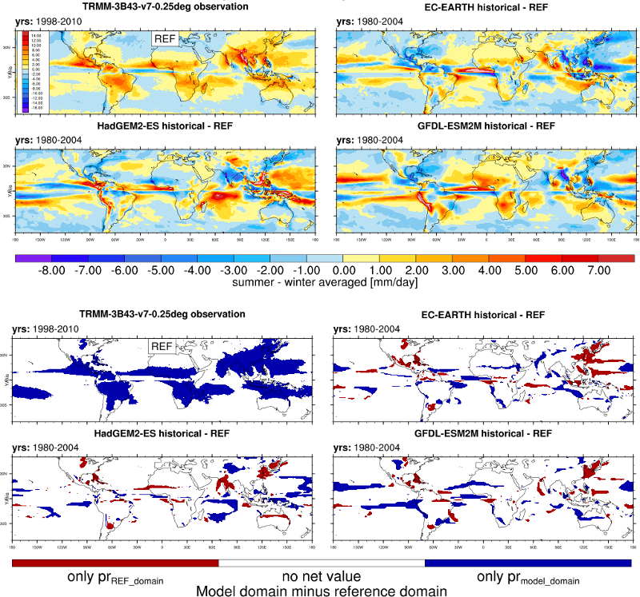
   
   Resembling Flato et al. (2013), Fig. 9.32 (Eyring et al., 2016: Fig. 5).

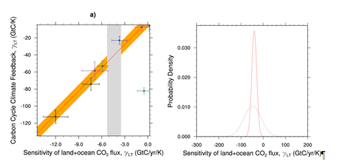
   
   Resembling Flato et al. (2013), Fig. 9.45 (Eyring et al., 2016: Fig. 26).

