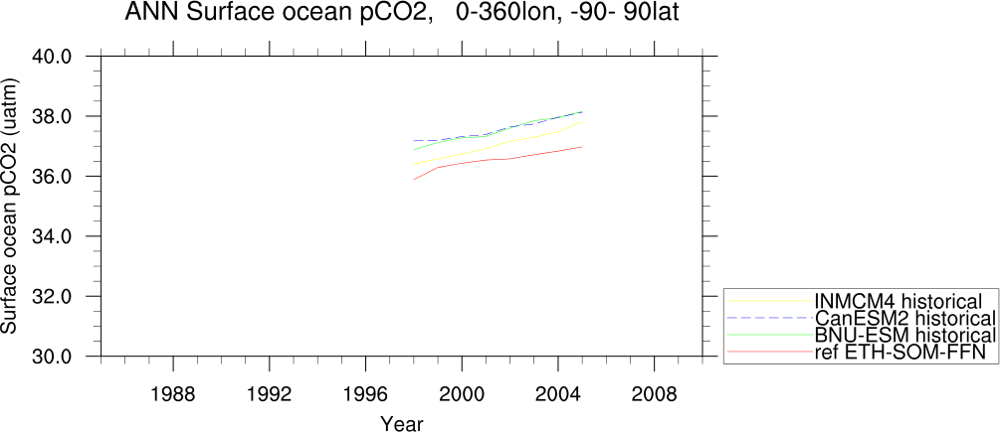
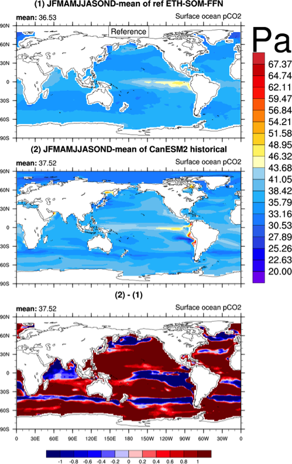
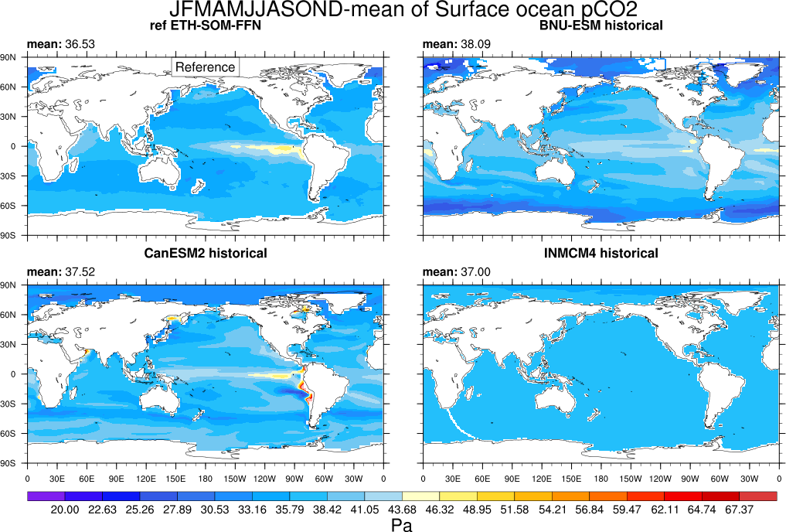

Marine biogeochemistry
======================

Overview
--------

A series of routines are provided to support the evaluation of ocean biogeochemical cycles at global scales as
simulated by both ocean-only and coupled climate-carbon cycle models. Diagnostics have been implemented to
generate time series line and contour plots for climatological distributions and inter-annual or inter-seasonal
(e.g., JJAS) variability of selected ocean biogeochemical variables along with companion plots for differences
("diff") relative to a chosen reference (observational) data set. Basic benchmarking statistics are also
provided (bias, standard deviation, root mean squared error, correlation coefficient).

Available namelists and diagnostics
-----------------------------------

Namelists are stored in nml/

* namelist_GlobalOcean.xml

Diagnostics are stored in diag_scripts/

* GO_comp_map.ncl: this diagnostic takes input from up to four models, one of which is defined as the reference, to produce contour maps of the time-mean (climatology) and standard deviation (inter-annual or inter-seasonal [e.g., JJAS] variability) together with the difference between the reference and each model. GO_comp_map.ncl is based on SAM_monsoon/SAMonsoon_wind_basic.ncl and uses many SAMonsoon underlying functions. Extensions to these routines include support for the pre-processing and interpolation of curvilinear ocean grids (e.g., ORCA2, NEMO) along with the option to use 3-D (TO3M; depth-resolving) input model data (ocean) and select a single depth level on which to produce comp_maps.
* GO_tsline.ncl: this diagnostic (developed from SeaIce_tsline.ncl) produces annual and seasonal time series plots from monthly ocean data, and includes reformatting options to convert input irregularly gridded data into a version that NCL can interpret by introducing intermediate referencing co-ordinates in dimensioning the variable, and writing gridcell areas to the same file. Plots can be produced either globally or from a selected latitude-longitude range, with optional extensions including the ability to mask model fields with observational coverage, plot anomaly fields, or overlay derived fields such as linear trend lines, running means or multi-model means. Support for irregular grids (e.g., ORCA2, ORCA1) is provided to, for instance, apply a weighting based on gridcell areas before calculating averages (see reformat_scripts/GO/).

User settings
-------------

User setting files (cfg files) are stored in nml/cfg_GO/

   #. GO_tsline.ncl

      *Required diag_script_info attributes*

         * month: "A" (A = annual mean)
         * styleset: "CMIP5" (CMIP5, DEFAULT, GO, EXPT)
         * colors = (/"red", "green", "blue", "yellow", "purple", "black", "gray", "white", "pink", "orange", "brown", "palegreen"/)
         * ts_multimean: "True" = plot multi-model mean & stddev; "False" = don't
         * ts_latrange: min. and max. latitude for area-averaging of first variable (array)
         * ts_lonrange: min. and max. longitude for area-averaging of first variable (array)

      *Optional diag_info_script attributes*

         * ts_anom: calculates anomalies with respect to the first 10-year average (anom, noanom)
         * ts_ymin: y-axis minimum
         * ts_ymax: y-axis maximum
         * ts_min_year: start year 
         * ts_max_year: end year
         * ts_smooth: smoothing (True, False)
         * ts_trend: overlay trend line (True, False)
         * ts_coverage: *not used*

   #. GO_comp_map.ncl

      *Required diag_script_info attributes*

         * GO_season: season (e.g., "JJASO")
	 * GO_detrend: detrend data (True, False)
	 * latrange_basic: min. and max latitude of region (array)
	 * lonrange_basic: min. and max. longitude of region (array)
	 * ref_model: name of reference data set
	 * cn_levels_mean_basic: contour levels for mean (array)
	 * cn_levels_mean_diff_basic: contour levels for differences (array)
	 * cn_levels_stddev_basic: contour levels for standard deviation (array)
	 * cn_levels_stddev_diff_basic: contour levels for difference in standard deviation (array)
	 * regrid_for_these_projects: list of project names that will be regridded (e.g., "CMIP5_gridfile", "GO_gridfile", "CMIP5_fx") (array)

Variables
---------

* spco2 (ocnBgchem, monthly mean, longitude latitude time)
* chl (ocnBgchem, monthly mean, longitude latitude time)
* talk (ocnBgchem, monthly mean, longitude latitude time)
* o2 (ocnBgchem, monthly mean, longitude latitude olevel time)

Observations and reformat scripts
---------------------------------

.. note:: (1) obs4mips data can be used directly without any preprocessing;
          (2) see headers of reformat scripts for non-obs4mips data for download instructions.

* spco2: Surface Ocean CO2 Atlas (SOCAT version 2; Bakker et al., 2014)

  *Reformat script*: reformat_scripts/obs/reformat_obs_SOCAT.csh

* spco2: Two Surface Ocean pCO2 Mapping Intercomparison (SOCOM) products: UEA-SI v1.0 (Jones et al., In Rev.) and ETH-SOM-FFN (Landshüster et al., 2014)

  *Reformat script*: reformat_scripts/obs/reformat_obs_ETH-SOM-FFN.csh

* chl: Chlorophyll concentration data from Sea-viewing WIde Field-of-view Sensor (SeaWIFs; available at: http://oceancolor.gsfc.nasa.gov/SeaWiFS/)

  *Reformat script*: reformat_scripts/obs/reformat_obs_SeaWIFS.csh

* o2: World Ocean Atlas (WOA) 2005 dissolved oxygen concentration data with corrections applied as described in Bianchi et al. (2012)

  *Reformat script*: reformat_scripts/obs/reformat_obs_woa2005.csh

* talk: Monthly surface climatological Total Alkalinity (T14; Takahashi et al., 2014)

  *Reformat script*: reformat_scripts/obs/reformat_obs_takahashi14.csh

References
----------

* Bakker, D. C. E., Pfeil, B., Smith, K., Hankin, S., Olsen, A., Alin, S. R., Cosca, C., Harasawa, S., Kozyr, A., Nojiri, Y., O'Brien, K. M., Schuster, U., Telszewski, M., Tilbrook, B., Wada, C., Akl, J., Barbero, L., Bates, N. R., Boutin, J., Bozec, Y., Cai, W.-J., Castle, R. D., Chavez, F. P., Chen, L., Chierici, M., Currie, K., de Baar, H. J. W., Evans, W., Feely, R. A., Fransson, A., Gao, Z., Hales, B., Hardman-Mountford, N. J., Hoppema, M., Huang, W.-J., Hunt, C. W., Huss, B., Ichikawa, T., Johannessen, T., Jones, E. M., Jones, S. D., Jutterström, S., Kitidis, V., Körtzinger, A., Landschützer, P., Lauvset, S. K., Lefèvre, N., Manke, A. B., Mathis, J. T., Merlivat, L., Metzl, N., Murata, A., Newberger, T., Omar, A. M., Ono, T., Park, G.-H., Paterson, K., Pierrot, D., Ríos, A. F., Sabine, C. L., Saito, S., Salisbury, J., Sarma, V. V. S. S., Schlitzer, R., Sieger, R., Skjelvan, I., Steinhoff, T., Sullivan, K. F., Sun, H., Sutton, A. J., Suzuki, T., Sweeney, C., Takahashi, T., Tjiputra, J., Tsurushima, N., van Heuven, S. M. A. C., Vandemark, D., Vlahos, P., Wallace, D. W. R., Wanninkhof, R., and Watson, A. J.: An update to the Surface Ocean CO2 Atlas (SOCAT version 2), Earth Syst. Sci. Data, 6, 69-90, doi: 10.5194/essd-6-69-2014, 2014.

* Bianchi, D., Dunne, J. P., Sarmiento, J. L., and Galbraith, E. D.: Data-based estimates of suboxia, denitrification, and N2O production in the ocean and their sensitivities to dissolved O2, Global Biogeochem. Cy., 26, GB2009, doi: 10.1029/2011GB004209, 2012.

* Jones, S. D., Le Quere, C., Rödenbeck, C., Manning, A. C., and Olsen, A.: A statistical gap-filling method to interpolate global monthly surface ocean carbon dioxide data, J, Adv. Model Earth Syst., in review. Key, R. M., Kozyr, A., Sabine, C. L., Lee, K., Wanninkhof, R., Bullister, J. L., Feely, R. A., Millero, F. J., Mordy, C., and Peng, T.-H.: A global ocean carbon climatology: results from Global Data Analysis Project (GLODAP), Global Biogeochem. Cy., 18, GB4031, doi: 10.1029/2004GB002247, 2004.

* Rödenbeck, C., Keeling, R. F., Bakker, D. C. E., Metzl, N., Olsen, A., Sabine, C., and Heimann, M.: Global surface-ocean pCO2 and sea-air CO2 flux variability from an observation-driven ocean mixed-layer scheme, Ocean Sci., 9, 193-216, doi: 10.5194/os-9-193-2013, 2013.

* Takahashi, T., Sutherland, S. C., Chipman, D. W., Goddard, J. G., Ho, C., Newberger, T., Sweeney, C., and Munro, D. R.: Climatological distributions of pH, pCO2, total CO2, alkalinity, and CaCO3 saturation in the global surface ocean, and temporal changes at selected locations, Mar. Chem., 164, 95-125, doi: 10.1016/j.marchem.2014.06.004, 2014.

.. raw:: latex

   \newpage

Example plots
-------------

|

|
|
         
+-----------------------------------------------------------------------------+----------------------------------------------------------------------------+
| .. image :: ../../source/namelists/figures/marine_bgc/marine_bgc_fig_2a.png | .. image:: ../../source/namelists/figures/marine_bgc/marine_bgc_fig_2b.png |
+-----------------------------------------------------------------------------+----------------------------------------------------------------------------+

