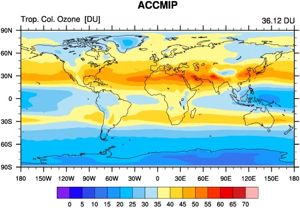
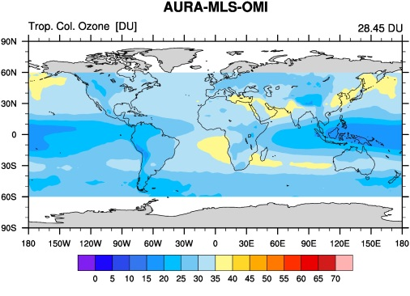
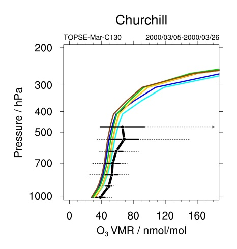
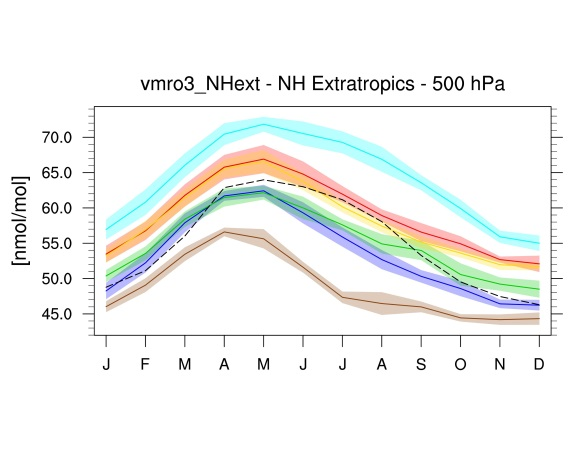

Ozone and some precursors
=========================

Overview
--------

This namelist provides diagnostics to evaluate the simulated atmospheric composition in ESMs with a focus on ozone and precursor gases such as NO\ :sub:`x`\.
This includes comparisons of simulated tropospheric ozone columns, seasonal cycle and vertical profiles of trace gases with observations.
Model data are sampled for the same regions and the same time of year as the observations, monthly data are weighted according to the number of days in each month contributing to the respective campaign climatology. 

Available namelists and diagnostics
-----------------------------------

Namelists are stored in nml/

    * namelist_righi15gmd_Emmons.xml
    * namelist_righi15gmd_tropo3.xml

Diagnostics are stored in diag_scripts/

    * ancyc_lat.ncl: annual cycle contour plots of zonal means.
    * Emmons.ncl: profiles of atmospheric trace gas mixing ratios, compared to the in-situ data climatologies of Emmons et al. (2000). Simulation data are sampled for the same regions and the same time of year as the observations. Monthly data are weighted according to the number of days in each month contributing to the respective campaign climatology. Note: simulation data are sampled according to the period specified in the namelist. Observational data may be from different years.
    * lat_lon.ncl: plots the geographical distribution of a variable (latitude-longitude plot).
    * perfmetrics_grading.ncl: calculates grades according to a given metric with different options for normalization. It requires fields precalculated by perfmetrics_main.ncl (see :ref:`nml_perfmetrics`).
    * perfmetrics_grading_collect.ncl: collects results from metrics previously calculated by perfmetrics_grading.ncl and passes them to the plotting functions (see :ref:`nml_perfmetrics`).
    * perfmetrics_main.ncl: calculates and (optionally) plots annual/seasonal cycles, zonal means, lat-lon fields and time-lat-lon fields from input monthly 2-d or 3-d ("T2M", "T3Ms") data. The calculated fields can be also plotted as difference w.r.t. a given reference model. They are also used as input to calculate grading metrics (see perfmetrics_grading.ncl) (see :ref:`nml_perfmetrics`).
    * perfmetrics_taylor.ncl: calculates grades according to a given metric with different options for normalization. It requires fields precalculated by perfmetrics_main.ncl (see :ref:`nml_perfmetrics`).
    * perfmetrics_taylor_collect.ncl: collects results from metrics previously calculated by perfmetrics_taylor.ncl and passes them to the plotting functions (see :ref:`nml_perfmetrics`).

User settings
-------------

User setting files (cfg files) are stored in nml/cfg_righi15gmd/Emmons/ and nml/cfg_righi15gmd_tropo3/

#. ancyc_lat.ncl

   *Requires diag_script_info attributes*

   * styleset: style ("DEFAULT, "righi15gmd"; see diag_scripts/lib/ncl/style.ncl for available styles)
   * font: font type (see www.ncl.ucar.edu/Document/Graphics/Resources/tx.shtml#txFont)

   *Optional diag_script_attributes*

   * obsfiles
   * range_option: 0 = as in nml, 1 = overlapping time period
   * case
   * y1
   * y2
   * obsname
   * lbLabelBarOn: plot label bar (True/False)

#. Emmons.ncl

   * **obsfiles: list of observational files including full pathnames; all files matching the following will be scanned, all suitable data will be used (mandatory), wildcards are allowed.**

   *OBS parameters*

   The target variable (e.g., "vmro3") + the following extensions give the variable names in the obs file for specific quantities such as mean, standard devition, minimum, etc.
   Deactivate lines corresponding to parameters that are not in the obs file; either *obsvar_mean* or *obsvar_median* is mandatory.
   "_N" is only used for grading: will use equal weights if disabled.
   Disabling any other quantity will just cause the corresponding whisker not to be drawn (this may be used to switch off whiskers).

   * obsvar_N: extension to assemble variable name for number of observations, e.g., "_N"
   * obsvar_mean: extension to assemble variable name for mean, e.g., "_mean"
   * obsvar_stddev: extension to assemble variable name for standard deviation, e.g., "_stddev"
   * obsvar_min: extension to assemble variable name for minima, e.g, "_min"
   * obsvar_max : extension to assemble variable name for maxima, e.g, "_max"
   * obsvar_5: extension to assemble variable name for 5% percentiles, e.g., "_5"
   * obsvar_25: extension to assemble variable name for 25% percentiles, e.g., "_25"
   * obsvar_median: extension to assemble variable name for median, e.g., "_median"
   * obsvar_75: extension to assemble variable name for 75% percentiles, e.g, "_75"
   * obsvar_95: extension to assemble variable name for 95% percentiles, e.g., "_95"

   *Campaign parameters, expected to be global attributes of each obs file (all mandatory)*

   * obsatt_campaign: name of the attribute containing the campaign name (plot annotation), e.g., "campaign"
   * obsatt_location: name of the attribute containing the region (plot annotation), e.g., "location"
   * obsatt_period: name of the attribute containing the time period covered, e.g., "period"
   * obsatt_latmin: name of the attribute containing the min. latitude of the region, e.g., "latmin"
   * obsatt_latmax: name of the attribute containing the max. latitude of the region, e.g., "latmax"
   * obsatt_lonmin: name of the attribute containing the min. longitude of the region, e.g., "lonmin"
   * obsatt_lonmax: name of the attribute containing max. longitude of the region, e.g., "lonmax"

   *Optional FILTER parameters for selection of obs data*

   * roi: region of interest (4-element array given as (/latmin, latmax, lonmin, lonmax/)) (default = (/90., 90., 0., 360./))
   * roi_match: "contained", "center", "overlap", "encloses", "outside" (default: "center"); e.g., "center" = center of observational region (given by global attributes of observational file) must be inside the "region of interest (roi)" for the data to be considered
   * poi: period of interest for obsservations (2-element array), (/first, last/) years to be considered (default = (/1900, 2100/))
   * poi_match: "contained" / "center" / "overlap" / "encloses" / "outside" (default = "overlap"), e.g., "overlap" = period of observations (given by the corresponding global attribute of the observational data file) must overlap with the "period of interest (poi)" for the data to be considered

   *Optional GENERAL parameters*

   * quantity: determines quantities to be evaluated and plotted for grading ("mean", "median" (not fully implemented yet))
   * ncdf: enable to output to netCDF: either use "default" or give a full file name (default = no netCDF output)
   * interpolation: flag determining regridding from simulation to observations' pressure levels: 1 = linear, 2 = log; sign (-/+) = with/without extrapolation (default: -1 or +1 will be used, depending on levels)

   *Optional PANELING parameters (none of them mandatory, because there are defaults)*

   * max_vert: max. plots per column (default = 1)
   * max_hori: max. plots per row (default = 1)
   * aux_info: string to include in outfile name (default = period of interest)

   *Optional STYLE parameters (used by function profile_plev)*

   * styleset: style, e.g., "righi15gmd" (see diag_scripts/lib/ncl/style.ncl for available styles) (default = "DEFAULT")
   * colors: override line colors (list), e.g., (/"black"/)
   * dashes: overrides line styles (list), e.g., (/"0"/)
   * thicks: override line thicknesses (list), e.g., (/2, 1, 1, 1, 1, 1, 1/) * 6.
   * annots: e.g., (/"data"/)
   * FuncCode: overrides default function code for strings
   * font: overrides default font (see www.ncl.ucar.edu/Document/Graphics/Resources/tx.shtml#txFont)

   *Optional PLOTTING parameters (used by function profile_plev)*

   * ptop: top pressure in hPa; "auto" = observational range from input file (default = minimum of pressure coordinate from observational data file)
   * pbot: surface pressure in hPa; "auto" = observational range from input file (default = maximum of pressure coordinate from observational data file)
   * zoom: zoom x-axis range; "yes" = consider only mean/median when determining x-axis range; "no" = use min/max/5%/95% values to determine x-axis range; alternatively, an explicit range can be specified, e.g., (/0, 300/) (default = "yes")
   * inline_legend: legend in the plot (True, False) (default = False)

#. lat_lon.ncl

   *Required diag_script_info attributes*

   * styleset: style ("DEFAULT, "righi15gmd"; see diag_scripts/lib/ncl/style.ncl for available styles)
   * font: font type (see www.ncl.ucar.edu/Document/Graphics/Resources/tx.shtml#txFont)
   * mpProjection: map projection, e.g., "CylindricalEquidistant"; see http://www.ncl.ucar.edu/Document/Graphics/Resources/mp.shtml#mpProjection for available projections)

   *Optional diag_script_attributes*

   * range_option: 0 = as in nml, 1 = overlapping time period
   * gsnZonalMean: plot zonal mean next to map (True, False)

#. perfmetrics_grading.ncl, perfmetrics_grading_collect.ncl, perfmetrics_main.ncl, perfmetrics_taylor.ncl, perfmetrics_taylor_collect.ncl

   See "user settings" for :ref:`nml_perfmetrics`.

Variables
---------

    * vmro3 (monthly mean, time level latitude longitude)
    * vmrnox (monthly mean, time level latitude longitude)
    * vmrco (monthly mean, time level latitude longitude)
    * vmrc2h4 (monthly mean, time level latitude longitude)
    * vmrc2h6 (monthly mean, time level latitude longitude)
    * vmrc3h6 (monthly mean, time level latitude longitude)
    * vmrc3h8 (monthly mean, time level latitude longitude)
    * vmrch3coch3 (monthly mean, time level latitude longitude)
    * tropoz (monthly mean, time latitude longitude)
    * toz (monthly mean, time latitude longitude)
    * vmrco
    * vmro3
    

Observations and reformat scripts
---------------------------------

*Note: (1) obs4mips data can be used directly without any preprocessing; (2) see headers of reformat scripts for non-obs4mips data for download instructions.*

* Total column ozone (toz): NIWA (Bodeker et al., 2005) and GTO-ECV (Loyola and Coldewey-Egbers, 2012; Loyola et al., 2009)

  *Reformat scripts:*

  * reformat_scripts/obs/reformat_obs_NIWA.ncl
  * reformat_scripts/obs/reformat_obs_GTO-ECV.ncl

* Tropospheric column ozone (tropoz): MLS/OMI (Ziemke et al., 2006)

  *Reformat script:* reformat_scripts/obs/reformat_obs_AURA-MLS-OMI.ncl

* Ozonesonde profiles: Tilmes et al. (2012)

  *Reformat script:* reformat_scripts/obs/reformat_obs_Tilmes.ncl

* CO surface mixing ratios: GLOBALVIEW (2010)

  *Reformat script:* reformat_scripts/obs/reformat_obs_GLOBALVIEW.ncl

* Trace gas in-situ campaign composite data: Emmons et al. (2000)

  *Reformat script:* reformat_scripts/obs/reformat_obs_Emmons.ncl

References
----------

    * Bodeker, G. E., Shiona, H., and Eskes, H.: Indicators of Antarctic ozone depletion, Atmos. Chem. Phys., 5, 2603-2615, doi: 10.5194/acp-5-2603-2005, 2005.
    * Emmons, L. K., Hauglustaine, D. A., Müller, J.-F., Carroll, M. A., Brasseur, G. P., Brunner, D., Staehelin, J., Thouret, V., and Marenco, A.: Data composites of airborne observation of tropospheric ozone and its precursors, J. Geophys. Res., 105, 20497-20538, 2000.
    * GLOBALVIEW-CO2: Cooperative Atmospheric Data Integration Project -- Carbon Dioxide, CD-ROM, NOAA ESRL, Boulder, Colorado, available at: ftp://ftp.cmdl.noaa.gov (last access: 2 October 2014), 2010.
    * Klinger, C., Quantitative evaluation of ozone and selected climate parameters in the chemistry-climate model EMAC, Master Thesis, Ludwig-Maximilians-Universität München, 2011.
    * Loyola, D. and Coldewey-Egbers, M.: Multi-sensor data merging with stacked neural networks for the creation of satellite long-term climate data records, EURASIP J. Adv. Sig. Pr., 2012, 1-10, doi: 10.1186/1687-6180-2012-91, 2012.
    * Loyola, D. G., Coldewey-Egbers, R. M., Dameris, M., Garny, H., Stenke, A., Van Roozendael, M., Lerot, C.,  Balis, D., and  Koukouli, M.: Global long-term monitoring of the ozone layer -- a prerequisite for predictions, Int. J. Remote Sens., 30, 4295-4318, doi: 10.1080/01431160902825016, 2009.
    * Righi, M., V. Eyring, K.-D Gottschaldt, C. Klinger, F. Frank, P. Jöckel, and I. Cionni, Quantitative evaluation of ozone and selected climate parameters in a set of EMAC simulations, Geosci. Model Dev., 8, 733-768, doi: 10.5194/gmd-8-733-2015, 2015.
    * Tilmes, S., Lamarque, J.-F., Emmons, L. K., Conley, A., Schultz, M. G., Saunois, M., Thouret, V., Thompson, A. M., Oltmans, S. J., Johnson, B., and Tarasick, D.: Technical Note: Ozonesonde climatology between 1995 and 2011: description, evaluation and applications, Atmos. Chem. Phys., 12, 7475-7497, doi: 10.5194/acp-12-7475-2012, 2012.
    * Ziemke, J. R., Chandra, S., Duncan, B. N., Froidevaux, L., Bhartia, P. K., Levelt, P. F., and Waters, J. W.: Tropospheric ozone determined from Aura OMI and MLS: Evaluation of measurements and comparison with the Global Modeling Initiative’s Chemical Transport Model, J. Geophys. Res., 111, D19303, doi: 10.1029/2006JD007089, 2006.

Example plots
-------------

.. centered:: |pic_ozone_prec1| |pic_ozone_prec2|

.. centered:: |pic_ozone_prec3| |pic_ozone_prec4|

