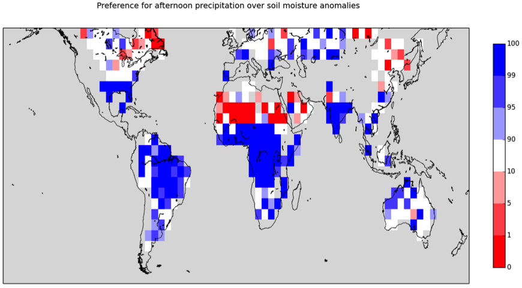

Precipitation dependence on soil moisture
=========================================

Overview
--------

The "precipitacion dependance on soil moisture diagnostic" is used for the analysis of the coupling between soil moisture and precipitation in Taylor
et al. 2012. The script sm_pr_diag_nml.py provides the diagnostic on a regular 5°x5° grid for the land surface between 60°S and 60°N. In the output
plots (see example :numref:`fig_precip_sm`) shading blue (red) indicates convective precipitation more likely over wetter (drier) soils.

Available Namelists and Diagnostics
-----------------------------------

Namelists are stored in nml/

* namelist_sm_pr.xml

Diagnostics are stored in diag_scripts/

* sm_pr_diag_nml.py: this script computes and plot the diagnostic "preference for afternoon precipitation over soil moisture anomalies" as in Fig.3 of Taylor et al. (2012).

Specific Routines
-----------------

* main(project_info): call all callable fuctions to read CMIP5 data, compute and plot the diagnostic
* read_pr_sm_topo(project_info): read and extract input for computing the diagnostic from CMIP5 input data and topography from aux file topo_var_5x5.gra
* get_smclim(sm, lon, time): compute monthly soil moisture climatology at 0600 LT (note that more strictly this is between 0600 and 0859 LT)
* get_monthly_input(project_info, mn, time, lon, lat, time_bnds_1, pr, sm, fileout, samplefileout, verbosity): prepare and agregate by month the input data required by the F90 routines global_rain_sm and sample_events
* F90 routine global_rain_sm: identifies rain events (time and location) from 3-hourly rainfall
* F90 routine sample_events: creates two datasets of difference in soil moisture between the locations of rainfall maximum and minimum, dataset 1 is for the events themselves, dataset 2 for the same locations but in different years (i.e. non-events)
* get_p_val(in_dir): compares the statistics of the two datasets above by resampling, to compute percentiles (p_values) of "preference for afternoon precipitation over soil moisture anomalies" as in Fig.3 of Taylor et al. 2012
* write_nc(fileout, xs, ys, p_vals, project_info): save netCDF file with the diagnostic in a regular 5°x5° grid
* plot_diagnostic(fileout, plot_dir, project_info): plot diagnostic and save to .png file

**Installation procedure**

The diagnostics uses two Fortran programs that have to be compiled and interfaced to Python. This is done via the F2PY - Fortran to Python interface
generator. General instructions for this is:

.. code:: bash

   cd diag_scripts
   f2py --fcompiler=gfortran -c -m global_rain_sm global_rain_sm.f90
   f2py --fcompiler=gfortran -c -m sample_events sample_events.f90
   cd ../
   <Run diagnostics as usual>

User settings
-------------

User setting files (cfg files) are stored in nml/ cfg_sm_pr/

Variables
---------

* pr - precipitation (atmos, 3hr, time latitude longtitude)
* mrsos - moisture in upper portion of soil column (land, 3hr, time latitude longtitude)

Observations and Reformat Scripts
---------------------------------

None.

References
----------

Taylor, C. M., R. A. M. de Jeu, F. Guichard, P. P. Harris, and W. A. Dorigo (2012), Afternoon rain more likely over drier soils, Nature, 489(7416), 423-426, doi: 10.1038/nature11377.

Example plots
-------------

.. _fig_precip_sm:

   
   CNRM-CM5_sm_pr_diag_plot (CNRM-CM5, 3hr, amip, r1i1p1, 1999-2008).

