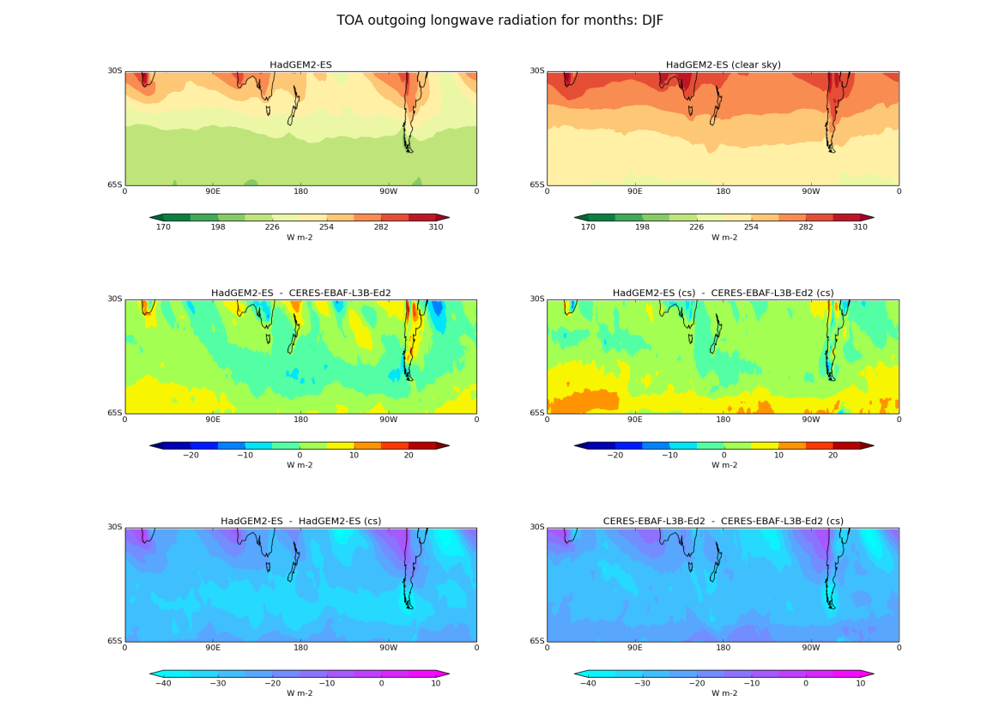
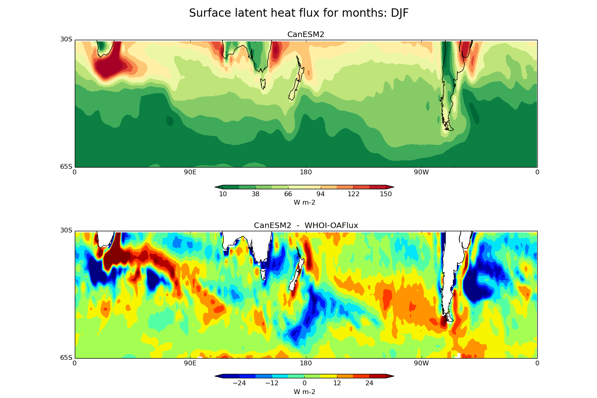
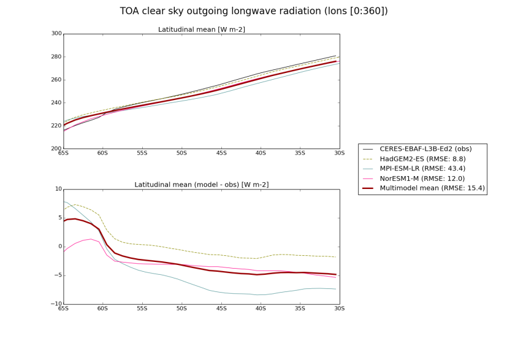
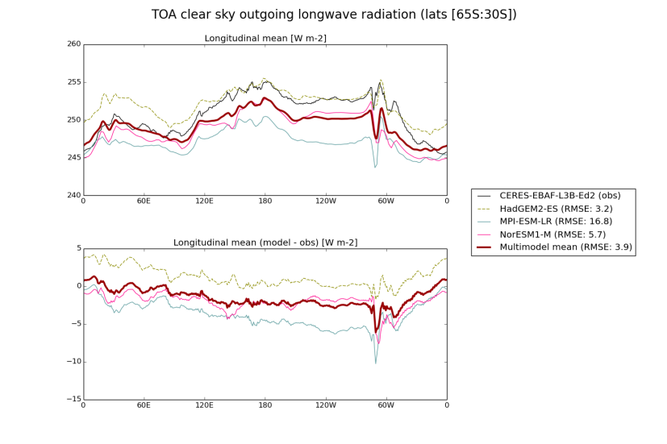
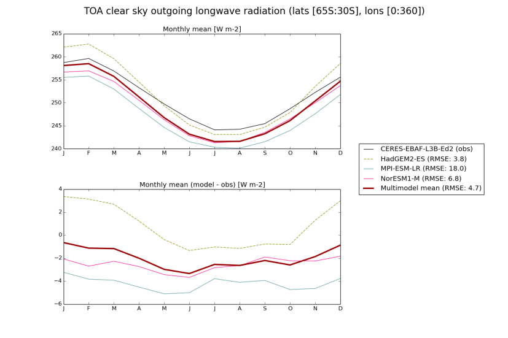

Southern hemisphere
===================

Overview
--------

The diagnostics compare model estimates of cloud, radiation and surface turbulent flux variables with suitable observational data sets. Seasonal mean maps of TOA, total and clear-sky, outgoing short wave (SW) and long wave (LW) radiation are constructed for the Southern Ocean region (30°S-65°S) comparing available model data with CERES-EBAF satellite observations (Loeb et al., 2005). Absolute values, model to satellite differences and total minus clear sky flux values are plotted through standard namelists. Combined with TOA radiation, seasonal mean maps of total cloud cover, vertically integrated cloud liquid water and cloud ice are also plotted with CloudSat data (Stephens et al., 2002) providing an observational constraint. Finally, seasonal mean maps of surface sensible and latent heat fluxes over the same region compare model estimates with the Woods Hole OAflux observations (Yu et al., 2008). For each of these quantities (TOA radiation, cloud and surface flux variables) climatological annual cycles are constructed using zonal means averaged separately over 3 latitude bands: (i) 30°S-65°S, the entire Southern Ocean, (ii) 30°S-45°S, the subtropical Southern Ocean, and (iii) 45°S-65°S, the mid-latitude Southern Ocean. Finally, annual means of each variable (models and observations) are constructed as zonal means, plotted over 30°S-65°S, and as latitudinal means (over 30°S-65°S) plotted around a longitude circle.

Available namelists and diagnostics
-----------------------------------

Namelists are stored in nml/

* namelist_SouthernHemisphere.xml

Diagnostics are stored in diag_scripts/

* SouthernHemisphere.py
* SouthernHemisphere_scatter.py

User settings
-------------

User setting files (cfg files) are stored in nml/cfg_SouthernHemisphere/

#. SouthernHemisphere.py and SouthernHemisphere_scatter.py

*Diag_script_info attributes*

General options for all diagnostics

* plot_clouds: True, False
* plot_fluxes: True, False
* plot_radiation: True, False
* plot_scatter: True, False
* plot_background_grid: True, False
* plot_total_cover: True, False
* plot_liquid_path: True, False
* plot_ice_path: True, False
* plot_optical_depth: True, False
* plot_flux_maps: True, False
* plot_radiation_maps: True, False

Common sub keys for all diagnostics (plot_): X_maps, X_averages, sub_areas

* plot_lat_averages: True, False
* plot_lon_averages: True, False
* plot_monthly_averages: True, False
* plot_sub_areas: True, False
* mask_unwanted_values: mask values (e.g., missing values) exceeding "mask_limit_low" and "mask_limit_high" (True, False)
* mask_limit_low: lower threshold used for creating a mask (if "mask_unwanted_values" = True)
* mask_limit_high: upper threshold used for creating a mask (if "mask_unwanted_values" = True)

Configuration for Southern Hemisphere maps and plots. All plots will be generated for all areas but only monthly averages for sub_areas. 

* areas: name of area(s), defined separately for each area (see below), e.g., default
* sub_areas: name of sub-area(s), defined separately for each sub-area (see below), e.g., northern southern
* scatter_areas: cloud vs radiation scatter plot areas; areas must be defined separately (see below), e.g., default
* seasons: which months to plot for each contour and lat/lon mean plots (e.g., DJF MAM JJA SON); each season has to be defined separately (see below)

Definition of each area, e.g., [SouthernHemisphere_default]

* lat_min: min. latitude
* lat_max: max. latitude
* lon_min: min. longitude
* lon_max: max. longitude
* stride: color difference interval (how many units per color/shade); if set to 0, the stride is calculated automatically using "maxshades" (max. number of colors/shades)
* maxshades: max. number of colors/shades

The contour_limits_* are contour map limits and are given by 3 or 5 integers (min, max, diff, [dev_min, dev_max]). The min and max values define the limits for model maps (and the clear sky (cs) variant). The diff value gives a range [-diff, diff] for difference maps of model - obs (and cs). The last range [dev_min, dev_max] is the range for model/obs - model/obs (cs).

* hfls, hfss (latent, sensible heat); rlut, rsut (long, shortwave radiation).
* contour_limits_clt: contour limits for total cloud cover
* contour_limits_clivi: contour limits for ice water path
* contour_limits_clwvi: contour limits for total condensed water path
* contour_limits_hfls: contour limits for latent heat
* contour_limits_hfss: contour limits for sensible heat
* contour_limits_rlut: contour limits for longwave radiation
* contour_limits_rsut: contour limits for shortwave radiation
* contour_limits_rlds: contour limits for surface downwelling longwave radiation
* contour_limits_rsds: contour limits for surface downwelling shortwave radiation

Color maps for map plots. You may change the maps as you will, just google "python matplotlib colormaps" for examples. Color maps can be inverted by adding '_r' at the end.

* colourmap_clouds: e.g., Blues
* colourmap_model: e.g., RdYlGn_r
* colourmap_diff: e.g., jet
* colourmap_dev: e.g., cool hot_r

Definition of sub areas, e.g., [SouthernHemisphere_northern]

* lat_min: min. latitude
* lat_max: max. latitude
* lon_min: min. longitude
* lon_max: max. longitude

Definition of months covered by each season – 1 is January and so forth, e.g., [SouthernHemisphere_season_DJF]

* season_months: e.g., 12 1 2

Configuration for cloud vs radiation scatter plots

* lat_min: min. latitude
* lat_max: max. latitude
* lon_min: min. longitude
* lon_max: max. longitude
* points: number of bins

Variables
---------

* clt: total cloud cover fraction (atmos, monthly mean, time latitude longitude)
* clivi: cloud ice water path (atmos, monthly mean, time latitude longitude)
* clwvi: total condensed water path (atmos, monthly mean, time latitude longitude)
* hfls: latent heat flux (atmos, monthly mean, time latitude longitude)
* hfss: sensible heat flux (atmos, monthly mean, time latitude longitude)
* rlut: top of atmosphere outgoing longwave radiation (atmos, monthly mean, time latitude longitude)
* rlutcs: top of atmosphere outgoing clear-sky longwave radiation (atmos, monthly mean, time latitude longitude)
* rsut: top of atmosphere outgoing shortwave radiation (atmos, monthly mean, time latitude longitude)
* rsutcs: top of atmosphere outgoing clear-sky shortwave radiation (atmos, monthly mean, time latitude longitude)

Observations and reformat scripts
---------------------------------

Note: (1) obs4mips data can be used directly without any preprocessing; (2) see headers of reformat scripts for non-obs4mips data for download instructions.

* CERES-EBAF (obs4mips)
* WHOI-OAFlux
 * Reformat script: reformat_scripts/obs/reformat_obs_WHOI-OAFlux.ncl
*CloudSat-L3
 * Reformat script: reformat_scripts/obs/reformat_obs_cloudsat.bash
* MODIS-L3-C6
 * Reformat script: reformat_scripts/obs/reformat_obs_MODIS-L3-C6.ncl

References
----------

None.

Example plots
-------------

   

