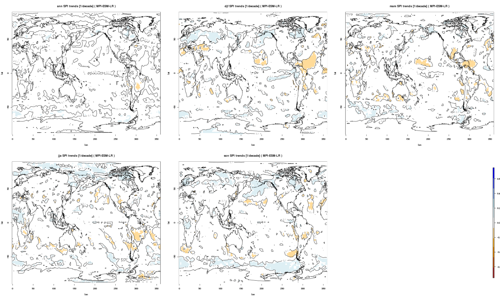

Standardized Precipitation Index (SPI)
======================================

Overview
--------

For each month, the precipitation over the preceding TIMESCALE months, x, is summed. Then a two-parameter Gamma distribution of cumulative probability, Gamma\ :sub:`α,β`, is fitted to the strictly positive TIMESCALE month sums, such that the probability of a non-zero precipitation sum being below a certain value x corresponds to Gamma\ :sub:`α,β`\ (x). We estimate shape parameter α and scale parameter β with a maximum likelihood approach. If the estimation does not converge, α and β are approximated using empirical relations (Bordi et al., 2001). Accounting for TIMESCALE month periods of no precipitation, occurring at a frequency q, the total cumulative probability distribution of a precipitation sum below x, H(x), becomes H(x) = q + (1 - q) * Gamma\ :sub:`α,β`\ (x). In the last step, a precipitation sum x is assigned to its corresponding Standardized Precipitation Index (SPI) value by computing the quantile q\ :sub:`N(0,1)` of the standard normal distribution at probability H(x). The SPI of a precipitation sum x, thus, corresponds to the quantile of the standard normal distribution which is assigned by preserving the probability of the original precipitation sum, H(x).

Available namelists and diagnostics
-----------------------------------

Namelists are stored in nml/

* namelist_SPI.xml

Diagnostics are stored in diag_scripts/

* SPI.r

User settings
-------------

User setting files (cfg files) are stored in nml/cfg_SPI/

#. SPR.r

   * begin.ref.year: first year of the reference period
   * end.ref.year: last year of the reference period
   * timescale: valid values are 3, 6 and 12 months
   * seasons: "ann", "djf", "mam", "jja", "son"
   * spi_colorbar_max: color bar range (= -spi_colorbar_max … +spi_colorbar_max)
   * my.colors: colors for contour plot, e.g., colorRampPalette(c("brown", "orange", "white", "lightblue", "blue"))
   * png_width: width of png image
   * png_height: height of png image
   * png_units: units of png dimensions ("px" = pixels, "in" = inches, "cm" = centimeters, "mm" = millimeters)
   * png_pointsize: the default size of plotted text in points (1/72 inch)
   * png_bg: background color, e.g., "white"

Variables
---------

* pr (atmos, monthly mean, longitude latitude time)

Observations and reformat scripts
---------------------------------

**Note: (1) obs4mips data can be used directly without any preprocessing; (2) see headers of reformat scripts for non-obs4mips data for download instructions.**

References
----------

*A very good explanation of SPI*

* Lloyd-Hughes, B. and Saunders, M. A. (2002), A drought climatology for Europe. Int. J. Climatol., 22, 1571-1592. doi: 10.1002/joc.846.

*Other standard SPI references*

* Guttman, N. B. (1999), ACCEPTING THE STANDARDIZED PRECIPITATION INDEX: A CALCULATION ALGORITHM. JAWRA Journal of the American Water Resources Association, 35, 311-322. doi: 10.1111/j.1752-1688.1999.tb03592.x.

* McKee, T. B., N. J. Doesken, and J. Kliest, 1993: The relationship of drought frequency and duration to time scales. In Proceedings of the 8th Conference of Applied Climatology, 17-22 January, Anaheim, CA. American Meterological Society, Boston, MA. 179-184.

* McKee, T. B, N. J. Doesken, and J. Kliest, 1995: Drought Monitoring with Multiple Time Scales. 9th AMS Conference on Applied Climatology, 15-20 January 1995, Dallas, Texas.

Example plots
-------------

   

