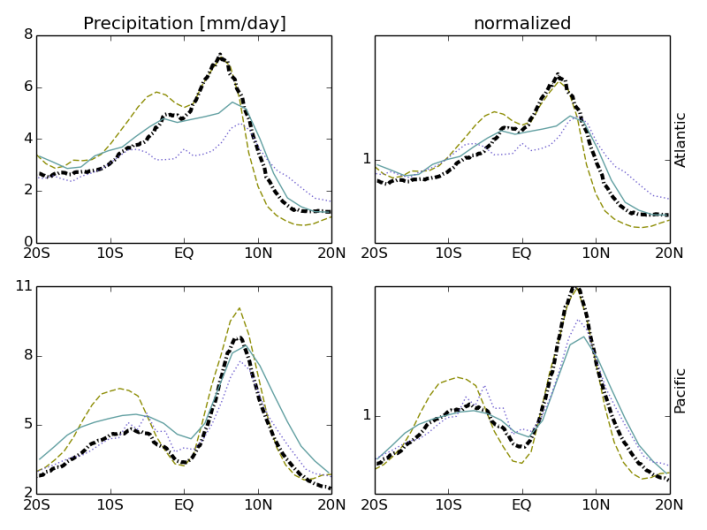
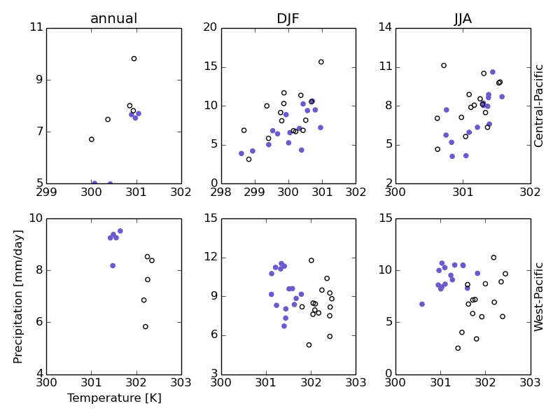
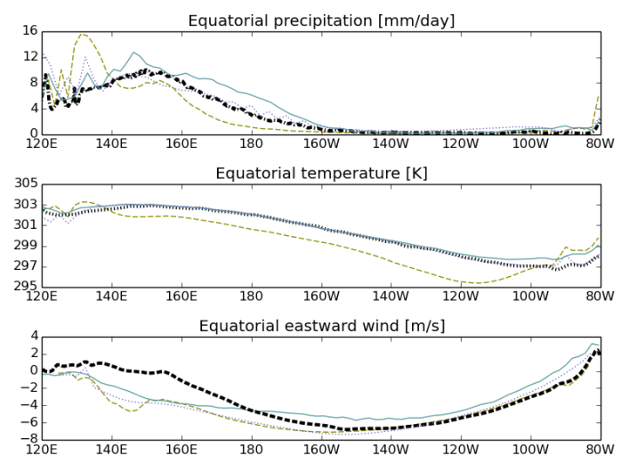

Tropical variability
====================

Overview
--------

The available diagnostics are motivated by the work of Li and Xie (2014). In particular, this diagnostics reproduces their Fig. 5 for models and observations/reanalyses, calculating equatorial mean (5°N-5°S), longitudinal sections of annual mean precipitation (pr), skin temperature (ts), horizontal winds (ua and va) and 925 hPa divergence (derived from the sum of the partial derivatives of the wind components extracted at the 925 hPa pressure level (that is du/dx + dv/dy). Latitude cross sections of the model variables are plotted for the equatorial Pacific, Indian and Atlantic Oceans with observational constraints provided by the TRMM-3B43-v7 for precipitation, the HadISST for SSTs, and ERA-interim reanalysis for temperature and winds. Latitudinal sections of absolute and normalized annual mean SST and precipitation are also calculated spatially averaged for the three ocean basins. Normalization follows the procedure outlined in Fig. 1 of Li and Xie (2014) whereby values at each latitude are normalized by the tropical mean (20°N-20°S) value of the corresponding parameter (e.g., annual mean precipitation at a given location is divided by the 20°N-20°S annual mean value). Finally, to assess how models capture observed relationships between SST and precipitation the co-variability of precipitation against SST is calculated for specific regions of the tropical Pacific. This analysis includes calculation of the Mean Square Error (MSE) between model SST/precipitation and observational equivalents.

Available namelists and diagnostics
-----------------------------------

Namelists are stored in nml/

* namelist_TropicalVariability.xml

Diagnostics are stored in diag_scripts/

* TropicalVariability.py
* TropicalVariability_EQ.py
* TropicalVariability_wind.py

User settings
-------------

User setting files (cfg files) are stored in nml/cfg_Tropical Variability/

#. TropicalVariability.py, TropicalVariability_EQ.py, TropicalVariability_wind.py

*Settings for all diagnostics*

* plot_equatorial: switch for equatorial plots (True, False)
* plot_scatter: switch for scatter plots (True, False)
* plot_zonal_means: switch for zonal mean plots (True, False)
* plot_clouds: True, False
* plot_fluxes: True, False
* mask_unwanted_values: mask values (e.g., missing values) exceeding "mask_limit_low" and "mask_limit_high" (True, False)
* mask_limit_low: lower threshold used for creating a mask (if "mask_unwanted_values" = True)
* mask_limit_high: upper threshold used for creating a mask (if "mask_unwanted_values" = True)
* plot_grid: provides a background grid for relavant plots (True, False)

*Settings for equatorial mean plots with precipitation, temperature and winds*

* areas: region to process ("Atlantic", "Indian", "Pacific"); each region is defined separately

*Definition of regions ("areas")*

* lat_min: min. latitude of region
* lat_max: max. latitude of region
* lon_min: min. longitude of region
* lon_max: max. longitude of region
* prec_min: range of values for precipitation (min.)
* prec_max: range of values for precipitation (max.)
* temp_min: range of values for temperature/SST (min.)
* temp_max: range of values for temperature/SST (max.)
* wind_min: range of values for wind speed (min.)
* wind_max: range of values for wind speed (max.)
* div_min: range of values for divergence (min.)
* div_max: range of values for divergence (max.)

*Settings for temperature/precipitation scatter plots* 

* areas: region to process ("West-Pacific", "Central-Pacific", "East-Pacific")
* seasons: season (annual DJF MAM JJA SON)
* seasonal_limits: if you want to use your own limits (True) or let the code decide (False - values based on observations)

*Definition of regions ("areas") for scatter plots*

* lat_min: min. latitude of region
* lat_max: max. latitude of region
* lon_min: min. longitude of region
* lon_max: max. longitude of region
* season_limits_annual: "seasonal" limits (annual means), 4 integer numbers giving 'min. temp.' 'max. temp.' 'min. precip.' 'max. precip.', e.g., 300 303 4 10
* season_limits_DJF: same as season_limits_annual, but for Dec-Jan-Feb (DJF)
* season_limits_MAM: same as season_limits_annual, but for Mar-Apr-May (MAM)
* season_limits_JJA: same as season_limits_annual, but for Jun-Jul-Aug (JJA)
* season_limits_SON: same as season_limits_annual, but for Sep-Oct-Nov (SON)

*Definition of the seasons (each season defined separately)*

* season_months: numbers of the months covered by the corresponding season, e.g., "12 1 2" for the season "DJF"

*Settings for zonal means of SST and precipitation*

* areas: region to process (Pacific Atlantic Indian)

*Definition of the regions ("areas")*

* lat_min: min. latitude of region
* lat_max: max. latitude of region
* lon_min: min. longitude of region
* lon_max: max. longitude of region

Variables
---------

* ts: skin temperature (atmos, monthly mean, time latitude longitude)
* pr: precipitation (atmos, monthly mean, time latitude longitude)
* ua: u-wind (atmos, monthly mean, time plevel latitude longitude)
* va: v-wind (atmos, monthly mean, time plevel latitude longitude)

Observations and reformat scripts
---------------------------------

**Note: (1) obs4mips data can be used directly without any preprocessing; (2) see headers of reformat scripts for non-obs4mips data for download instructions.**

* HadISST: skin Temperature (ts) / sea surface temperature (SST)
  Reformat script: reformat_scripts/obs/reformat_obs_HadISST.ncl
* TRMM-L3 (pr, monthly means - obs4mips)
* ERA-Interim (u-wind, v-wind)
  Reformat script: reformat_scripts/obs/reformat_obs_ERA-Interim.ncl

References
----------

* Li, G. and S.-P. Xie (2014), Tropical Biases in CMIP5 Multimodel Ensemble: The Excessive Equatorial Pacific Cold Tongue and Double ITCZ Problems. J. Climate, 27, 1765-1780. doi: http://dx.doi.org/10.1175/JCLI-D-13-00337.1.

Example plots
-------------

   

  
  

   

