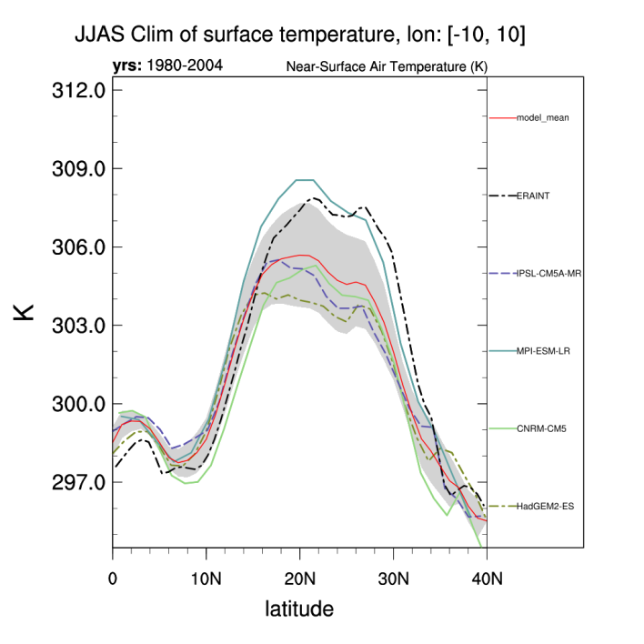
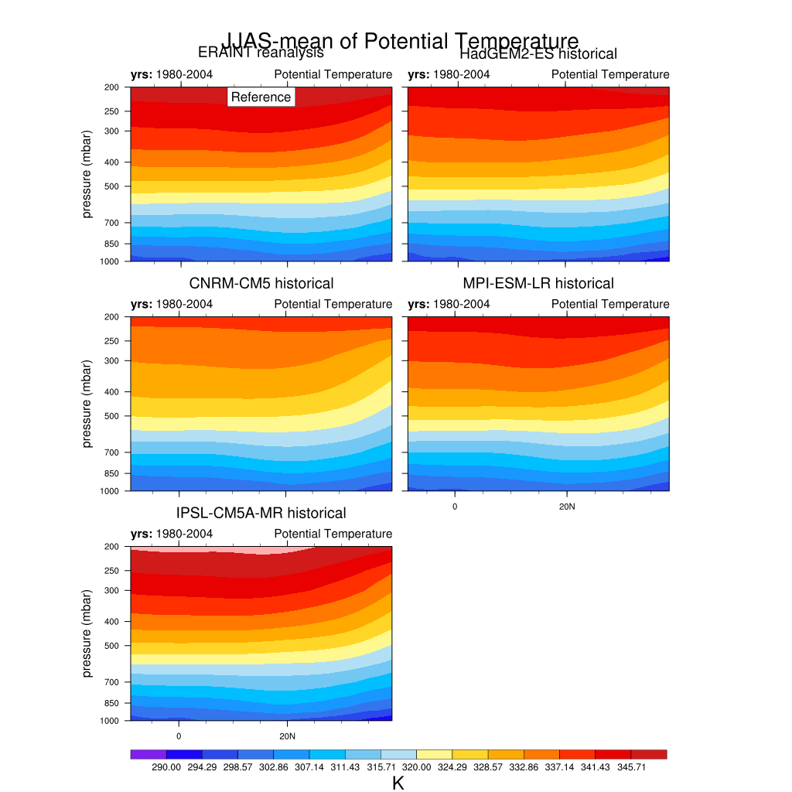
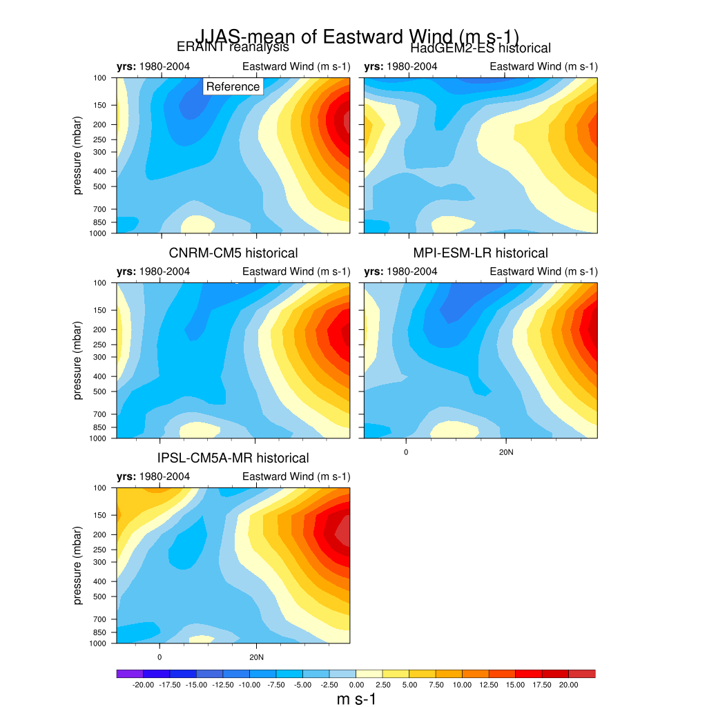
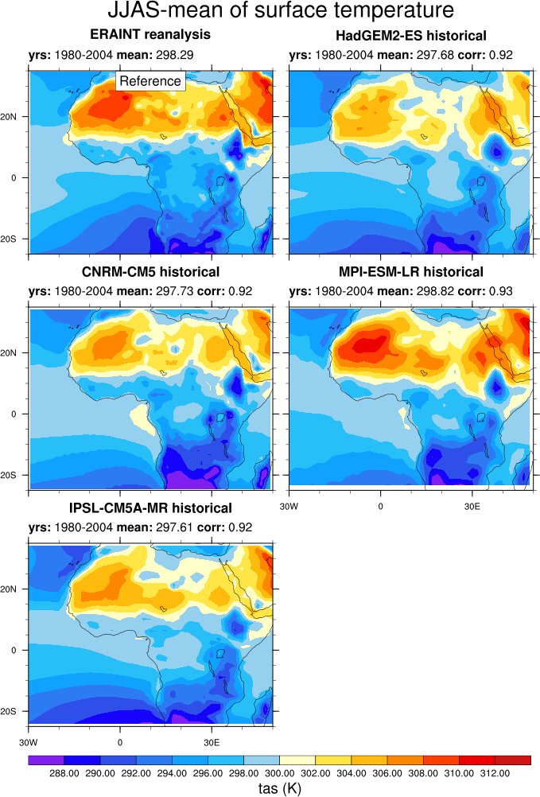
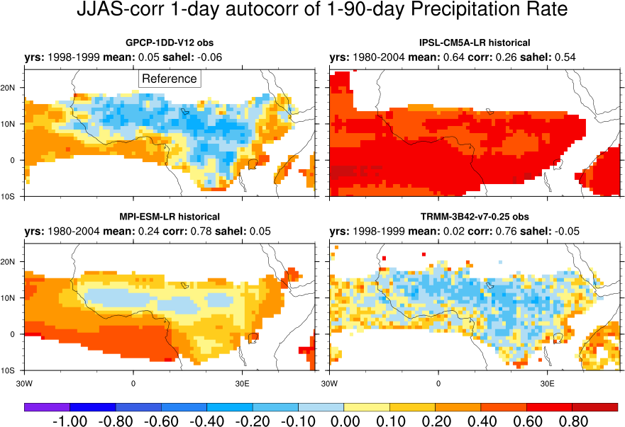
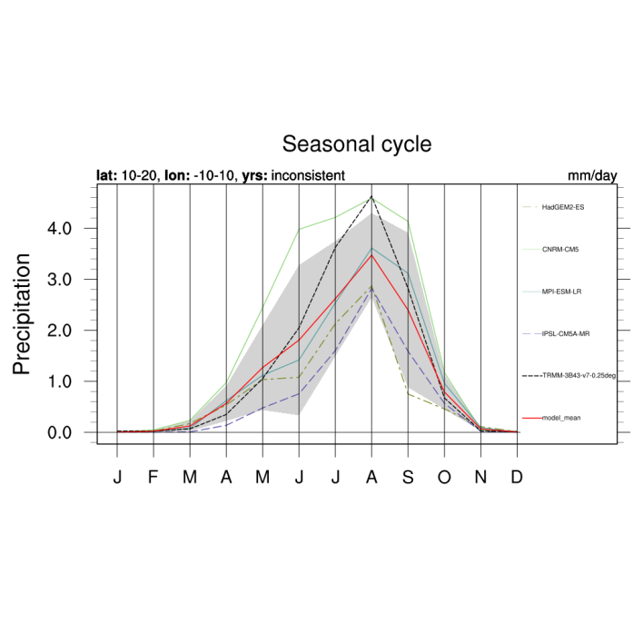
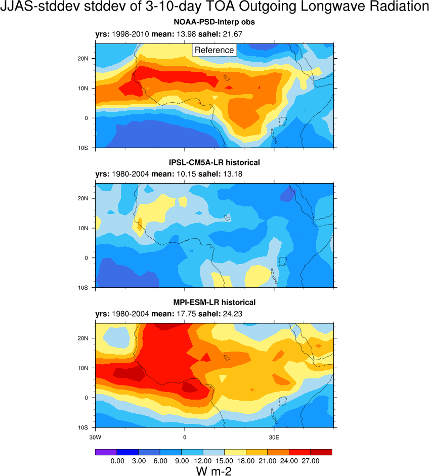
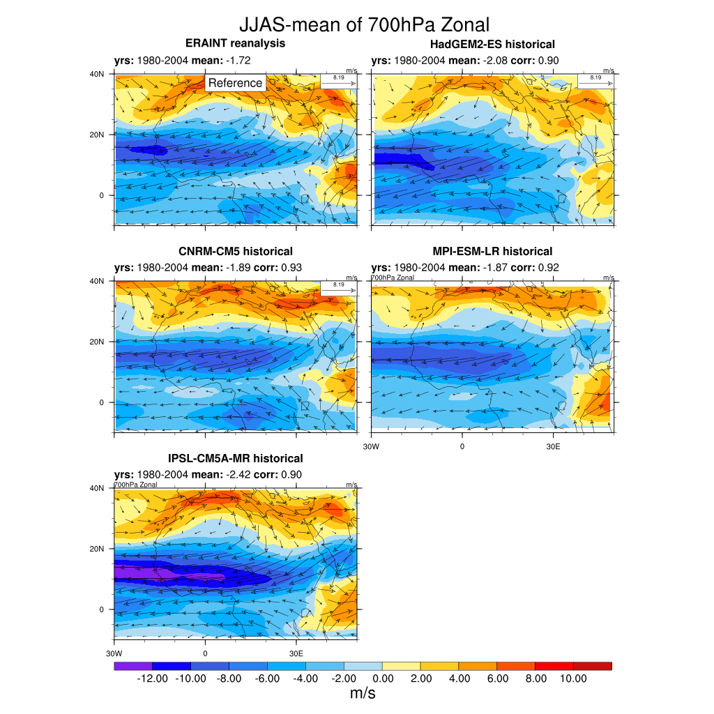
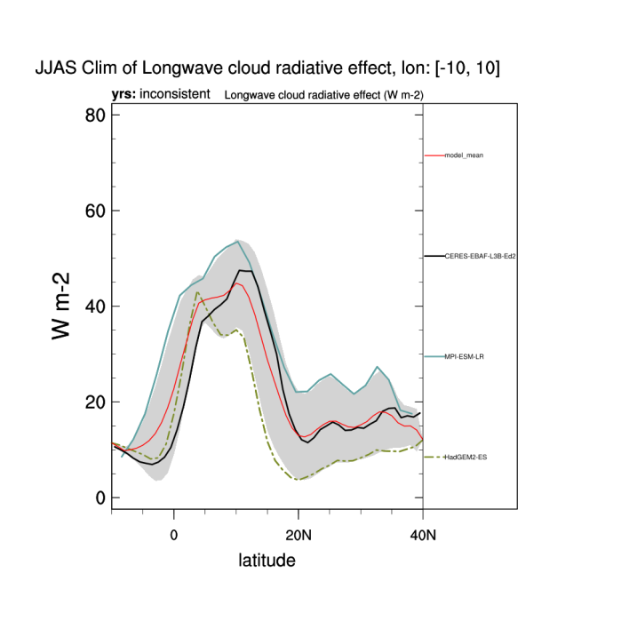
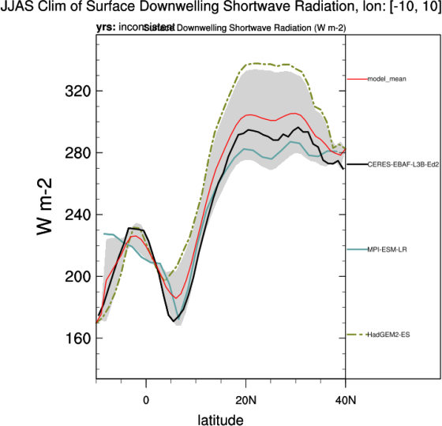

West African Monsoon (WAM)
==========================

Overview
--------

West Africa is a critical region for climate models (e.g., Cook and Vizy, 2006; Roehrig et al., 2013). Roehrig et al. (2013) show that although state-of-the-art CMIP5 models can capture many features of the West African monsoon, they have not yet reached a sufficient degree of maturity that makes them trustable to anticipate climate changes and their impacts in this region, especially with regard to rainfall. Therefore, along the process of climate model development and evaluation, it is crucial for model developers and users to have at their disposal a set of synthetic and simple diagnostics that provide them an overall vision of the representation of the West African monsoon in their model or set of models. Such diagnostics are implemented in this namelist.

Available namelists and diagnostics
-----------------------------------

Namelists are stored in nml/

* namelist_WAMonsoon.xml
* namelist_WAMonsoon_daily.xml

Diagnostics are stored in diag_scripts/

* WAMonsoon_10W10E_1D_basic.ncl: same as WAMonsoon_10W10E_3D_basic.ncl but for a 2D variable (e.g., precipitation, potential temperature at 850 hPa).
* WAMonsoon_10W10E_3D_basic.ncl: computes the zonal average over 10°W-10°E of a 3-dimensional variable (e.g., zonal wind, meridional wind, potential temperature). It is then averaged over the JJAS season and plotted as a latitude-level transect over West Africa.
* WAMonsoon_autocorr.ncl: similar to WAMonsoon_isv_filtered.ncl, except that it computes the 1-day autocorrelation of intraseasonal anomalies of any field (e.g., precipitation), as a measure of convection persistence.
* WAMonsoon_contour_basic.ncl: computes the average of any 2-dimensional field over the JJAS season and plots it as a latitude-longitude map zoomed over West Africa. It is used for precipitation, 2-m air temperature and 850-hPa potential temperature (heat low signature).
* WAMonsoon_precip_IAV.ncl: plots the interannual variability of precipitation averaged over JJAS and over the Sahel (10°N-20°N, 10°W-10°E).
* WAMonsoon_isv_filtered.ncl: filters any 2-dimensional field, computes the standard deviation of the filtered field over the JJAS season and plots it on a latitude-longitude map zoomed over West Africa. High-pass and band-pass filter based on the Lanczos filtering method are available. Basically, this is used for computing the 90-day high pass or 3-10-day bandpass filtered precipitation or outgoing longwave radiation standard deviation, namely the intraseasonal and synoptic (African easterly waves) standard deviation. Data are first interpolated on a common grid before any computations. We advise a 1°x1° grid for precipitation (reference is GPCP version 1.2, 1DD, available on this grid) and a 2.5°x2.5° grid for OLR (reference is from NOAA satellites, and available on this grid).
* WAMonsoon_precip_seasonal.ncl: computes the mean monthly annual cycle of any 2-dimensional variable averaged over a given latitude-longitude box and plots it for the given models and reference data set. It is used for precipitation and 2-m air temperature averaged over the Sahel (10°N-20°N, 10°W-10°E).
* WAMonsoon_wind_basic.ncl: computes the average of zonal and meridional wind component over the JJAS season and plots it as a latitude-longitude map for a given level (200 and 700 hPa). Zonal wind is in shading and total wind is in vector. The map is zoomed over West Africa.

User settings
-------------

User setting files (cfg files) are stored in nml/cfg_WAMonsoon/

#. WAMonsoon_10W10E_1D_basic.ncl

*Required diag_script_info attributes*

* latrange: min. and max. latitude for plot (2-elemen array)
* lonrange: min. and max. longitude for plot (2-element array)
* minmax: lower and upper limit of values in plot (2-element array)
* season: season, typically "JJAS"

*Optional diag_script attributes*

* cn_levels_mean_basic: contour levels for mean plot (n-element array)
* cn_levels_mean_diff_basic: contour levels for difference plot (n-element array)
* cn_levels_stddev_basic: contour levels for standard deviation plot (n-element array)
* cn_levels_stddev_diff_basic: contour levels for difference stdandard deviation plot (n-element array)
* legendPos: position of legend ("TopRight", "BottomRight", "TopLeft", "BottomLeft")
* multi_model_mean: calculate multi-model mean ("y", "n")
* plottype_lbres: plot labelbar (True, False)
* styleset: stylesheet to use ("CMIP5", "DEFAULT")
* x_gridlines: display gridline along x-axis ("y", “n”)
* y_gridlines: display gridline along y-axis ("y", “n”)

#. WAMonsoon_10W10E_3D_basic.ncl

*Required diag_script_info attributes*

* cn_levels_mean_basic: contour levels for mean plot (n-element array)
* cn_levels_mean_diff_basic: contour levels for difference plot (n-element array)
* latrange: min. and max. latitude for plot (2-element array)
* lonrange: min. and max. longitude for plot (2-element array)
* levrange: max. and min. pressure (Pa) for plot (2-element array)
* plottype_lbres: handle for labelbar settings (True, False)
* season: season, typically "JJAS"
* plot_stddev: switch for plotting stdandard deviation (True, False)
* diff_colormap: filename and full path for colormap for difference plot, e.g., "diag_scripts/aux/WAMonsoon/cmap_difference_theta.rgb"

*Optional diag_script_info attributes*

* cn_levels_mean_basic: contour levels for mean plot (n-element array)
* cn_levels_mean_diff_basic: contour levels for difference plot (n-element array)

#. WAMonsoon_autocorr.ncl

*Required diag_script_info attributes*

* cn_levels_corr_basic: contour levels for correlation plot (n-element array)
* cn_levels_corr_diff_basic: contour levels for correlation difference plot (n-element array)
* latrange: min. and max. latitude for plot (2-elemen array)
* lonrange: min. and max. longitude for plot (2-element array)
* sahel_latrange: min. and max. latitude of “Sahel” region (2-element array)
* sahel_lonrange: min. and max. longitude of “Sahel” region (2-element array)
* season: season, typically "JJAS"
* destgrid: destination grid for ESMF regridding ("1x1", "2.5x2.5")
* styleset: stylesheet to use ("CMIP5", “DEFAULT”)
* my_region: label for Monsoon region, e.g., "WA"
* filter_hp: value for high pass filter
* filter_type: "hp" = high pass filter, "bp" = band pass filter
* filter_weights: filter weights
* filter_min, filter_max: required for band pass filter only

#. WAMonsoon_contour_basic.ncl

*Required diag_script_info attributes*

* cn_levels_mean_basic: contour levels for mean plot (n-element array)
* cn_levels_mean_diff_basic: contour levels for difference plot (n-element array)
* latrange: min. and max. latitude for plot (2-element array)
* lonrange: min. and max. longitude for plot (2-element array)
* season: season, typically "JJAS"
* my_region: label for Monsoon region, e.g., "WA"
* plot_stddev: switch for plotting stdandard deviation (True, False)
* cn_levels_stddev_basic: contour levels for standard deviation plot (only required if plot_stddev = True) (n-element array)
* cn_levels_stddev_diff_basic: contour levels for standard deviation difference plot (only required if plot_stddev = True) (n-element array)
* diff_colormap: filename and full pathname of colormap for difference plots, e.g., "diag_scripts/aux/WAMonsoon/cmap_difference.rgb"

#. WAMonsoon_precip_IAV.ncl, WAMonsoon_precip_seasonal.ncl

*Required diag_script_info attributes*

* cn_levels_mean_basic: contour levels for mean plot (n-element array)
* cn_levels_mean_diff_basic: contour levels for difference plot (n-element array)
* cn_levels_stddev_basic: contour levels for standard deviation plot (n-element array)
* cn_levels_stddev_diff_basic: contour levels for difference stdandard deviation plot (n-element array)
* diff_colormap: filename and full pathname of colormap for difference plots, e.g., "diag_scripts/aux/WAMonsoon/cmap_difference.rgb"
* latrange_seasonal: min. and max. latitude of crop region for plot (2-element array)
* lonrange_seasonal: min. and max. longitude of crop region for plot (2-element array)
* season: season, typically "JJAS"
* styleset: stylesheet to use ("CMIP5", "DEFAULT")
* multi_model_mean: calculate multi-model mean ("y", "n")
* my_region: label for Monsoon region, e.g., "WA"
* supporting_gridlines: display supporting grid line ("y", "n")

#. WAMonsoon_isv_filtered.ncl

*Required diag_script_info attributes*

* season: season, typically "JJAS"
* destgrid: destination grid for ESMF regridding ("1x1", "2.5x2.5")
* styleset: stylesheet to use ("CMIP5", "DEFAULT")
* latrange_basic: min. and max. latitude for plot (2-elemen array)
* lonrange_basic: min. and max. longitude for plot (2-element array)
* diff_colormap: filename and full pathname of colormap for difference plots, e.g., "diag_scripts/aux/WAMonsoon/cmap_difference.rgb"
* cn_levels_stddev_basic: contour levels for standard deviation plot (n-element array)
* cn_levels_stddev_diff_basic: contour levels for difference standard deviation plot (n-element array)
* plot_norm: plot normalized stdandard deviation (True, False)
* cn_levels_stddev_norm_basic: contour levels for normalized standard deviation plot (n-element array)
* cn_levels_stddev_norm_diff_basic: contour levels for normalized standard deviation difference plot (n-element array)
* sahel_latrange: min. and max. latitude of "Sahel" region (2-element array)
* sahel_lonrange: min. and max. longitude of "Sahel" region (2-element array)
* filter_type: "hp" = high pass filter, "bp" = band pass filter
* filter_hp: value for high pass filter
* filter_weights: filter weights
* filter_min, filter_max: required for band pass filter only
* my_region: label for Monsoon region, e.g., "WA"

#. WAMonsoon_wind_basic.ncl

*Required diag_script_info attributes*

styleset: stylesheet to use ("CMIP5", "DEFAULT") 
season: season, typically "JJAS"
latrange_basic: min. and max. latitude for plot (2-element array)
lonrange_basic: min. and max. longitude for plot (2-element array)
cn_levels_mean_basic: contour levels for mean plot (n-element array)
cn_levels_mean_diff_basic: contour levels for difference plot (n-element array)
diff_colormap: filename and full pathname of colormap for difference plots, e.g., "diag_scripts/aux/WAMonsoon/cmap_difference_wind.rgb"
cn_levels_stddev_basic: contour levels for standard deviation plot (n-element array) (if plot_stddev = True)
cn_levels_stddev_diff_basic: contour levels for difference standard deviation plot (n-element array) (if plot_stddev = True)
plottype_lbres: plot labelbar (True, False)
my_region: label for Monsoon region, e.g., "WA"
use_for_contour: switch for kind of contour ("speed", "zonal" (ua), "meridional" (va))
plot_stddev: plot standard deviation (True, False)

Variables
---------

* pr (atmos, monthly mean, longitude latitude time)
* tas (atmos, monthly mean, longitude latitude time)
* rlut (atmos, monthly mean, longitude latitude time)
* rsut (atmos, monthly mean, longitude latitude time)
* rlutcs (atmos, monthly mean, longitude latitude time)
* rsutcs (atmos, monthly mean, longitude latitude time)
* rlds (atmos, monthly mean, longitude latitude time)
* rsds (atmos, monthly mean, longitude latitude time)
* ua (atmos, monthly mean, longitude latitude plev time)
* va (atmos, monthly mean, longitude latitude plev time)
* ta (atmos, monthly mean, longitude latitude plev time)
* pr (atmos, daily mean, longitude latitude time)
* rlut (atmos, daily mean, longitude latitude time)

Observations and Reformat Scripts
---------------------------------

Note: (1) obs4mips data can be used directly without any preprocessing; (2) see headers of reformat scripts for non-obs4mips data for download instructions.

* ERA-Interim Reanalysis (tas, ua, va)
  *Reformat script*: reformat_scripts/obs/reformat_obs_ERA-Interim.ncl
* GPCP monthly (pr) – obs4mips
* CERES-EBAF (TOA and derived surface radiation fluxes) – obs4mips
* GPCP Version 1.2, daily and 1°x1° (pr) – obs4mips
* Daily NOAA OLR
  *Reformat script*: reformat_scripts/obs/reformat_obs_NOAA-PSD-Interp.ncl

References
----------

* Cook, K. H. and E. K. Vizy, 2006: Coupled model simulations of the West African monsoon system: Twentieth- and twenty-first-century simulations. J. Climate, 19, 3681-3703.
* Roehrig, R., D. Bouniol, F. Guichard, F. Hourdin, and J.-L. Redelsperger, 2013: The Present and Future of the West African Monsoon: A Process-Oriented Assessment of CMIP5 Simulations along the AMMA Transect. J. Climate, 26, 6471-6505. doi: http://dx.doi.org/10.1175/JCLI-D-12-00505.1.

Example plots
-------------

