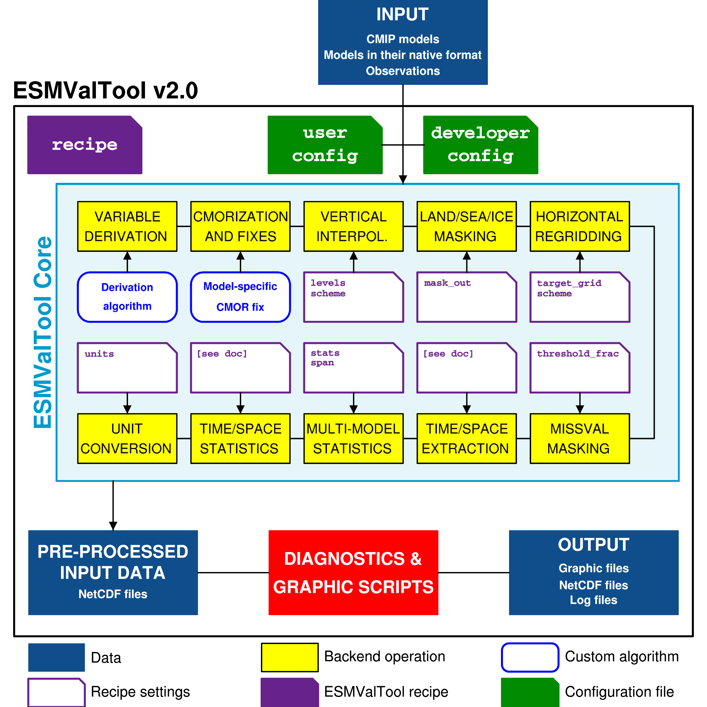

.. _architecture:

************
Architecture
************

Overview and input
==================

The ESMValTool applies a great variety of standard diagnostics and metrics, and
produces a collection of netCDF and graphical files (plots). Thus, the tool
needs a certain amount of input from the user so that it can:

* establish the correct input and output parameters and the structured
  workflow;
* acquire the correct data;
* execute the workflow; and
* output the desired collective data and media.

To facilitate these four steps, the user has control over the tool via two
main input files: the :ref:`user configuration file <config-user>` and the
:ref:`recipe <esmvalcore:recipe>`. The configuration file sets user and
site-specific parameters (like input and output paths, desired output graphical
formats, logging level, etc.), whereas the recipe file sets data, preprocessing
and diagnostic-specific parameters (data parameters grouped in the datasets
sections, preprocessing steps for various preprocessors sections, variables'
parameters and diagnostic-specific instructions grouped in the diagnostics
sections). The configuration file may be used for a very large number of runs
with very minimal changes since most of the parameters it sets are recyclable;
the recipe file can be used for a large number of applications, since it may
include as many datasets, preprocessors and diagnostics sections as the user
deems useful.

Workflow
========

Once the user configuration files and the recipe are at hand, the user can
start the tool. A schematic overview of the ESMValTool workflow is depited in
the figure below.

.. _figarch:

   Schematic of the system architecture.

For a generalized run scenario, the tool will perform the following ordered
procedures.

Data finding:
-------------
* read the data requirements from the :ref:`datasets section
  <esmvalcore:Datasets>` of the recipe and assemble the data request to locate
  the data; 
* find the data using the specified root paths and DRS types in the
  configuration file (note the flexibility allowed by the :ref:`data finder
  <esmvalcore:findingdata>`);

Data selection:
---------------
* data selection is performed using the parameters specified in the
  :ref:`datasets section <esmvalcore:Datasets>` (including e.g. type of
  experiment, type of ensemble, time boundaries etc); data will be retrieved
  and selected for each variable that is specified in the
  :ref:`diagnostics <esmvalcore:Diagnostics>` section of the recipe;

Data fixing:
------------
* the ESMValTool requires data to be in CMOR format; since errors in the data
  formatting are not uncommon, the ESMValTool performs :ref:`checks against the
  CMOR library and fixes small irregularities <esmvalcore:CMOR check and
  dataset-specific fixes>` (note that the degree of leniency is not very high).

Variable derivation
-------------------
* :ref:`variable derivation <esmvalcore:Variable derivation>` (in the case of
  non CMOR-standard variables, most likely associated with observational
  datasets) is performed automatically before  running the preprocessor;
* if the variable definitions are already in the database then the user will
  just have to specify the variableto be derived in the :ref:`diagnostics
  <esmvalcore:Diagnostics>` section (as any other standard variable, just
  setting ``derive: true``).

Run the preprocessor:
---------------------
* if any :ref:`preprocessor section <esmvalcore:preprocessor>` is specified in
  the recipe file, then data will be loaded in memory as iris cubes and passed
  through the preprocessing steps required by the user and specified in the
  preprocessor section, using the specific preprocessing step parameters
  provided by the user as keys (for the parameter name) and values (for the
  paramater value); the preprocessing order is very imprtant since a number of 
  steps depend on prior excution of other steps (e.g. :ref:`multimodel
  statistics <esmvalcore:Multi-model statistics>` can not be computed unless
  all models are on a common grid, hence a prior :ref:`regridding
  <esmvalcore:Horizontal regridding>` on a common grid is necessary); the
  preprocessor steps order can be set by the user as custom or the default
  order can be used;
* once preprocessing has finished, the tool writes the data output to disk as
  netCDF files so that the diagnostics can pick it up and use it; the user will
  also be provided with a metadata file containing a summary of the
  preprocessing and pointers to its output. Note that writing data to disk
  between the preprocessing and the diagnostic phase is required to ensure
  multi-language support for the latter.

Run the diagnostics:
--------------------
* the last and most important phase can now be run: using output files from the
  preprocessor, the diagnostic scripts are executed using the provided
  diagnostics parameters.
