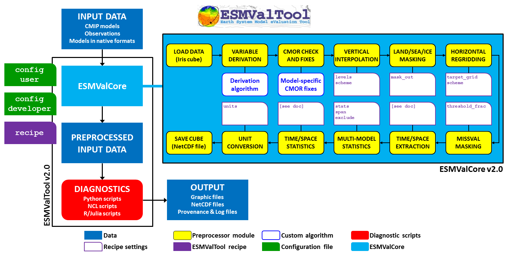

.. _architecture:

************
Architecture
************

Overview and input
==================

ESMValTool performs
a number of standard diagnostics and output a collection of metrics and graphical
objects (plots). Thus, the tool will need a certain amount of input from the user
so that it can:

* establish the correct input and output parameters and the structured workflow;
* acquire the correct data;
* execute the workflow; and
* output the desired collective data and media.

To facilitate these four steps the user has control over the tool via two input files:
the configuration file and the recipe file. The configuration file sets user and site-specific
parameters (like input and output paths, desired output graphical formats, logging level, etc.)
whereas the recipe file sets data, preprocessing and diagnostic-specific parameters
(data parameters grouped in the datasets sections, preprocessing steps for various preprocessors
sections, variables' parameters and diagnostic-specific instructions grouped in the diagnostics
sections). The configuration file may be used for a very large number of runs with very minimal
changes since most of the parameters it sets are recyclable; the recipe file can be used for a
large number of runs since it may include as many datasets, preprocessors and diagnostics
sections as the user deems useful.

Workflow
========

Once these two files are at hand, the user can start the tool. The workflow is presented
in the schematic below: for a generalized run scenario, the tool will perform the following
ordered procedures:

Data finding:
-------------
* read the data requirements from the recipe from the datasets (and additional_datasets)
  section; assemble the data request to locate the data;
* find the data using the specified root paths and DRS types in the configuration file
  (note the flexibility allowed by the data finder, see Preprocessor/Data finding);

Data selection:
---------------
* data selection is performed using the parameters specified in the datasets (and additional
  datasets) section (including e.g. type of experiment, type of ensemble, time boundaries etc);
  data will be retrieved and selected for each variable that is specified in the
  daignostics/variables subsection;

Data fixing:
------------
* ESMValTool requires data to be in CMOR format; a strict CMOR data formatting standard is not
  enforced so that data will undergo checks against the CMOR library and fixing if small
  irregularities are found (note that the degree of leniency is not very high).

Variable derivation
-------------------
* variable derivation (in the case on non CMOR-standard variables, most likely associated with
  observational datasets) is performed automatically before running the preprocessor;
* if the variable definitions are already in the database then the user will just have to specify
  the variableto be derived in the diagnostics/variable section (as any other standard variable, just
  with the derive: true key and value).

Run the preprocessor:
---------------------
* if any preprocessor section is specified in the recipe file, then data will be loaded in memory
  as iris cubes and passed through the preprocessing steps required by the user and specified in
  the preprocessor section, using the specific preprocessing step parameters provided by the user
  as keys (for the parameter name) and values (for the paramater value); the preprocessing order
  is very imprtant since a number of steps depend on prior excution of other steps (e.g. multimodel
  statistics can not be computed unless all models are on a common grid, hence a prior regridding
  on a common grid is necessary); the preprocessor steps order can be set by the user as custom or
  the default order can be used;
* once preprocessing has finished, the tool writes the data output to disk as netCDF files so that
  the diagnostics can pick it up and use it; the user will also be provided with a metadata file
  containing a summary of the preprocessing and pointers to its output.

Run the diagnostics:
--------------------
* the last and most important phase can now be run: using output files from the preprocessor, the
  diagnostic will be run using the provided diagnostics parameters.

   Schematic of the system architecture.
