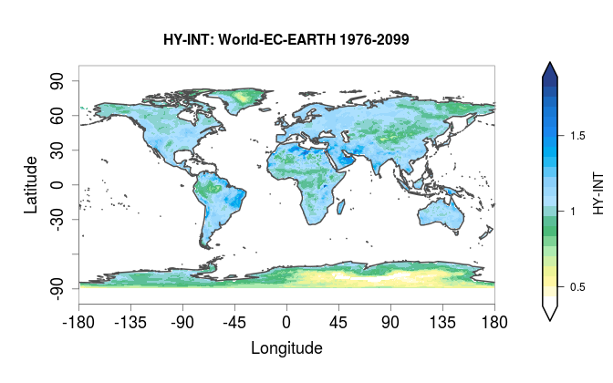
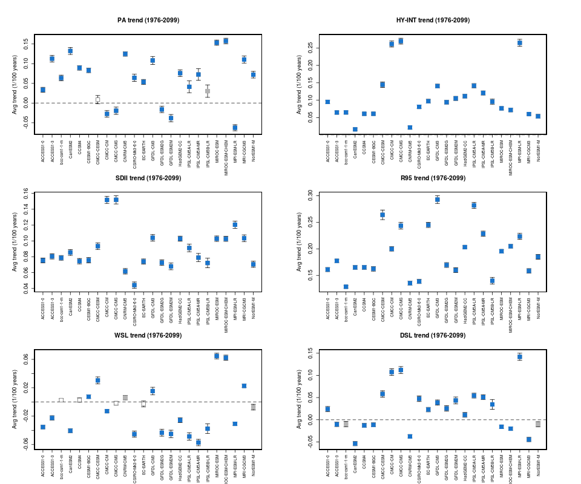

Hydroclimatic intensity and extremes (HyInt)
==============================================
 

Overview
--------
This module computes a set of 6 indices that allow to evaluate the response of the hydrological cycle to global warming with a joint view of both wet and dry extremes. The indices were selected following Giorgi et al. (2014): the simple precipitation intensity index (SDII), the maximum dry spell length (DSL) and wet spell length (WSL), the hydroclimatic intensity index (HY-INT), a measure of the overall behaviour of the hydroclimatic cycle (Giorgi et al., 2011), and the precipitation area (PA), i.e. the area over which at any given day precipitation occurs, (Giorgi et al., 2014). Additionally also a selection of the 27 ETCCDI indices produced by the extremeEvents recipe can be ingested to produce timeseries plots (calling the extremeEvents diagnostics). Trends are calculated using the R `lm` function and significance testing performed with a Student T test on non-null coefficients hypothesis. Trend coefficients are stored together with their statistics which include standard error, t value and Pr(>|t|). The tool produces a variety of types of plots including timeseries with their spread, trend lines and summary plots of trend coefficients.

The hydroclimatic indices calculated by the diagnostic and included in the output are defined as follows:

* PRY = mean annual precipitation

* INT = mean annual precipitation intensity (intensity during wet days, or simple precipitation intensity index SDII)

* WSL = mean annual wet spell length (number of consecutive days during each wet spell)

* DSL = mean annual dry spell lenght (number of consecutive days during each dry spell)

* PA  = precipitation area (area over which of any given day precipitation occurs)

* R95 = heavy precipitation index (percent of total precipitation above the 95% percentile of the reference distribution)

* HY-INT = hydroclimatic intensity. HY-INT = normalized(INT) x normalized(DSL).
 
 
 
Available recipes and diagnostics
---------------------------------
 
Recipes are stored in recipes/
 
* recipe_hyint.yml
 
Diagnostics are stored in diag_scripts/hyint/
 
* hyint.R
 
and subroutines

* hyint_diagnostic.R
* hyint_functions.R
* hyint_parameters.R
* hyint_plot_trends.R
* hyint_etccdi_preproc.R
* hyint_metadata.R
* hyint_plot_maps.R
* hyint_preproc.R
* hyint_trends.R

 
User settings
-------------
 
*Required settings for script*

* norm_years: first and last year of reference normalization period to be used for normalized indices
* selfields: indices to be plotted. Select one or more fields from the following list (order-sensitive) as a numerical index: 1=SDII, 2=DSL, 3=WSL, 4=HY-INT, 5=ABS_INT, 6=ABS_DSL, 7=ABS_WSL, 8=PA, 9=R95
* selregions: Select regions for timeseries and maps from the following list as a numerical index: 1=World, 2=World60 (60S/60N), 3=Tropics (30S/30N), 4=South 5=America, 6=Africa, 7=North America, 8=India, 9=Europe, 10=East-Asia, 11=Australia
* plot_type: type of figures to be plotted. Select one or more from: 1=lon/lat maps per individual field/exp/multi-year mean, 2=lon/lat maps per individual field exp-ref-diff/multi-year mean, 3=lon/lat maps multi-field/exp-ref-diff/multi-year mean, 11=timeseries over required individual region/exp, 12=timeseries over multiple regions/exp, 13=timeseries with multiple models, 14=summary trend coefficients multiple regions, 15=summary trend coefficients multiple models

 
Variables
---------
 
* pr (atmos, daily mean, longitude latitude time)

 
Observations and reformat scripts
---------------------------------
 
None.
 
 
References
----------
 
* Giorgi et al., 2014, J. Geophys. Res. Atmos., 119, 11,695–11,708, doi:10.1002/ 2014JD022238
* Giorgi et al., 2011, J. Climate 24, 5309-5324, doi:10.1175/2011JCLI3979.1

Example plots
-------------
 

.. figure:: figures/hyint/hyint_maps2.png
   :width: 8cm
 
Annual mean precipitation intensity with boundaries of pre-defined regions (left, figure type 1) and difference in dry spell length between two datasets over Africa (right, figure type 2)
 

.. figure:: figures/hyint/hyint_trends2.png
   :width: 8cm
 
HY-INT timeseries (left, figure type 12) and trend coefficients (right, figure type 14) over selected regions for EC-Earth rcp85 2006-2100 future projection normalized to the historical 1976-2005 period.

